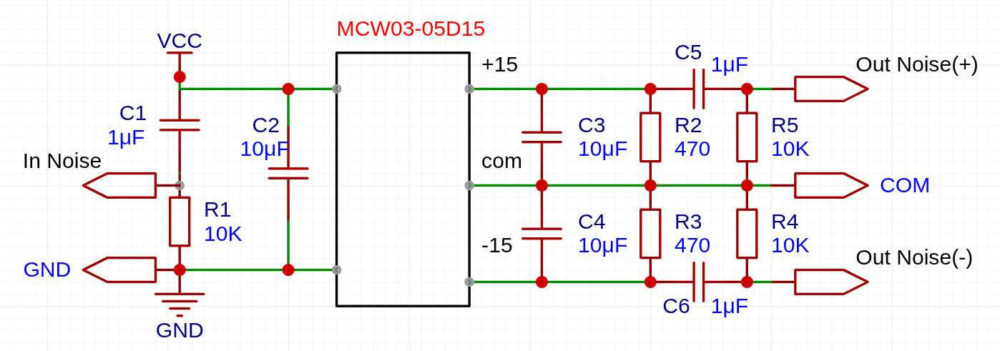
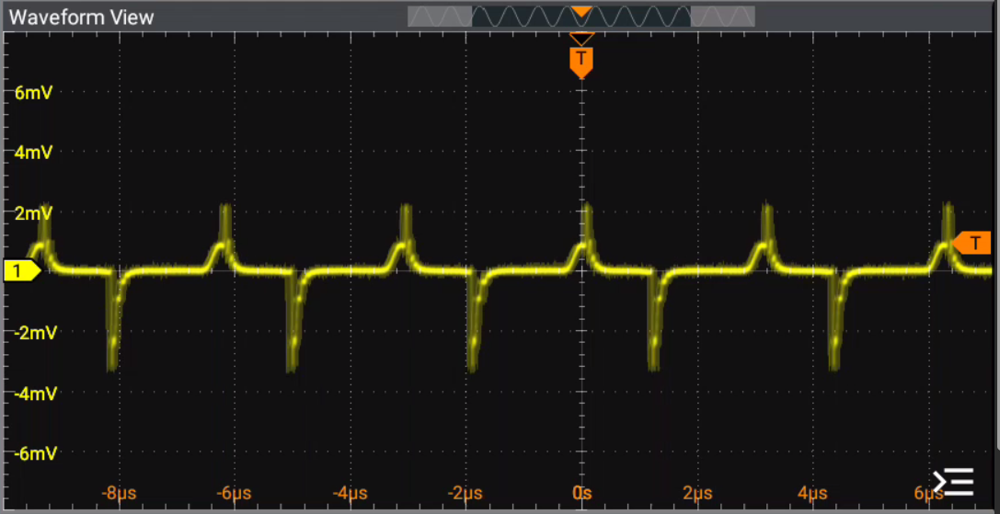
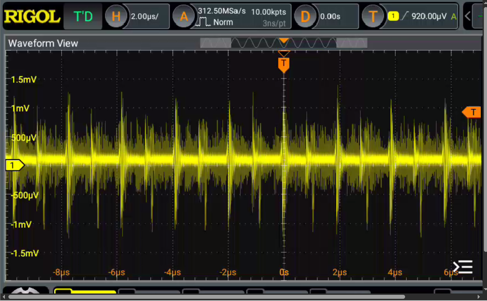
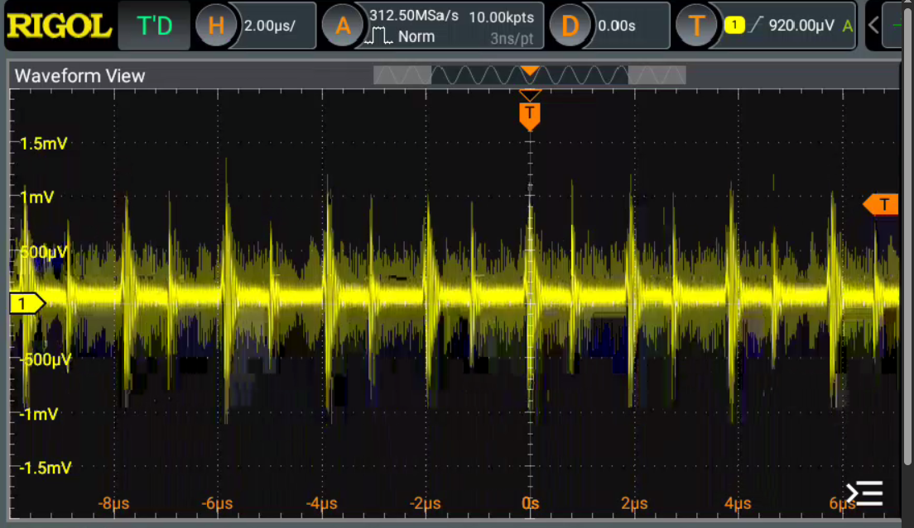
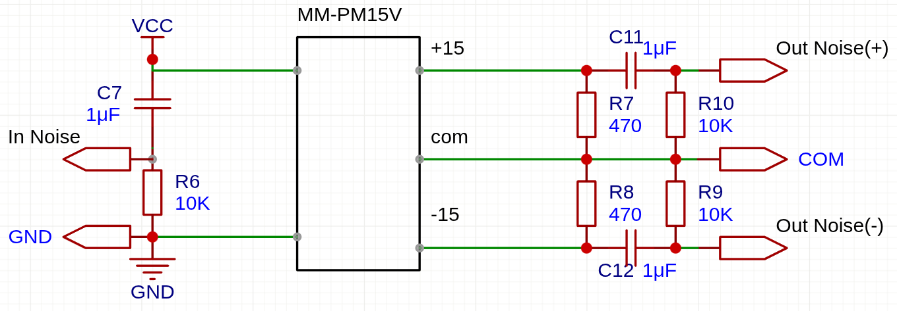
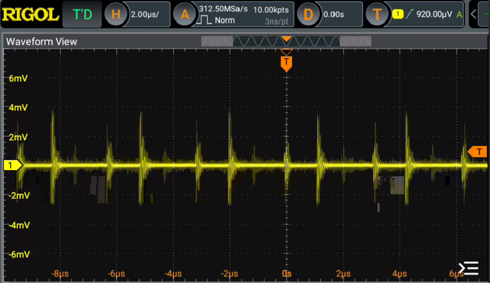
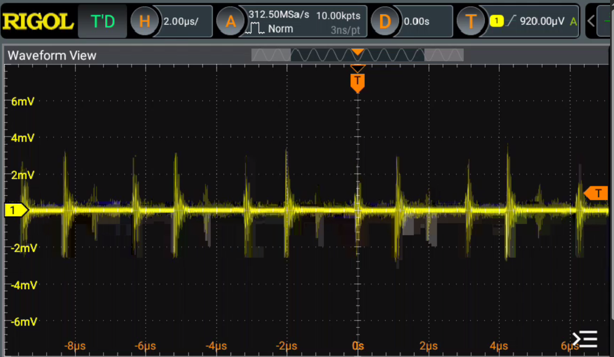

+++
date ="2025-12-29"
title = "正負DC/DCコンバータのノイズを確認"
[extra]
og_image = "/blog/15v/ogp.jpg"
+++

# はじめに

次はOPアンプを使ったオーディオ用のアナログ回路を作りたいと考えている。単電源OPアンプではないので、正負電源が必要だが、今回は3-5Vの単電源からDC/DCコンバータで生成しようと考えている。

2つの候補を入手したのでノイズ特性を見ておこうと思う。

ひとつは秋月の[MCW03-05D15](https://akizukidenshi.com/catalog/g/g104266/)

もうひとつは共立の[MM-PM15V](https://eleshop.jp/shop/g/gP5D41I/)。「超低ノイズ」と謳われており期待が高まる。

# 結果

## MCW03-05D15

### 測定回路

データシートを見て、ガイド通りパスコンを入れた。出力には470Ωの負荷をかけている。

### 入力のノイズ

まず入力側のノイズを確認しておく。今回は9VのACアダプターの出力を5Vの三端子レギュレータに通したものを使用している。ここのノイズをオシロスコープで見てみた。

Vppで5-6mVくらいか。周波数は数100kHzくらいで、可聴周波数を超えているので聴感上は問題無さそう。

### 出力のノイズ

次に出力側のノイズを見てみる。まず+15V側。

次に-15V側。

どちらもVppで2-3mV以内に収まっており良好だ。周波数は1MHzくらいで。こちらも可聴周波数を超えているので聴感上は問題無さそう。

## MM-PM15V

お次はMM-PM15V。

### 測定回路

こちらはモジュール型になっていて中にパスコンが入っているので省略した。

### 出力のノイズ

+15V側。

-15V側。

「超低ノイズ」とあったので期待したが、こちらはVppで6mVくらいかな。まぁそれでも良好と言えるだろう。こちらも周波数は1MHzくらいだ。

大差無しなので、どちらを使っても良さそうだ。
