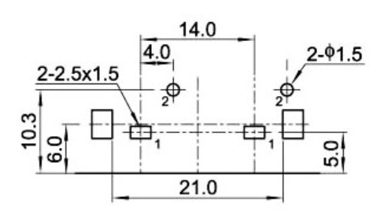

+++
date ="2026-1-16"
title = "電子ボリューム基板"
[extra]
og_image = "/blog/2026-1-16/ogp.jpg"
+++

電子ボリューム基板のアナログ部が届いた。早速RCAジャックを当ててみる...

{{ clickable_img(src="IMG_3062.JPG", alt="photo") }}は、入らないw

図面では、この白い爪の間隔は21mmとなっているのだが、測ってみると、

{{ clickable_img(src="IMG_3058.JPG", alt="photo") }}23mmですなw

とりあえず爪をニッパで切ってみると、問題無かったので今回の基板ではこれで行こう。
EasyEDAのパーツデータは修正しておいた。

今気付いたけどこのRCAジャック、右(赤)が左にあるのだな。だから安いのだろうか。