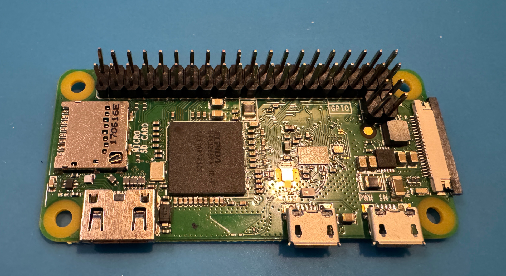
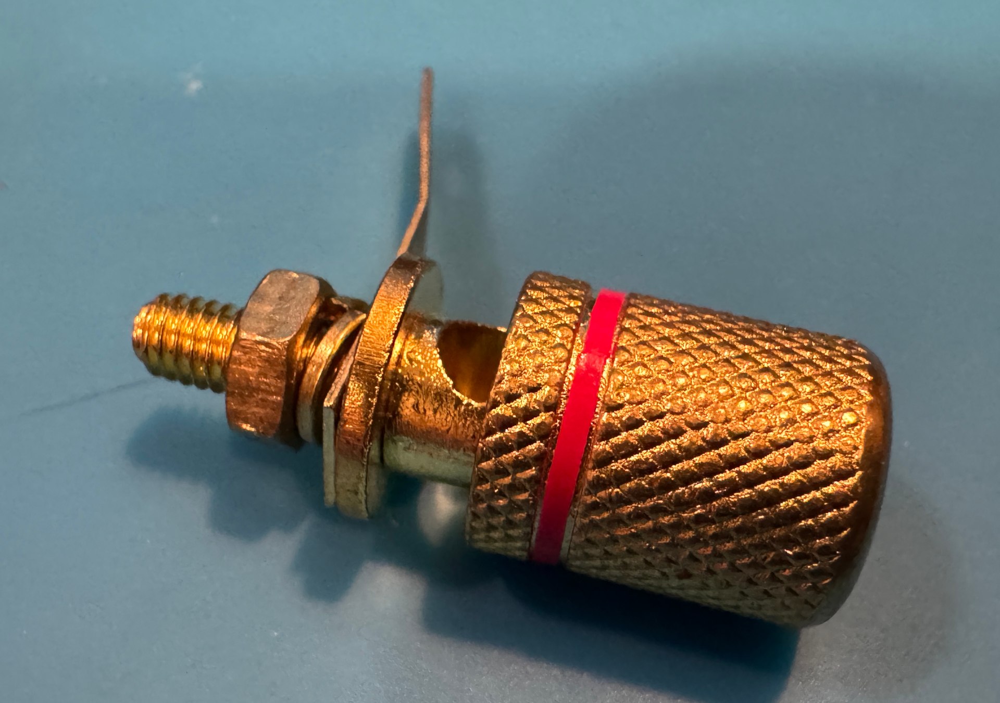
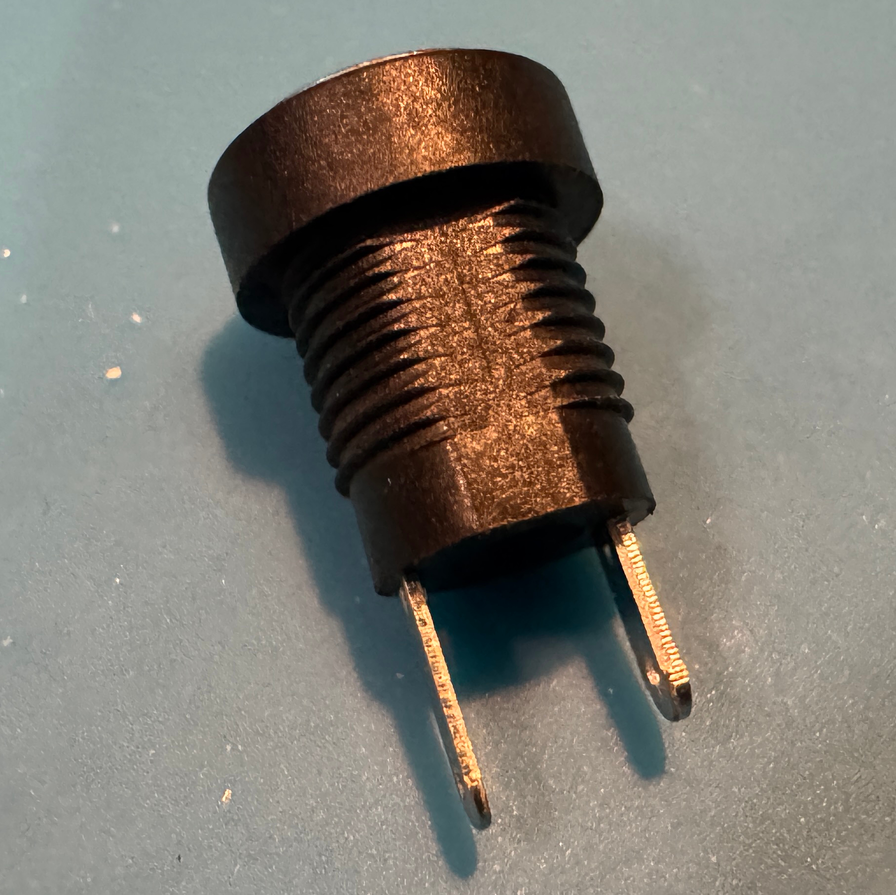
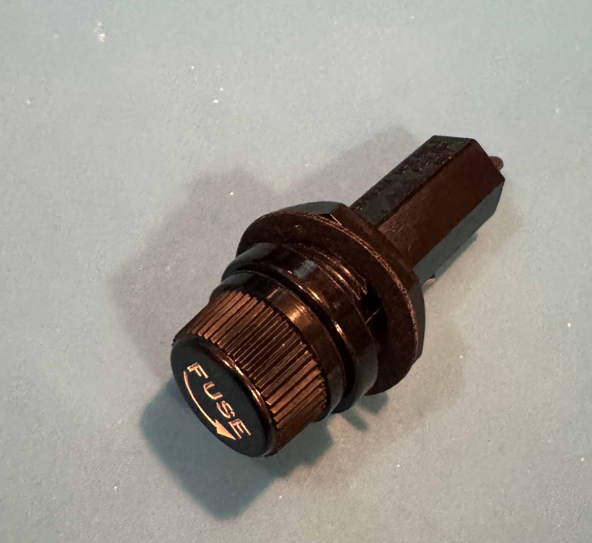

+++
date ="2026-6-28"
title = "3Dスキャナで部品の3Dモデルを作る"
[taxonomies]
tags = ["DIY"]
[extra]
og_image = "/blog/3dscan/ogp.jpg"
+++

[EasyEDAで自分用にコンポーネントを作り、3Dモデルも登録してケースも3Dプリント可能にする](https://www.ruimo.com/diy/easyeda/create-component/)では、AIとFreeCADを使って部品の3Dモデルを作ったが、3Dスキャナはどうだろうか。[Revopoint POP 4](https://www.revopoint3d.jp/products/pop4-wireless-hybrid-3d-scanner)を手に入れたので、試してみた。

まずはRaspberry Pi Zero W

{{ obj_viewer(src="raspberrypi.ply", title="3Dスキャン結果") }}

おぉ、これは結構良いかも。3Dスキャナは光沢面や黒いところに弱いと言われているが、POP 4は青色レーザーが使えるので結構な精度でスキャンできている。穴位置やコネクタ位置が良く分かるので、これを使えばケースを正確に設計できそうだ。

お次は金キラの端子。ナットは外してスキャンした。

{{ obj_viewer(src="terminal.ply", title="3Dスキャン結果") }}

間の部分が抜けてしまったが、ケースの設計の寸法合わせとしては十分だろう。

次はDCジャック。

{{ obj_viewer(src="dcjack.ply", title="3Dスキャン結果") }}

端子部分にノイズgが乗っているが、寸法合わせとしては十分そう。写真を見ると分かるように穴は正円ではなくて面取りされているのだが、その部分もスキャンされている。

次はFUSEホルダー

これは、全然ダメだった。筐体の細くなっている部分が全くスキャンできなかった。スキャナの設定に「メタリック」と「黒色」があるので両方やってみたがだめ。見た感じ、光沢のある黒なのでその点が苦手なのかもしれない。

最後に前の記事で扱ったRCAコネクター

{{ obj_viewer(src="rca.ply", title="3Dスキャン結果") }}

結構苦しい。まぁ使えなくは無いかなという感じか。白いプラスチックの部分も割とスキャンしにくいようだ。

スキャンしにくいものだけ、[AESUBスプレー](https://aesub.jp/aesub_spray/)を併用するのが良さそうだ。
