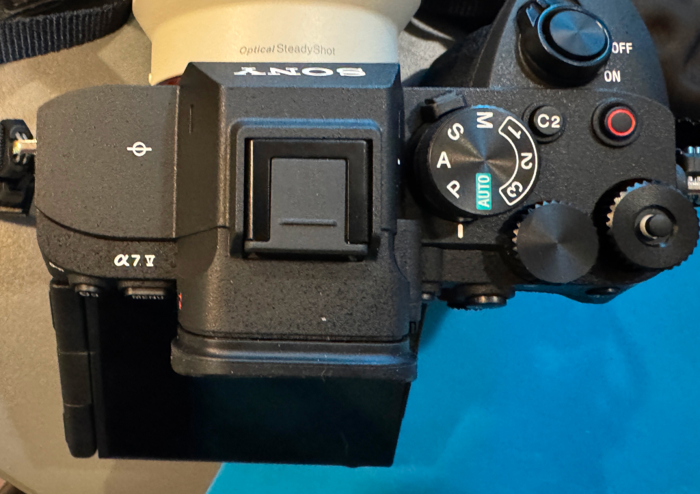
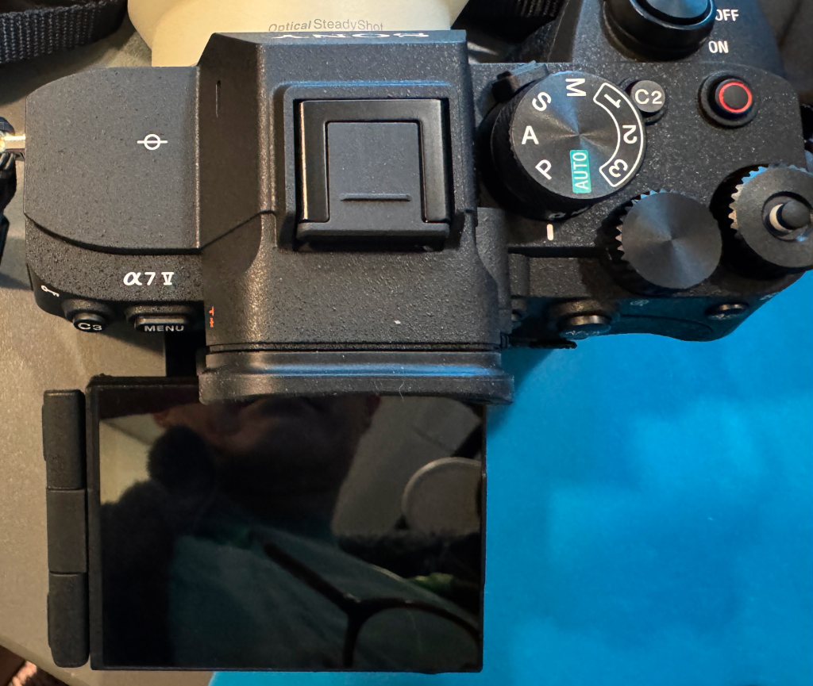

+++
date ="2025-12-27"
title = "カメラ買い替え"
[extra]
og_image = "/blog/alpha7v-0/DSC00047.JPG"
+++

# 発端

これまでずっとEOS 5D Mark IIを使ってきた。調べたみたら2008/11に発売だそうなので、17年近く使ったことになる。その間、故障ひとつせず、バッテリーもまだ使えるので素晴しい品質のカメラだったと言えよう。

その後、ミラーレス一眼が出始めて、少しずつ世代が代わり始めた。ミラーレス一眼が出た頃は、まだこなれていない感が強く、発展途上だなと思ったものだが、最近のモデルを見る限り大分成熟したように思う。そこで今年の夏あたりからそろそろ買い替えようかなと思い始めた。順当に行くと、キヤノンのR6シリーズなのだが、どうせマウントが変更になる(同じキヤノンでもEFマウントからRFマウント)なら、他のメーカーのものも選択肢に入れようと調べ始めた。

# 2025年夏頃の調査結果

5D Mark IIを買った頃はニコン、キヤノンが2強だったものだが、今はどうもソニーかキヤノンらしい。ニコンも光学機器としては超一流なのだが、ソフトウェア回りがもう一歩のようだ。ミラーレス一眼になって、中はコンピューターのお化けのようになっているので、そのあたりのキャッチアップが必要なのだろう。あとニコンのミラーレス用の最新マウントはZマウントなのだが、そのあたりのラインナップに自分の欲しいものが欠けていた。

2025年夏時点だと、キヤノンならR6mkII、ソニーだとα7IVあたりになる。自分の使い方の範囲で情報を集めてみた感じは以下のようだった。

## シフト・ティルトレンズ

ソニーはシフト・ティルトレンズを出していないし噂も聞かない。キヤノンはまだRFマウントのシフト・ティルトレンズを出していないが、AFにも対応した14mmのモデルが開発中で、既にフィールドテスト中という噂も聞く。自分は今はTS-E17を愛用しており、この噂には心をひかれる。しかし特に愛用しているシフト撮影については、近年、超広角レンズが出てきているので、それで済ますことも可能になってきているのと、マウントアダプターを使うことでαマウントでもTS-E17が使えるので致命的とは言えなそうだ。


とはいえシフト・ティルトの14mmと同等となると7mmの焦点距離になるので、まだ市場には存在しないことからキヤノンの優位は変わらないが


## 70-200mmズーム

自分は花の写真を撮るのに今は良くEF70-200mm F2.8Lを使っているが、このレンズの重さが辛くなってきたのと、このレンズは寄れないのでいつも中間リングを入れるのがわずらわしい。だいたいF4以上に絞っているので、それならF4モデルでいいのではないか、もしくは150-200mm近辺のマクロレンズで良いのではないかと思っていた。5D時代はキヤノンも180mmのマクロを出していたが、どうも最近のレンズのラインナップでは、こうした焦点距離のマクロレンズははやりではないようだ(画素数が増えたからクロップしろということなのかもしれない)。しかしソニーがFE 70-200mm F4 Macroというレンズを出していることに驚かされた。ハーフマクロとして使える800gの望遠ズーム。テレコンも対応していてテレコン使えば等倍相当。キヤノンもRF70-200mm F4 L IS USMを出しているが、撮影倍率は0.28倍。まぁそれでも十分寄れるレンズだとは思うのだが、どうしてもソニーと比べると見劣りしてしまう。もっともこちらは700g切りの超軽量という強みもある。

## マクロレンズ

マクロレンズはソニーもキヤノンも100mmがメインのようだ。どちらも1.4倍対応でスペックは似ているが、ソニーは手振れ補正で前後ブレも補正できるそう。そうだよね。マクロ撮影だと前後ブレでピントを外すことが良くあるから、これはまさに欲しかった機能。

## キヤノンの尖ったレンズ

キヤノンのRF45mm F1.2は面白い。F1.2で安価で描写も独特な味がある。RF 100-400mmも面白いし、RF 24-240mmもすごい。キヤノンのレンズは技術者が新しい事にチャレンジしている心意気を感じるし、逆にソニーはひたすらユーザーの要求を研究しつくして、それに応えるものを出している感がある。

## ソフトウェア

キヤノンはDigital Photo Professionalというアプリを無料で配っており、これが深度合成やHDR合成に対応しており、このアプリだけで一通りのことができそうだ。ソニーのアプリは、こうした機能を提供していないようなのでサードパーティのものを自分で揃える必要がありそう。

## ファイル転送

デジカメで微妙に面倒なのが撮った写真の取り込み。今はソニーもキヤノンもftpで転送できるようだ(SMBじゃないのが面白いね)。キヤノンはカメラ側をftpサーバーにすることもできるようで、こちらの方がセキュリティ的にはありがたいと思う。LAN内とはいえftpサーバーを置くのはゼロトラスト的には好ましくないわけで、カメラ側にサーバー機能があればftpサーバーを置かなくて済む。まぁどちらも証明書の設定ができるようなので、設定の手間を厭わなければそれが良いだろう。

## プリ撮影

プリ撮影はシャッター半押しの状態で被写体を狙い続け、全押ししてから0.5-1秒前の過去の写真を記録する機能だ。自分は動き物はほぼ撮らないのだが、猫が飛び上がるシーンなどを撮るのには便利そうだ。2025年夏時点だとソニーのミドルレンジモデルは非対応でキヤノンの一人勝ち。

## ライブビュー

ソニーの場合絞り、シャッター速度、ISOの指定条件で実際にシャッターを押したら撮影される絵が常にファインダーに表示される。これはとても分かり易い。キヤノンの場合はファインダー像は絞り開放の絵だ。これはレフ機の時がそうだったから、古参ユーザーの混乱を防ぐためなのだろう。絞り込みボタンを押せば実絞りも確認できるが一手間必要になる。もっとも絞り開放と実絞りの表示を簡単に切り替え出来るという見方もできるか。正直絞り込みボタンはレフ機時代は「単にファインダーが暗くなる不便な謎機能」でしかなかったが、ミラーレスの時代は、実絞り表示の方がメインだと感じる。なので設定で変更できるようになっていた方が親切なのではないか。

## EFレンズ資産

EFレンズも使えるものは今後も使いたい。キヤノンはEF-EOS Rというマウントアダプターを出している。純正なので心強い。ソニー側はもちろん純正では存在しないが、シグマがMC-11というのを出している。もっともこれはEFマウントのシグマレンズを、αEマウントで使うもので、他のメーカー(キヤノン含む)のEFマウントレンズは対象外である。とはいえWebで検索してみると一部相性があるものの大体使えているようだ。

## サードパーティーレンズ

ソニーはαEマウントの仕様を公開しているそうで、そのため様々なサードパーティーがレンズを出している。有名なのはタムロンとシグマで、評判も良い。キヤノンはこのあたりは保守的で基本は自社のレンズを使ってねというスタンスのようだ。往年のIBM PC/ATとApple Macintoshみたいなものか(例えが古い!)。

# そして新機種の噂

2025年秋あたりから、新機種の話で騒がしくなってきた。どうもキヤノンもソニーも年末にかけてミドルレンジの新機種を出すらしい。もっともこの手の新機種の噂は常に出ては消えての繰り返しという感じなので、いちいち気にしていたら永遠に買えないのだが、今度の噂はかなり信憑性が高そうなので、両者が揃うまで待ってみることにした。

最初がキヤノンのR6 MkIII。順当な進化で隙が無い感じ。そして12月に入ってα7Vが出てきた。ついにソニーのミドルレンジもプリ撮影が可能になり、もう基本スペックでは大きな差が無くなった。

# α7Vを購入

上記を総合的に判断して、今回はα7Vを購入。結局レンズのレパートリー的に自分に合ったものが多かったのとオープン戦略好きの自分の趣向に合った形。入手難が予想されたが、12/25に無事届いた。
とりあえず初見での印象は以下の通り。

## AIによるAF

猫撮りが圧倒的に楽。カメラが勝手に猫の瞳を検出してピントを合わせ続けてくれる。とはいえ花の写真などではAFでは意図を汲み取ってくれない事も多く、適宜切り替えが必要。

## 高ISOでもノイズが少ない

室内では安心して3000くらいまで上げられる

## ftp自動転送

ftpで自動転送をonにしておくと、撮ったそばから勝手にftpでuploadしてくれる

## チルト液晶が良い

特に細やかな配慮がうれしい。以下は普通に上向きにティルトしたところだが、

こんな感じで、そのままだと液晶の上側がアイカップに隠れてしまう。しかし液晶は更に前側に引き出せる機構になっている。

このあたりのちょっとした心遣いがうれしい。

## 電池もち

5D mkIIの場合、電源は入れっぱなしで運用していた。スリープに入っていれば数か月放置しても電池はほとんど減らない。シャッターを半押しすれば0.x秒(測定不能)で起動する。ミラーレスは機構的にどうしても電池の消費が激しいので、今はいちいち電源をoffにする運用にしている。onにして撮影可能になる時間だが、おおむね1秒を切る感じなので、そこまで遅いとは感じない。近所をちょっと散歩した後で90%以上残量があったので、いちいち電源を切らずに、もう少しおおらかに扱っても良いのかもしれない。とりあえずUSB-Cで給電できるので、予備の電池は買わないことにした。緊急の場合はモバイルバッテリーを使えば良かろう。

# マウントアダプターMC-11はどうだったか？

三宝カメラにMC-11の中古が出ていたので、α7Vが入荷されるタイミングで一緒に買おうかと思っていたら絶妙なタイミングで売れてしまった。きっと同じことを考えていた人がいたのだろう。メルカリを見たら、ほぼ未使用品が15k円で出ていたのを見かけたので、今度は待つことなくポチった。結果的には安く入手できて良かったのかもしれない。手持ちのレンズで動作をチェック。

## 特に問題無し

- EF24mm F1.4L
- EF35mm F2
- EF85mm F1.8
- EF135mm F2L
- EF70-200mm F2.8L
- TS-E17 F4L
- TS-E45 F2.8

## 若干難あり

- 初代タムロン28-75mm(A09)    
公称1/3.9倍のはずだが、今一歩寄れないように感じるが気のせいか？

- EF100mm F2.8 Macro    
AFだと、最短で40cmくらいまでしか寄れず。MFなら大丈夫。

## 全く動かず

- EF50mm F1.4    
真っ暗。絞りが思いきり絞られた状態でハングしてしまう。レンズを外さないとカメラの電源を切ることすらできず。

というわけでEF100mm F2.8 Macroに難があったのが残念だが、とりあえずTS-Eが動いたので致命的な問題は無し。あと50mmがアウトだったので、このあたりの焦点域の単焦点が欲しいところ。これはTAMRON 28-75mm(A09)。

{{ clickable_img(src="DSC00047.JPG", alt="TAMRON A09") }}

20年以上前のレンズだから、今となってはAFは遅いしズームリングも少々渋くなっているけど、ここまで写れば大満足。当時新品を3万代で買ったような記憶。十二分に元がとれた。
