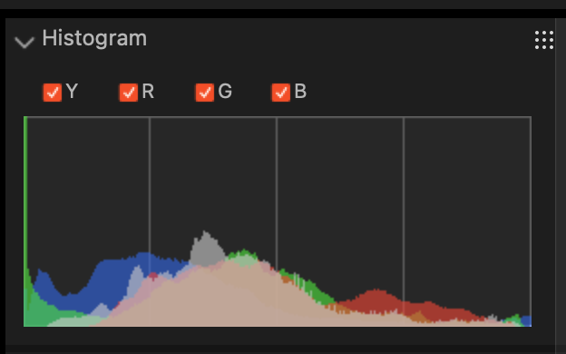
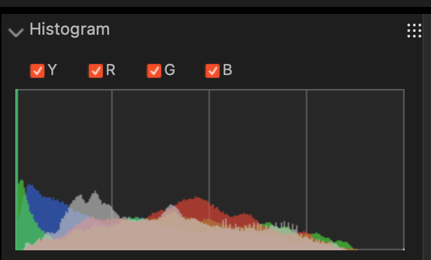
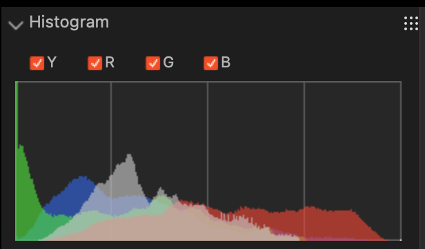
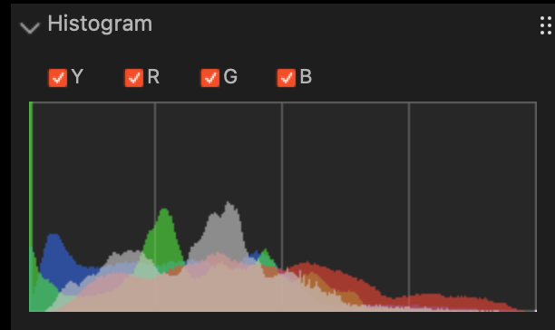
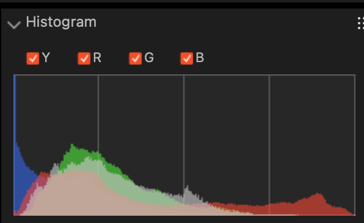

+++
date ="2025-12-27"
title = "最新カメラで赤飽和の問題はどうなったのか"
[extra]
og_image = "/blog/alpha7v-1/ogp.jpg"
+++

EOS 5D Mark IIを使っていて工夫が必要だったのが、赤色の被写体。元々、この時代の撮像素子はダイナミックレンジが狭く、普段から露出補正-1/3で撮るクセが付いていた。その中でも赤色の被写体は苦手で、真紅のバラなどは露出補正-2にしてギリギリ。補正しないと赤の部分が飽和してのっぺりした絵になってしまう。カメラが新しくなったら、この赤飽和がどうなったのかを検証しようと思っていた。今回はこれまでのクセを継承して-1/3evの露出補正にした。

{{ clickable_img(src="DSC00087.JPG", alt="赤飽和") }}

ヒストグラムを見ると、赤飽和は起きていない。大丈夫そう。

{{ clickable_img(src="DSC00092.JPG", alt="黄色") }}

こちらは普通の黄色。問題無し。

{{ clickable_img(src="DSC00093.JPG", alt="赤飽和") }}

こちらも問題無し。-1/3ev補正しているから、余裕すらある。

{{ clickable_img(src="DSC00094.JPG", alt="白") }}

白も大丈夫。

{{ clickable_img(src="DSC00095.JPG", alt="赤飽和") }}

こちらも大丈夫。これなんかは、5D mkIIだと強烈に飽和するケース。すごいね。

{{ clickable_img(src="DSC00097.JPG", alt="赤飽和") }}

ピンク。こちらは結構ギリギリまで来ていた。

{{ clickable_img(src="DSC00098.JPG", alt="赤飽和") }}

こちらもギリギリ。真紅なら大丈夫な感じなのだけど、他の明度の高い色が入ると、そのバランスで影響を受けるように見える。

{{ clickable_img(src="DSC00099.JPG", alt="赤飽和") }}

このオレンジが意外だった。絵的にはもう少し明るくしたい感じなのだがヒストグラム的には赤がギリギリまで来てしまっている。まぁ相当コントラストが高い絵なので、現像時にコントラストを少し下げて明度をプラスすれば補正できそう。

というわけでさすがに最新のカメラの場合は、ダイナミックレンジに余裕がありそう。後からPC上で柔軟に調整が可能なので、もう赤色の被写体に神経を使わなくて済みそうだ。
