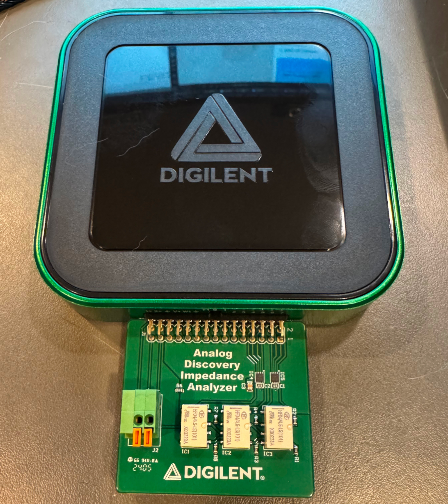
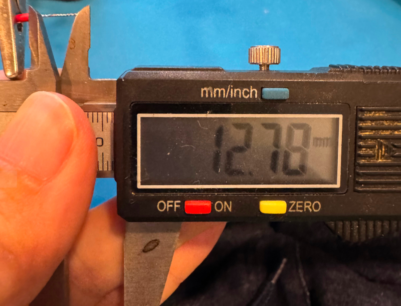
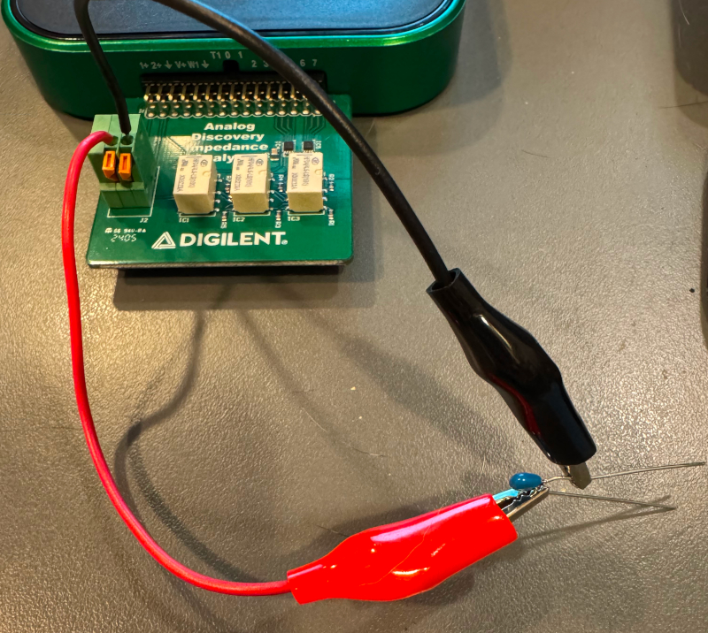
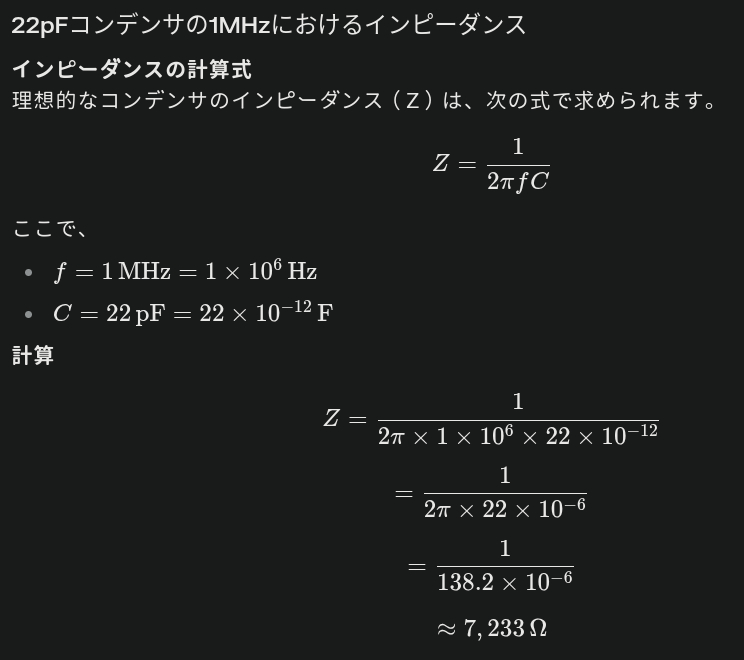
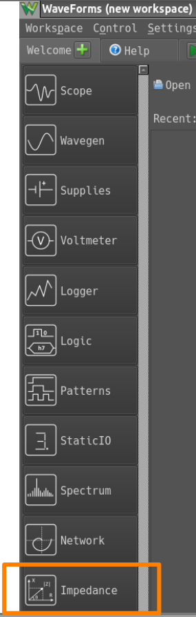
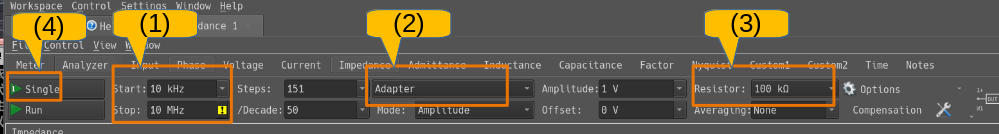
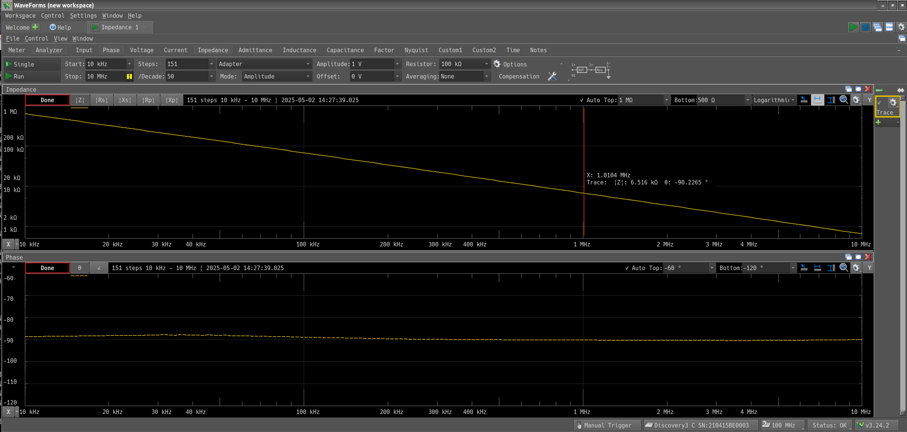
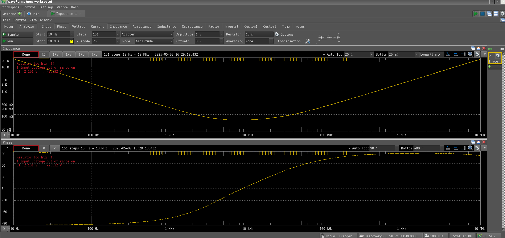

+++
date = "2025-05-02 02:00:00"
title = "Analog Discovery 3 - インピーダンスアナライザ"
[taxonomies]
tags = ["Analog Discovery 3"]
[extra]
og_image = "https://ruimo.github.io/ruimo-blog/blog/analogDiscovery3-impedance/impedanceAnalyzer.jpg"
+++

[Analog Discovery 3の基本的なセットアップはこちら](../analogDiscovery3-introduction)

次にインピーダンスアナライザを接続する。この向きで良いようだ。

左側にリード線を差し込む箇所があるが、かなり深いので1cm以上被覆を剥く必要があるので注意。

今回はミノ虫クリップを付けて、22pFの積層セラミックコンデンサをつないでみた。

1MHzの時に22pFのインピーダンスをPerplexityに計算してもらうと、7kΩくらい。

測定値と計算値が一致するか調べてみる。

## 測定

インストールしたWaveFormsを起動し、Impedanceメニューを選択。

測定条件の設定を行う。

- (1) 測定する周波数範囲
- (2) 今回は純正のインピーダンス測定ボードを使っているのでAdapterを選択
- (3) インピーダンス測定で使用する抵抗値。この抵抗は測定する対象に直列に接続される。今回は計算値が7kΩほどなので、十分に大きい100kΩを選択(不適切だと、測定時に赤文字で表示されるので、それに従えば良い)
- (4) Singleボタンを押すと測定が開始される。

グラフの上がインピーダンス。下が位相。グラフ上でダブルクリックすると、カーソル位置のX, Y軸が表示されるようになる。これを利用して1Mhzあたりのインピーダンスを見ると計算値とほぼ一致していることが分かる。さすがに積層セラミックコンデンサなので周波数特性は良好で、位相は測定周波数範囲で-90°になっている。

電解コンデンサならどうか。試しに手元にあった1000μFを測定。

1kHz以降から位相が-90°から離れていくことが分かる。

[Analog Discovery 3記事一覧](/tags/analog-discovery-3/)
