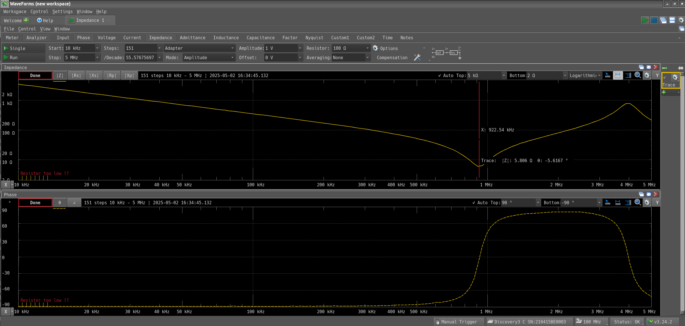
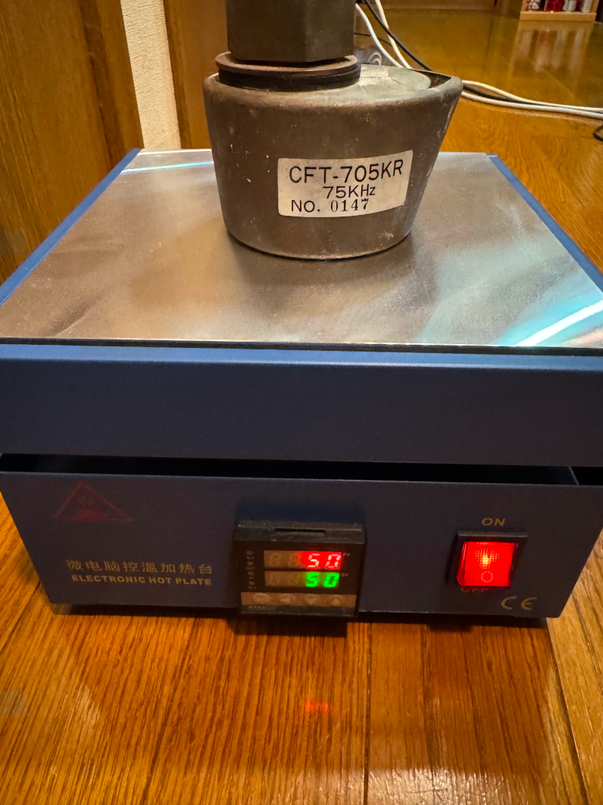
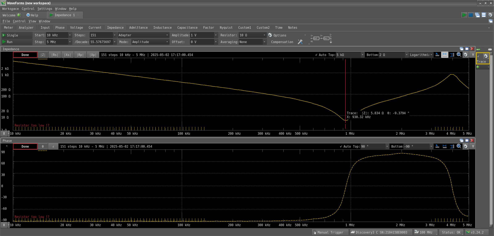

+++
date = "2025-05-02 03:00:00"
title = "超音波振動子の測定"
[taxonomies]
tags = ["Analog Discovery 3", "超音波洗浄器"]
+++

40年くらい前に秋月で買ったもの。確か魚群探知機から外したものという説明だった気がする。ずっと放置していたのだが、これを使って超音波洗浄器を作りたい。

<figure markdown="span">

<figcaption>超音波振動子</figcaption>
</figure markdown="span">

左は大きさ比較用のUSBコネクタ。結構大きい。Analog Discovery 3を手に入れたのでインピーダンスを測定してみた。

75kHzと書かれているので、このあたりでインピーダンスが最低になるのだろうと思っていたが、やはり測定器があるのはありがたい。900kHzあたりで最低になるようだ(室温25℃くらい)。多分温度がある程度上がると75kHzに近付いていくのだろうか。

仮定を確かめるため50℃に加熱してみる。

再度測定すると...

変わらない。もしかして壊れているのかな、ただ、筐体の内部の方にまで温度が伝わっていないのかもしれない。通電して内部の温度を上昇させて調べてみる必要がありそうだ。

[Analog Discovery 3記事一覧](/tags/analog-discovery-3/)

[超音波洗浄器記事一覧](/tags/chao-yin-bo-xi-jing-qi/)
