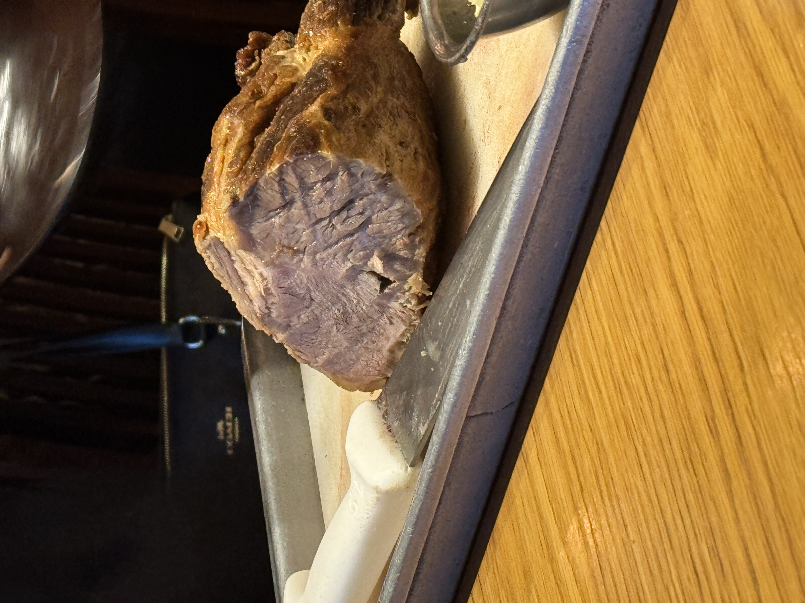
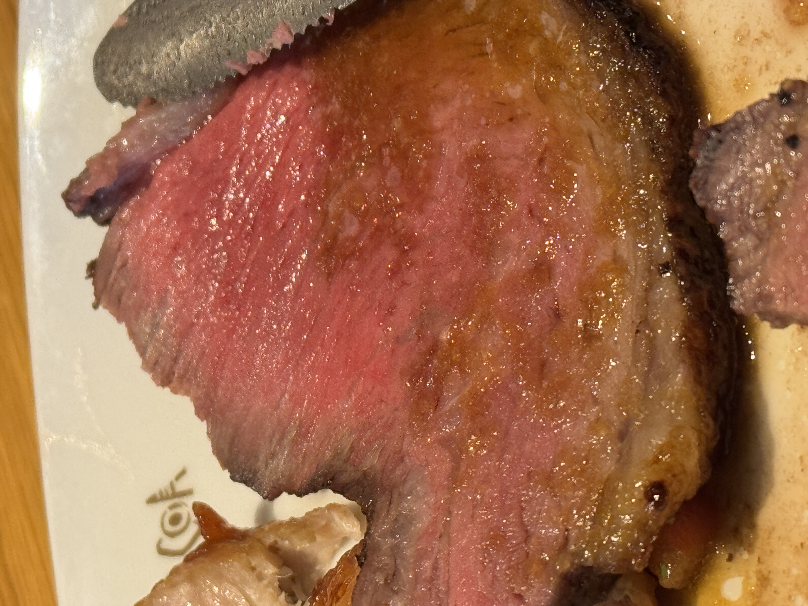
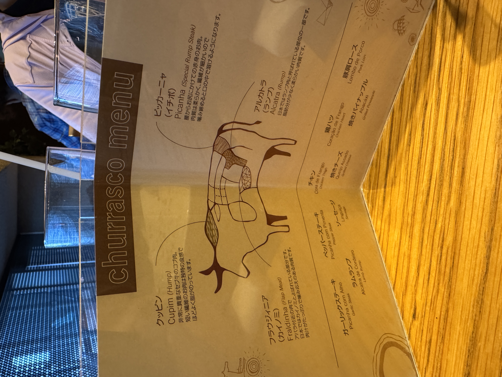

+++
date ="2025-10-10"
title = "ブラジル料理 バルバッコア"
[extra]
og_image = "/blog/barbacoa2025/ogp.JPG"
+++

[ブラジル料理 バルバッコア](https://www.facebook.com/barbacoatakanawa/)に行ってきた。シェフが肉を抱えながら、各テーブルを回りながら希望者に少しずつ切り分けてくれるという初めてのスタイルでなかなか良かった。

こんな感じの肉を持ってきてナイフで切ってくれる。

焼きパイナップルを肉に載せて食べるのが良い。個人的にはクッピンという部位が気に入った。1時間くらいで一通りの部位が届くので、気に入った部位を2週目で再度もらうと良いかも。

