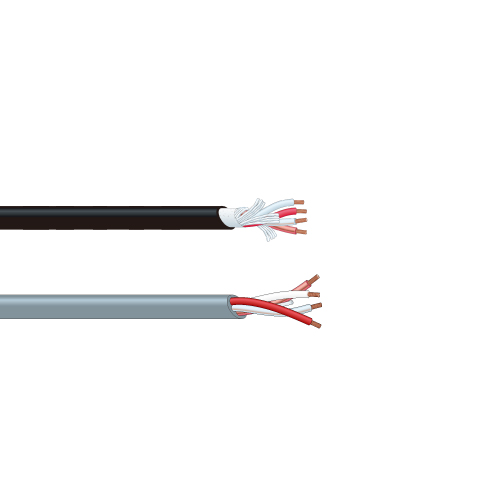

+++
date ="2026-2-28"
title = "カナレのスピーカーケーブル"
[extra]
og_image = "/blog/canare/008_001.jpg"
+++

スピーカーを新調したので、ケーブルを交換してみた。最初はメルカリで10mで1000円のOFCの安いのを買ってみたものの、テスターで測ると直流抵抗が1Ω近くあり、ちょっとこれはダメだねということで、色々調べる。

[カナレの4芯ケーブル](https://www.canare.co.jp/products/cables/index.php?tid=pr4_008)が良さそう。どうやら業務用のようだ。共立エレショップで4S8まではあったが、4S11が欲しい。ヤフオクで売っていたので10m購入。5k円ほどだった。

届いてみると太くて良いね。テスターで測ると0.09Ω。上記のカナレのページでは0.9Ω/100mなので計算通りではあるが、テスタ棒をショートしてもこのあたりの数値にあるので、テスターの測定限界を超えている。4芯なのでバイワイヤ接続する。

低音の厚みが増したように感じるが、まぁ正直二重盲検しないとあてにはならない。
