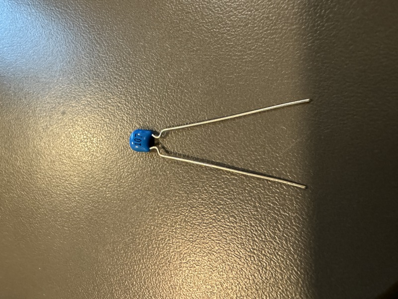
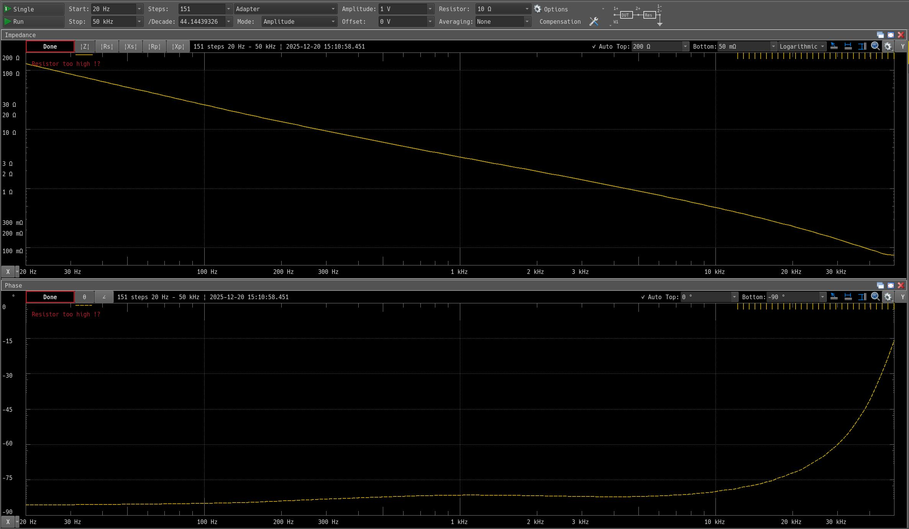
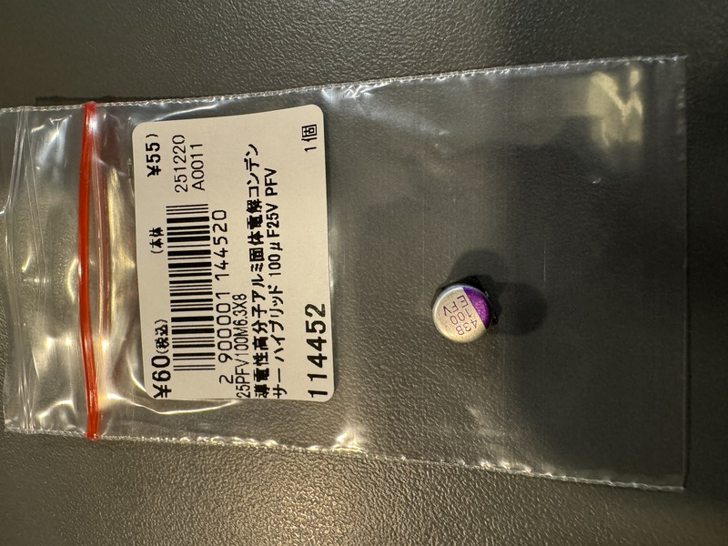
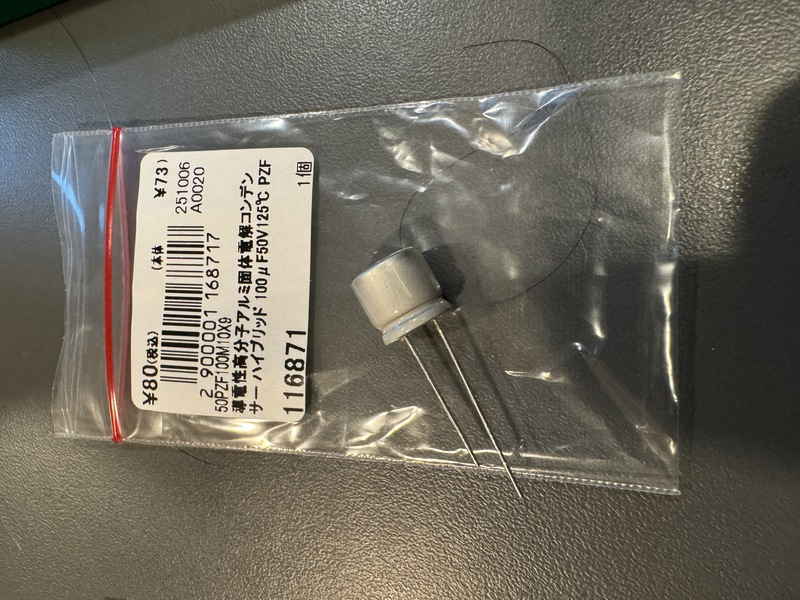
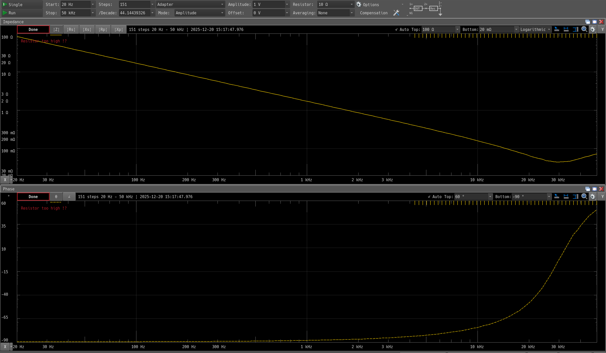

+++
date ="2025-12-20"
title = "大容量コンデンサの周波数特性"
[extra]
og_image = "/blog/capaciter/Ceramics.jpg"
+++

最近はほとんど積層セラミックコンデンサーしか使わないのだけど、冬休みには電子ボリュームで遊んでみようかなと画策しており、こうしたアナログ回路では耐圧高めの大容量のコンデンサーが必要となるので、電解コンデンサに頼らざるを得ない。実際のところ周波数特性はどの程度違うのかを測定してみた(負荷は10Ωで計測している)。

最初は積層セラミックコンデンサ。100μFだと秋月では耐圧6.3Vのものしかなく、オペアンプ回路だと耐圧不足。

さすがに周波数特性は良好だが、低周波域から位相が-90°から少し離れている。容量を稼ぐために集積度が上がってインダクター成分が混ざるのだろうか。10kHzを越えたあたりから特性が悪化していくことが分かる。

お次は表面実装用の導電性高分子アルミ固体コンデンサー。

意外なことに、かなり周波数特性は良い。低周波域ではちゃんと位相が-90°でスタートしている。10kHzあたりまで来るとかなり位相がずれていることが分かる。

最後は普通のリード付きの導電性高分子アルミ固体コンデンサー。ただしこちらは耐圧が50V(秋月では同じ耐圧のものが見つからなかった)。

面白いことにこちらの方が表面実装用のものより周波数特性は良い(単なる誤差かもしれない)。

というわけで、このあたりの容量になると導電性高分子アルミ固体コンデンサーも良い勝負をするなという感想。
