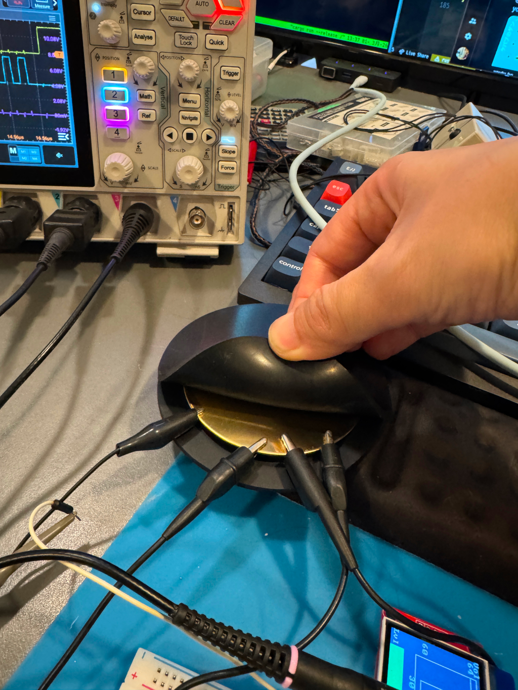

+++
date ="2026-3-1"
title = "共通グランド板"
[taxonomies]
tags = ["DIY"]
[extra]
og_image = "/blog/commonground/IMG_3176.JPG"
+++

試作回路の測定で微妙にストレスなのが測定器類のグラウンド。オシロやテスターなどのグランドのミノ虫クリップが大量にあり、これらをお互いに噛み合わせてお茶を濁すのだが、むき出しでショートの危険もあり、不安定で知らない間に外れていたりする。

前々から、こういう時のための治具があるのではないかと思って、探していたのだが、どうにも見つからない。それなら自分で作れば良かろうということで作ってみた。

10cm径のゴム板で8cm径の真鍮の板をサンドイッチ。中心を接着剤で留めただけ。

使ってみるとすこぶる調子が良い。ただちょっと大き過ぎたかも。この半分のサイズで十分かな。
