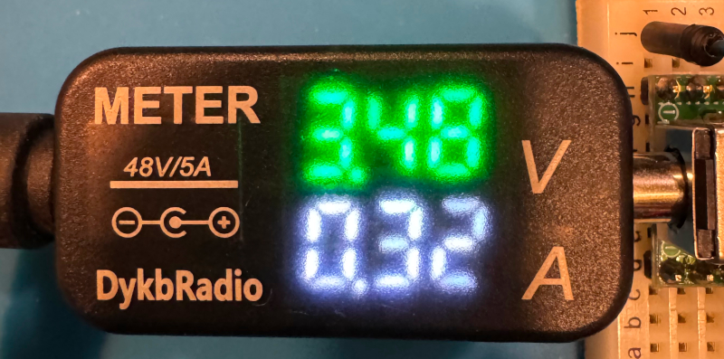
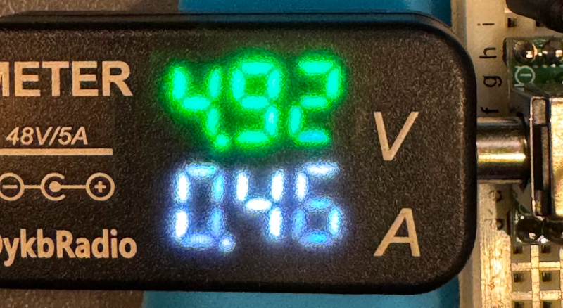

+++
date ="2025-6-8"
title = "3Vから測定可能なDCジャック電圧電流計"
[extra]
og_image = "/ruimo-blog/blog/dcjackva/3_3.jpg"
+++

DCジャックに対応した電圧電流計。前から気になっていたのだが、当時は最低電圧が4Vだったので二の足を踏んでいた(やはり3.3Vから測れて欲しいよねぇ)。

AliExpressに[3Vから測定可能なもの](https://ja.aliexpress.com/item/1005009056022311.html)があったので買ってみた。10Ωの抵抗をつないで測定してみた。

3.3Vで測定

5Vで測定

iPhoneの写真は、数値がぼやけて見辛い感じに写っているけど、実際の表示は特に支障はない。大丈夫そう。
