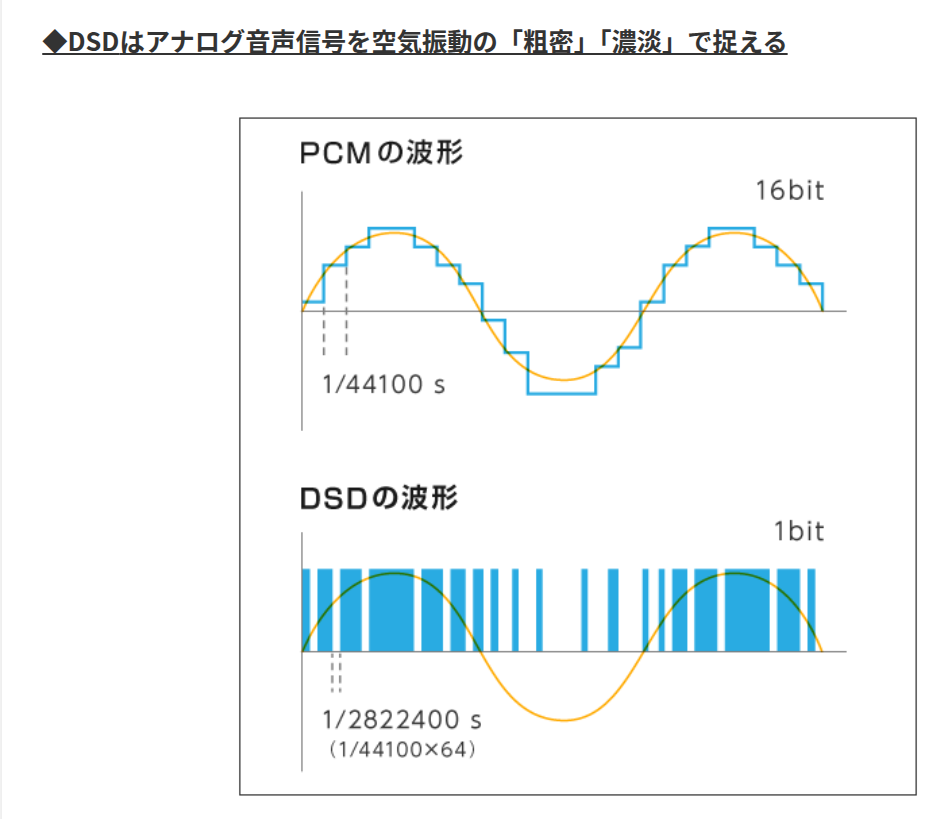
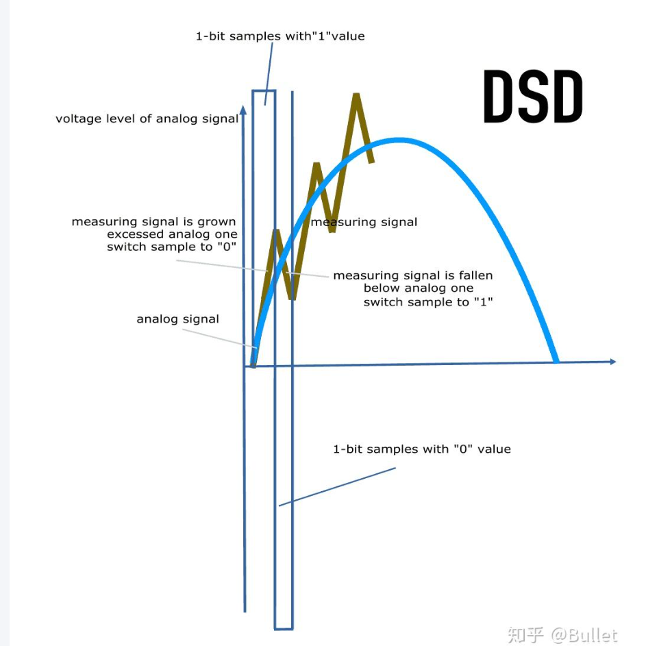

+++
date ="2026-5-24"
title = "DSDで録音された曲に空気感があるとはどういうことなのか"
[extra]
og_image = "/blog/dsd/dsd-logo.png"
+++

DSD方式というものは聞いた事はあった。


[検索エンジンで探すと、ここ](https://mora.jp/topics/osusume/whats-dsd/)に原理が書かれている。ただ、この図を見てもなんか良く分からなかった。



[中国語になるけど、ここ](https://zhuanlan.zhihu.com/p/217733414)の図が分かりやすい。



高い周波数で、1と0を切り替えて、それをフィルターで滑らかにすることで原波形を再現するということらしい。

このDSD方式について検索すると「空気感がある」とか「やわらかい」とか「レコードのよう」みたいな感想で溢れている。正直、そこまで変わるものかねという疑問があったので、DSD形式の音楽を購入してみた。最近は[qobuz](https://www.qobuz.com/jp-ja/shop)を良く使う。残念ながらqobuzではDSD形式の作品は試聴できるものが非常に少ないが、ようやく見つけたのが[Saint-Saëns, Guilmant & Others: Orchestral Works](https://www.qobuz.com/jp-ja/album/saint-saens-guilmant-others-orchestral-works-yannick-nezet-seguin-philippe-belanger-and-orchestre-metropolitain/w1gysvllfhhpa)。パイプオルガンなら「空気感」を見るのに良さそうだ。

```
-rw-r--r-- 1 shanai shanai 1.7G May 23 08:07 '01 Symphony No. 3 in C Minor, Op. 7.dsf'
-rw-r--r-- 1 shanai shanai 1.7G May 23 08:07 '02 Symphony No. 3 in C Minor, Op. 7.dsf'
-rw-r--r-- 1 shanai shanai 1.2G May 23 08:07 '03 Symphony No. 3 in C Minor, Op. 7.dsf'
-rw-r--r-- 1 shanai shanai 1.3G May 23 08:07 '04 Symphony No. 3 in C Minor, Op. 7.dsf'
-rw-r--r-- 1 shanai shanai 1.2G May 23 08:07 '05 Pièces dans différents styles, B.dsf'
-rw-r--r-- 1 shanai shanai 1.2G May 23 08:07 '06 24 Pièces de fantaisie Suite No.dsf'
-rw-r--r-- 1 shanai shanai 1.6G May 23 08:07 '07 Organ Symphony No. 6 in G Minor,.dsf'
```

サイズがやばいですな。PCMのものとは1桁違う感じ。さて、DSDを聴く環境だが、今回はDSD対応のDACを使用。

<a href="https://amzn.to/4dx9T2Q">

S.M.S.L DS100
</a>

たまたま今はMacにつないでいたので、[Pine Player](https://www.pine-player.com)というのを入れて聴いてみた。

オーディオ関係の感想はだいたい大袈裟に書かれているものが多い。当初予想ではヘッドホンでじっくり聴き込まないと分かないようなものだと思っていた。しかしなるほど聴いた瞬間「空気感」と表現されていたやつが分かった。旧来の録音とは明確に異なる。

と同時にカラクリが分かってしまった。これ、DSD方式とかPCM方式の違いから来ているんじゃないよ。断言できる。

今時のPCM方式の録音というのは、多かれ少なかれ派手な加工がされている。ちょっと聴いた感じの「解像感」を増やす加工がされているのだ。あまり性能の良くない、解像度の低いオーディオセットで聴くと、うまい具合に打ち消し合っていい感じに聴こえるようになる仕掛けだ。しかし逆にそれなりの性能のオーディオセットやヘッドホンで聴くと耳が痛くなるようなキンキンした響きになる。写真でいえばアンシャープネスマスクをかけ過ぎたガサガサな写真のような感じ。しかしDSDだと原理的に、こうした加工をやりにくいのだろう。なのでマイクから拾った原音が収録されている。これが「空気感」とか「やわらかい」の正体だ。最近の派手な加工で失なわれていた情報が蘇がえってくる。また「レコードのよう」も納得。レコードの時代はこの手の加工はしてなかったから。

もっともPCM録音して加工してからDSD化しているケースもあるらしいので、買う前に試聴してみるのは必須だろう。

さて、一応検証もしておく。つまりDSD方式の音源をPCM方式に変換したら「空気感」とか「やわらかい」という印象が消えてしまうのかを見れば良い。DSDからPCMに変換するツールは[dsd2dxd](https://github.com/clone206/dsd2dxd)というのを見つけた。バイナリは配布されていないみたいなのでビルドする。

```bash
git clone https://github.com/clone206/dsd2dxd
cd dsd2dxd
git submodule update --init --recursive
cargo build --release
```

変換は、こんな感じ。今回は24bit/96kHzのWAVに変換した。

```bash
dsd2dxd -r 96000 -i 4 -b 24 -o W -p out 01.dsf
flac -8 01.wav
```

なんとサイズは、1/10以下になった。

```
-rw-rw-r-- 1 shanai shanai 146M May 24 08:43 01.flac
-rw-rw-r-- 1 shanai shanai 151M May 24 08:08 02.flac
-rw-rw-r-- 1 shanai shanai 104M May 24 08:08 03.flac
-rw-rw-r-- 1 shanai shanai 118M May 24 08:08 04.flac
```

聴いてみると、若干音量が変わってしまうので比較が難しいがPCM形式にしても「やわらかい」ままだった。DSD形式の方が低音の厚みがある気がするが「気のせいじゃない？」と言われると、そうかもと思うくらいの微妙な違い(そもそもDSDとPCMで高音域ならともかく低音域が違いが出るとは原理的に思えないのでやはり気のせいだろう)。なのでうちではDSDで買って、flacに変換して聴くことにした。

qobuzはDSDだと試聴できるものが少ないのが難点だが、他にもDSD対応のサイトはあるようだ。[NativeDSD](https://www.nativedsd.com)は、元の録音形式が書かれているし、試聴も曲の最初から出来て良い。少々高価なのが難点だがこれは円安が悪い。


そもそもレコードの時代は、音質の「加工」は自分でラウドネスかけるなりトーンコントロールするなり末端でやっていたのだ。DSDの流行と共に余計なお節介である加工処理が廃れることを望みたい。
