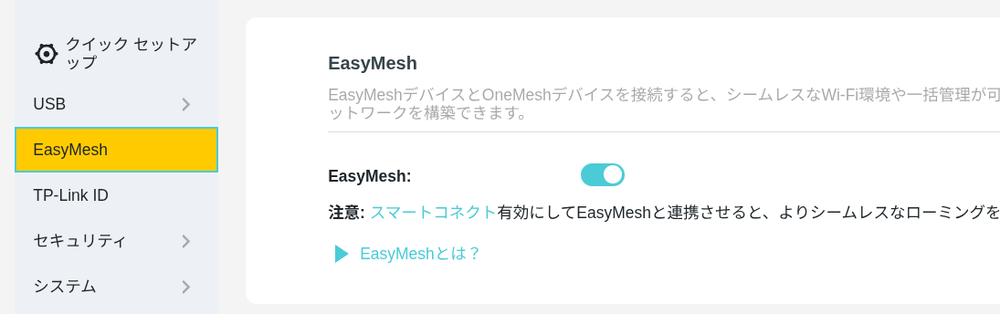
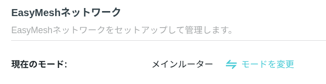

+++
date ="2025-10-25"
title = "TP-LINKのBE7200とBE3600でEasyMeshを組んでみる"
[taxonomies]
[extra]
og_image = "/blog/easymesh/ogp.jpg"
+++

うちはNuroの10Gbpsプランなので、ルータはNuroの貸出機(Sony NSD-G3000T)しか使えない。このルータがいまいちなので(接続台数が増えると、謎のハングなど動作が不安定になる)、[TP-LINKのBE7200](https://amzn.to/475AGBy)をアクセスポイントモードで使用していた。

BE7200の設置場所は3Fなのだが、2Fの反対側の方では電波が弱いようなのでEasyMeshで拡張できないか試してみた。

TP-LINKのEasyMeshについては、[公式FAQ](https://www.tp-link.com/jp/support/faq/3529/)にアクセスポイントモードでは利用できないと記載されているため、あきらめていたのだが、[価格.comの書き込み](https://bbs.kakaku.com/bbs/K0001663226/SortID=26234883/)で使えたという報告もあり、多分最新のファームウェアではこの制限が無くなったのではないかと予想される(FAQの方は更新忘れなのだろう)。BE7200のWeb管理画面を見ると、アクセスポイントモードでもEasyMeshの設定があるのが分かる。

これならうまく行く可能性が高そうだなということで、Wifi7対応で最安の[BE3600](https://amzn.to/3L2NYGt)を購入。

BE3600は10GbpsのLANが無いのだがEasyMeshのサテライトとして使うなら関係ない。

設定はちょっと分かりにくい。

- まずLANケーブルでBE3600を接続しておく(これは設定のために必要なだけで、設定が終われば外して良い)。
- BE3600の電源を入れる。
- スマホにTP-LINKのTetherアプリをインストールしていない場合はインストール。
- スマホのWiFiをBE3600の初期設定のSSIDに設定。
- Tetherアプリで、BE3600につなぐ。
- 初期設定の画面になるが、スルーしてBE3600のIPアドレスを確認。
- PCのブラウザでIPアドレスを入力して管理画面に接続。
- ファームウェアを最新に上げておく。

PCのブラウザで開いた管理画面でここのEasyMeshのモードをサテライトに変更する。

もうBE3600のLANケーブルは外して良い。メインルータであるBE7200の管理画面を開いてEasyMeshにBE3600を追加してやる。

あとはBE3600を好きな場所に配置してやれば良い。このスクショだと、BE3600経由でつながっているクライアントが5台あるようだ。

なお公式FAQではアクセスポイントモードではEasyMeshできないと記載されているため、将来のファームウェアでは使えなくなる可能性もゼロではないので、自己責任でどうぞ。