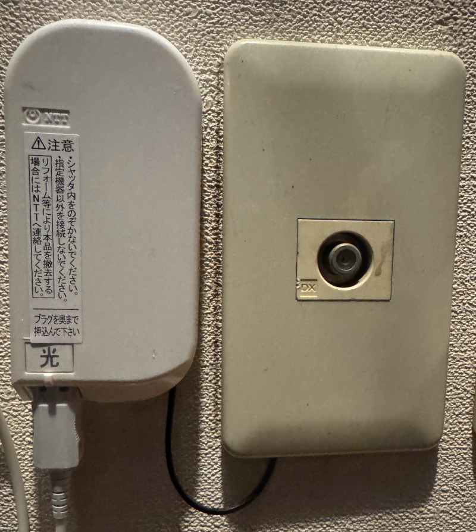

+++
date ="2025-12-06"
title = "Nuroからen光"
[taxonomies]
tags = []
[extra]
og_image = "/blog/en/IMG_2937.JPG"
+++

2年ほど前からNuro 10Gを使っていたのだが、最近不安定になってきた。NuroではNSD-G3000TというSonyのルータがレンタルされるのだが当初から数か月に1回くらいの頻度でハングする事があった。まぁ電源off/onで復旧するのでだましだまし使っていたのだが、ここ2-3か月くらい前から1週間に1度くらいハングするようになってしまった。

Nuroのサポートに相談したところMAP-Eに変更することで改善するかもしれないので、作業させてくれとのことで、進めてもらった。ところが今度は1日に何度もハングするようになってしまった。ここからサポートは梨の礫で全く応答が無くなってしまった。とりあえずラズパイで、8.8.8.8にpingを定期的に飛ばし不通ならルータの電源をoff/onする機器を作ってしのぎつつ、他のプロバイダを探すことに。

色々見たところ、en光というのが良さそうなので。申し込んでみた。

Nuro開通の時は光ファイバーの施工でエアコンの排水ダクトを使って良いか聞かれ、良く分からず承諾したら、その後エアコン交換の時に作業員にゴネられたことがある。エアコン業者は光ファイバの扱いなんて知らないので、何かあっても責任持てないとのことで、もっともだなと納得。今回はエアコンの排水ダクトは使わないでねとNTTの人に念を押しておいたところ、テレビのアンテナ線のところに通してくれた。

Nuroは解約を申し込んだところ、ルーターの回収で配達業者が来るので、渡してくれとのこと。え、それだけ？ 光ファイバー撤去しないの？ 適当しませんかね..

en光はここ数日使った感じでは、ハングもせず快調だ(そりゃそうだ)。スピードはfast.comで7Gbpsくらい出ているのでNuroと遜色無い。
