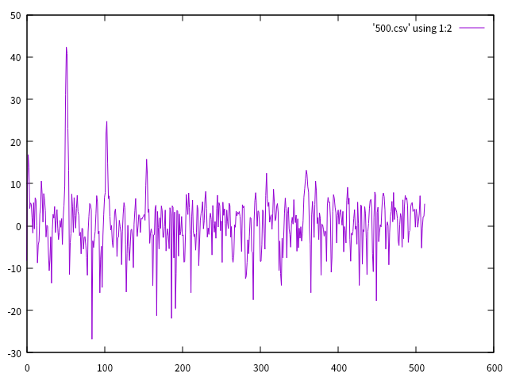
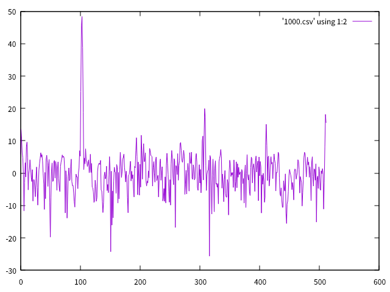
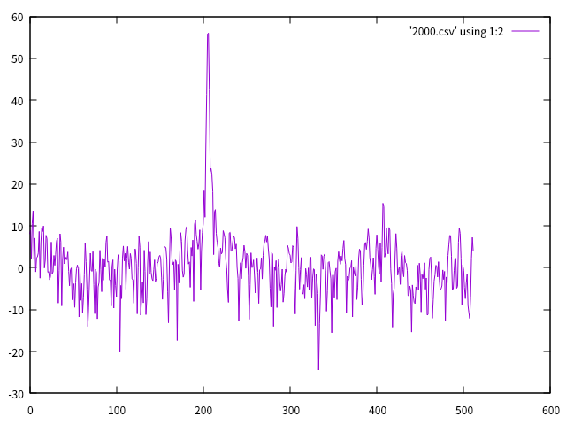

+++
date = "2025-05-31"
image = "https://ruimo.github.io/ruimo-blog/blog/esp32-fft/500.png"
title = "ESP32で音声を記録して、FFTする"
+++

うちにある石油ファンヒータ、2時間くらい経つとブザーが鳴って自動で消火する機能が付いている。消し忘れ防止のようだが、イヤホンなど付けていると気付かないことが多い。そこでブザーが鳴っていたら、それを検出する機器を作りたい。

ESP32にマイクを接続して音声を記録して周波数成分を分析してみる。

## マイク

以前使用した秋月のシリコンマイクが良かったので、今回も使用。

20dBのアンプが内蔵されているので扱い易い。基板裏の半田ブリッジに半田を盛ってショートしておく。

## ESP32のADC

ADCがあるので、試してみる。GPIO32がアナログ入力に使える。

    #include <Arduino.h>
    
    void setup() {
      Serial.begin(115200);
      pinMode(32, ANALOG);
    }
    
    void loop() {
      Serial.println(analogRead(32));
      delay(300);
    }

12bit出力なのだが、可変抵抗を接続して0から4095になる範囲を見ると、

| 最低電圧 | 最高電圧 |
|---|---|
| 0.12V | 3.18V |

マイクの出力範囲はオシロで見る限りこの範囲に入っているようなので、大丈夫そうだ。

## ESP32でFFT

Espressif社が、esp-dspというデジタル信号処理用のライブラリを提供してくれているので、これを使うのうが良さそう。ここに[サンプル](https://github.com/espressif/esp-dsp/tree/eedf2a50811195224f07f941250a99bf1368d69e/examples/fft)がある。これを見ながら自分用のを作成。サンプリング周波数は10kHzにし、サンプル数は1024にした。

マイク信号はDCバイアスがかかっているので、平均値を減算している。

    #include <stdio.h>
    #include <stdlib.h>
    #include <string.h>
    #include "freertos/FreeRTOS.h"
    #include "freertos/task.h"
    #include "esp_system.h"
    #include "driver/spi_master.h"
    #include "soc/gpio_struct.h"
    #include "driver/gpio.h"
    #include "driver/uart.h"
    #include "soc/uart_struct.h"
    #include <math.h>
    
    #include "esp_dsp.h"
    
    #define SAMPLING_FREQUENCY 10000
    unsigned int sampling_period_us = 1000L * 1000L / SAMPLING_FREQUENCY;
    
    #define N_SAMPLES 1024
    int N = N_SAMPLES;
    // Input test array
    __attribute__((aligned(16)))
    float x1[N_SAMPLES];
    // Window coefficients
    __attribute__((aligned(16)))
    float wind[N_SAMPLES];
    // working complex array
    __attribute__((aligned(16)))
    float y_cf[N_SAMPLES * 2];
    
    void setup() {
      pinMode(32, ANALOG);
      Serial.begin(115200);
    }
    
    void loop() {
      esp_err_t ret = dsps_fft2r_init_fc32(NULL, CONFIG_DSP_MAX_FFT_SIZE);
      if (ret != ESP_OK) {
        Serial.printf("Not possible to initialize FFT. Error = %i", ret);
        return;
      }
    
      dsps_wind_hann_f32(wind, N); // Generate hann window
      //  dsps_tone_gen_f32(x1, N, 1.0, 0.16, 0); // Generate input signal: A=1.0, F=0.16
    
      float ave = 0;
      for (int i = 0; i < N; ++i) {
        unsigned long t = micros();
        int a = analogRead(32);
        while ((micros() - t) < sampling_period_us) ;
        x1[i] = a;
        ave += a;
      }
    
      ave /= N;
      Serial.println("Input:");
      for (int i = 0; i < N; ++i) {
        x1[i] = x1[i] - ave;
        Serial.printf("%d, %f\r\n", i, x1[i]);
      }
    
      // Apply window and convert to complex format
      for (int i = 0 ; i < N ; i++) {
        y_cf[i * 2 + 0] = x1[i] * wind[i];  // 実部
        y_cf[i * 2 + 1] = 0.0;              // 虚部は0
      }
    
      dsps_fft2r_fc32(y_cf, N); // FFT
      dsps_bit_rev_fc32(y_cf, N); // Bit reverse
    
      Serial.println("Output:");
      // Calculate power spectrum
      for (int i = 0 ; i < N / 2 ; i++) {
        float real = y_cf[i * 2 + 0];
        float imag = y_cf[i * 2 + 1];
        float power = (real * real + imag * imag) / N;
        y_cf[i] = 10 * log10f(power);  // dB変換
        Serial.printf("%d, %f\r\n", i, y_cf[i]);
      }
    
      // Show power spectrum
      dsps_view(y_cf, N / 2, 64, 10, -60, 40, '|');
      
      while (true) delay(1000);
    }

iPhone用の[Tone Generator](https://apps.apple.com/om/app/tone-generator-audio-sound-hz/id1206449238)というアプリがあったので、これで500, 1000, 2000Hzを出力した状態で実行。結果はシリアルに出力されるのでgnuplotでグラフにしてみた。

500Hzの場合 

1000Hzの場合 

2000Hzの場合 

500Hzの場合は結構倍音が出ているようだが、ちゃんと周波数成分が抽出できているようだ。実際の石油ファンヒータのブザー音は冬までおあずけ。
