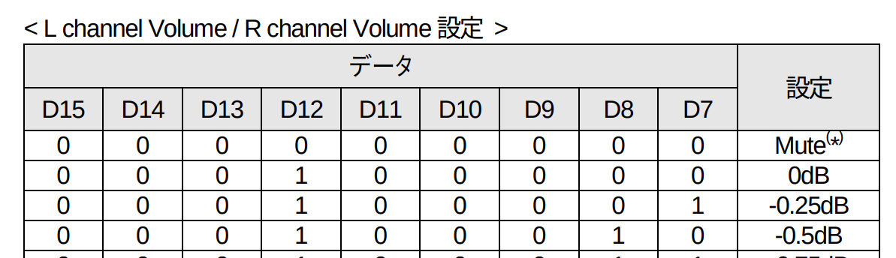
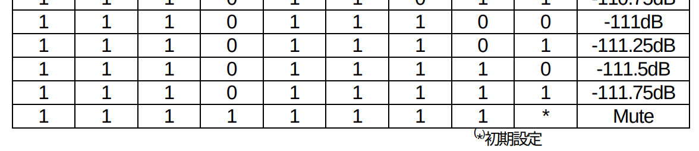
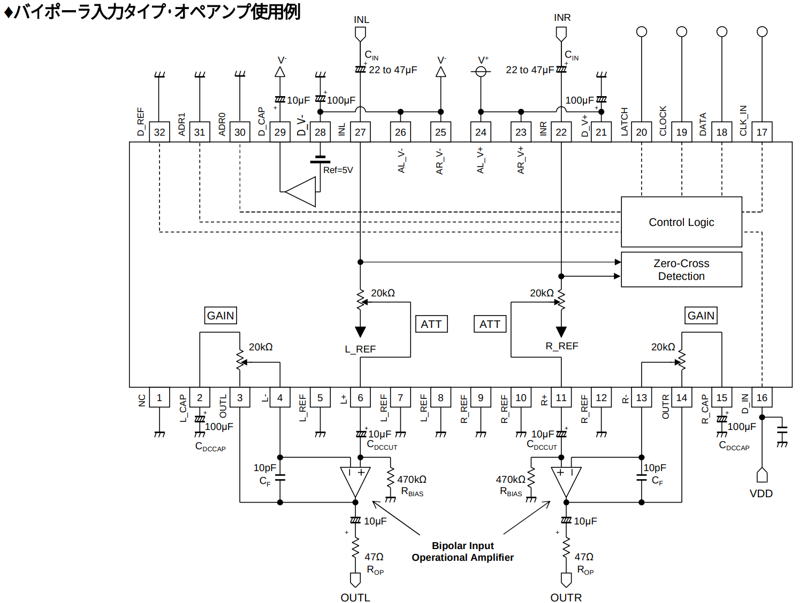

+++
date ="2025-12-31"
title = "MUSES72323のESP32による制御(コマンド送信編)"
[extra]
og_image = "/blog/esp32-muses72323/ogp.jpg"
+++

[前回、SPI通信ができたので](https://www.ruimo.com/blog/esp32-spi/)、今回はそれを使って実際にMUSES72323を制御してみる。

[MUSES72323データシート](https://akizukidenshi.com/goodsaffix/MUSES72323.pdf)に掲載されているコマンドは、どれも16bit長のもので、これをSPIで送れば良い。このコマンドをRustで簡単に生成できるように[crateを作ってみた](https://crates.io/crates/muses72323)。

このcrateを使って、ボリュームを3段階に変化させるサンプルを作ってみる。

セットアップは以前の[これ](https://www.ruimo.com/diy/micro-controller/esp32/rust/)で、dependencyに上記のcrateと、anyhowを追加する。

```toml
[dependencies]
log = "0.4"
esp-idf-svc = "0.51"
muses72323 = "0"
anyhow = "1"
```

main.rsはこんな感じ。

```rust
use esp_idf_svc::hal::delay::FreeRtos;
use esp_idf_svc::hal::gpio::AnyInputPin;
use esp_idf_svc::hal::peripherals::Peripherals;
use esp_idf_svc::hal::spi::*;
use esp_idf_svc::hal::units::*;
use log::info;
use muses72323::commands::Channel;
use muses72323::commands::ClockDiv;
use muses72323::commands::Gain;
use muses72323::commands::SetGain;
use muses72323::commands::SetVolume;
use muses72323::commands::SoftClock;
use muses72323::commands::ZeroWindowVolt;

fn main() -> anyhow::Result<()> {
    esp_idf_svc::sys::link_patches();
    esp_idf_svc::log::EspLogger::initialize_default();

    let peripherals = Peripherals::take()?;
    let spi = peripherals.spi2;

    let sclk = peripherals.pins.gpio15;
    let sdo = peripherals.pins.gpio2;
    let latch = peripherals.pins.gpio18;

    let driver = SpiDriver::new::<SPI2>(
        spi,
        sclk,
        sdo,
        Option::<AnyInputPin>::None,
        &SpiDriverConfig::new(),
    )?;

    let cfg = config::Config::new().baudrate(1.MHz().into());
    let mut dev = SpiDeviceDriver::new(&driver, Some(latch), &cfg)?;
    
    let clock_cmd: [u8; 2] = Into::<u16>::into(
        SoftClock::new()
            .with_chip_addr(0b00)
            .with_internal_clock(true)
            .with_clock_div(ClockDiv::Div1)
            .with_zero_window_volt(ZeroWindowVolt::Mul1)
    ).to_be_bytes();
    info!("Write command {:#04X?}", clock_cmd);
    dev.write(&clock_cmd)?;

    let gain_cmd: [u8; 2] = Into::<u16>::into(
        SetGain::new()
        .with_chip_addr(0b00)
        .with_l_gain(Gain::Gain0)
        .with_r_gain(Gain::Gain0)
        .with_l_r_cont(true)
        .with_zero_cross_off(false)
    ).to_be_bytes();
    info!("Write command {:#04X?}", gain_cmd);
    dev.write(&gain_cmd)?;

    loop {
        for v in [0b000100000, 0b001000000, 0b001100000] {
            let volume_cmd: [u8; 2] = Into::<u16>::into(
                SetVolume::new()
                .with_chip_addr(0b00)
                .with_channel(Channel::LorBoth)
                .with_is_soft_step(true)
                .with_volume(v)
            ).to_be_bytes();
            info!("Write command Volume: {}, {:#04X?}", v, volume_cmd);
            dev.write(&volume_cmd)?;

            FreeRtos::delay_ms(5000);
        }
    }

   panic!("Should not come here!");
}
```

注意は、コマンドの中のボリュームのところは9bit分あるものの、全値域が使えるわけではく、0dBは、32(=0b000100000)から始まって、



一番絞ったところが、0b111011111であること。



回路は、データシートに掲載されているものそのまま。OPアンプにNL8802を使用しているので、バイポーラ入力タイプの方を使用した。外部クロックは使用しないので17ピンは使用せず。18-20ピン(とGND)をESP32とつないでやれば良い。



入力はオシレータから1 kHz Vpp 1Vのサイン波を入力した。


動画を撮ってみた。

<iframe width="560" height="315" src="https://www.youtube.com/embed/DkIf4efWNCo?si=BWkBdE8mi7yjj_p8" title="YouTube video player" frameborder="0" allow="accelerometer; autoplay; clipboard-write; encrypted-media; gyroscope; picture-in-picture; web-share" referrerpolicy="strict-origin-when-cross-origin" allowfullscreen></iframe>

両チャネルとも動作が確認できたので、昨日の半田付けは成功のようだ。
