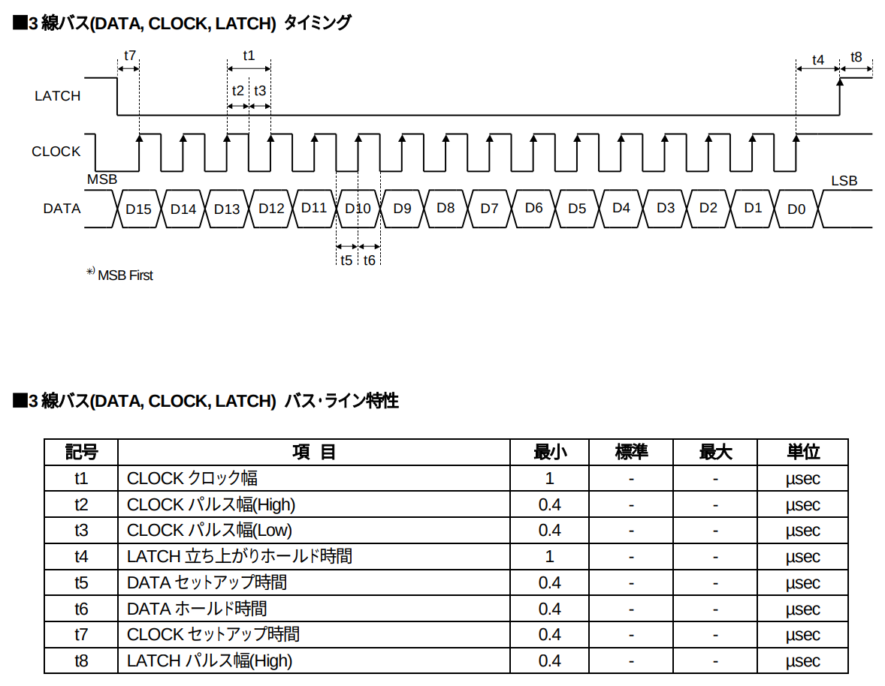
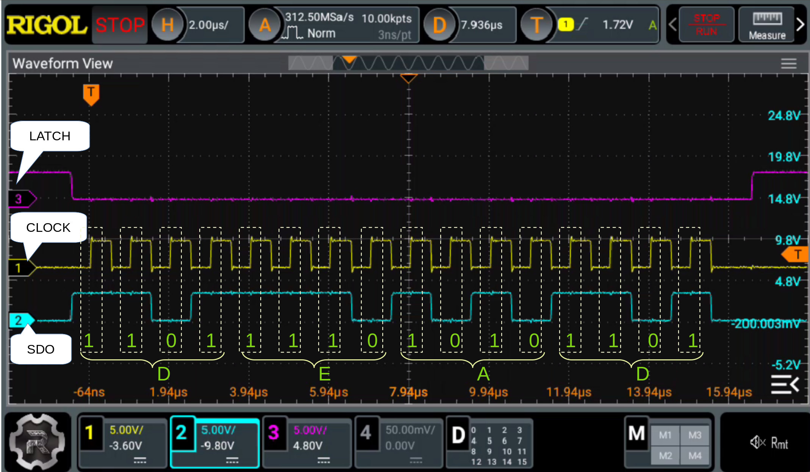

+++
date ="2025-12-30"
title = "MUSES72323のESP32による制御(シリアルデータ転送編)"
[extra]
og_image = "/blog/esp32-spi/ogp.jpg"
+++

まずはMUSES72323を制御するためのデータ転送を実装してみる。今回もWROVERを使う。

[MUSES72323データシート](https://akizukidenshi.com/goodsaffix/MUSES72323.pdf)のデータ転送のところを確認する。



特に何も書かれていないけど、SPIだよね、これ。1μsecなので、クロックは1MHz。

[esp-idf-halのサンプルにSPIのサンプル](https://github.com/esp-rs/esp-idf-hal/blob/master/examples/spi_loopback.rs)があったので、これを元に作成。

```rust
use esp_idf_svc::hal::delay::FreeRtos;
use esp_idf_svc::hal::gpio::AnyInputPin;
use esp_idf_svc::hal::peripherals::Peripherals;
use esp_idf_svc::hal::spi::*;
use esp_idf_svc::hal::units::*;

fn main() -> anyhow::Result<()>{
    esp_idf_svc::sys::link_patches();
    esp_idf_svc::log::EspLogger::initialize_default();

    let peripherals = Peripherals::take()?;
    let spi = peripherals.spi2;

    let sclk = peripherals.pins.gpio15;
    let sdo = peripherals.pins.gpio2;
    let latch = peripherals.pins.gpio18;

    let driver = SpiDriver::new::<SPI2>(
        spi,
        sclk,
        sdo,
        Option::<AnyInputPin>::None,
        &SpiDriverConfig::new(),
    )?;

    let cfg = config::Config::new().baudrate(1.MHz().into());
    let mut dev = SpiDeviceDriver::new(&driver, Some(latch), &cfg)?;
    let write = [0xde, 0xad];

    loop {
        FreeRtos::delay_ms(500);
        dev.write(&write)?;
   }
   panic!("Should not come here!");
}
```

データ長は16bitなので、0xdeadを送信し続けるサンプル(元のサンプルがDEADBEAFだった..)。
ソース全体は[こちら](https://github.com/ruimo/esp32-spi)

これを実行しながらオシロで信号を見てみる。



規格通りの信号が出ているようだ。
