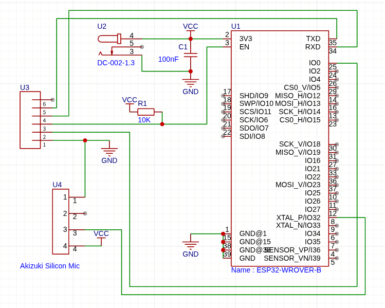
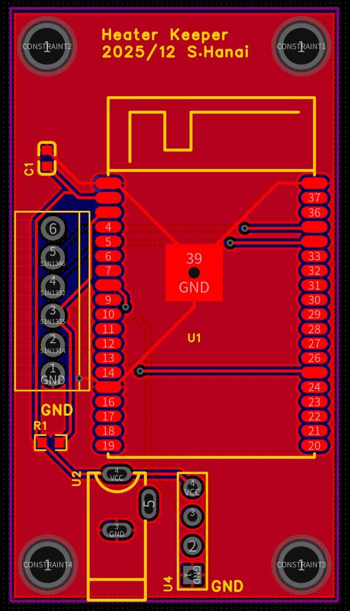
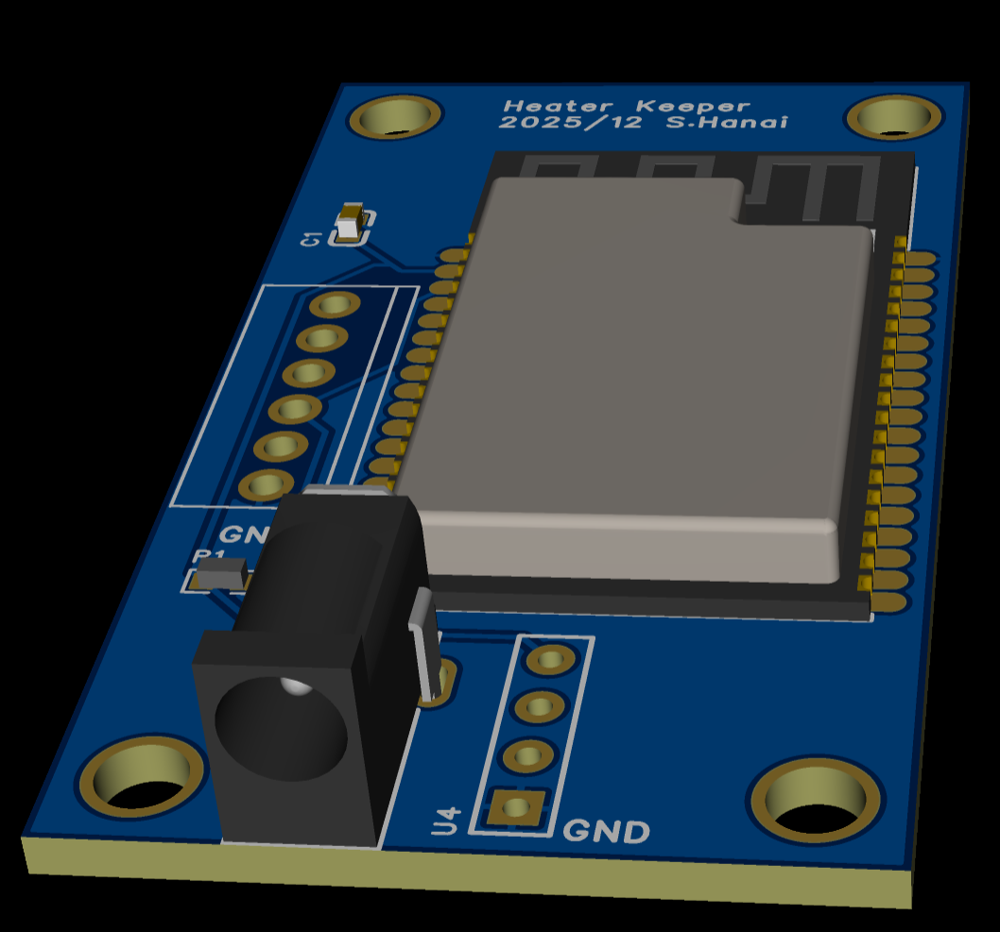
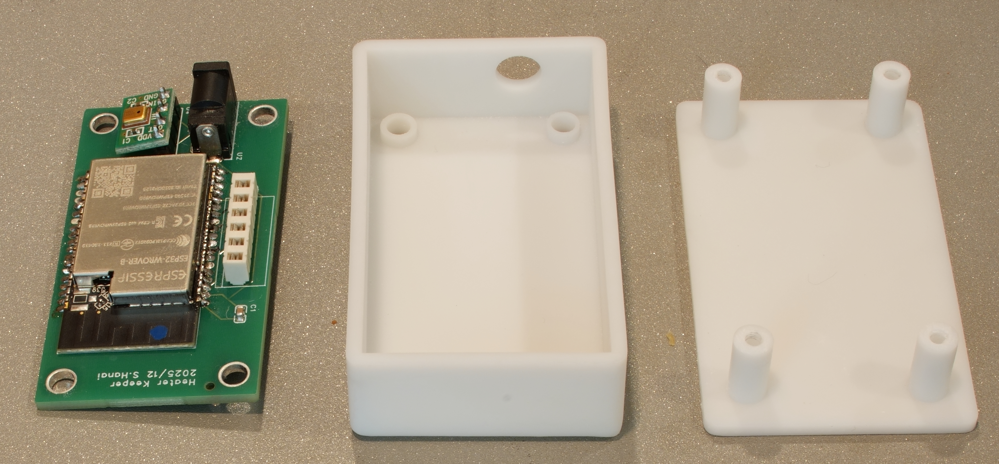
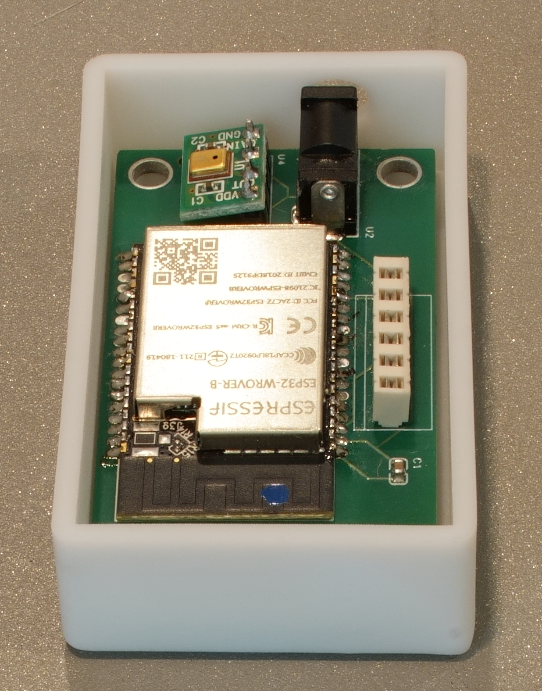
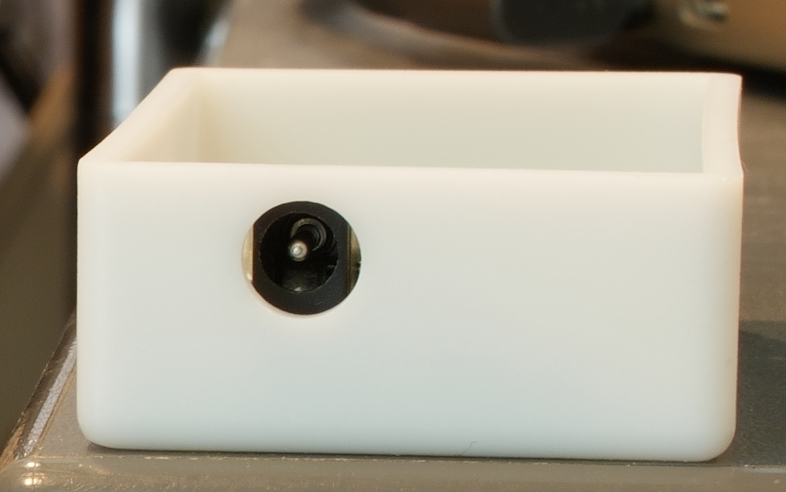
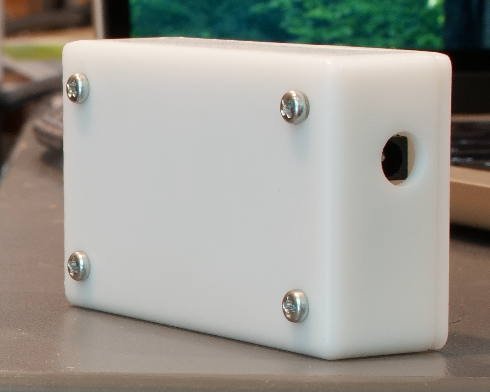
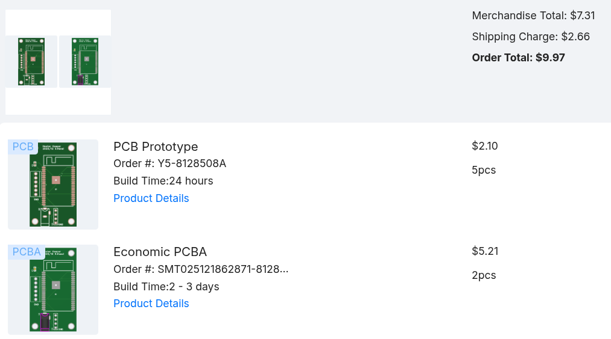
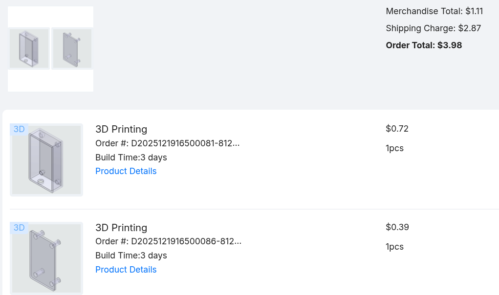

+++
date ="2025-12-28"
title = "石油ファンヒータの自動offを防ぐ(完結編)"
[extra]
og_image = "/blog/heaterkeeper2/ogp.jpg"
+++

[石油ファンヒータの自動offを防ぐ](/blog/heaterkeeper/)の続き。今回は回路が簡単なので最初はユニバーサル基板で済まそうかと思っていたのだが、前からちょっと試してみたいことがあり、基板を起こすことにした。

そういえば回路図はまだ載せていなかったような気がする。

ピン数的にWROVERである必要は無いのだが、以前、秋月で1つ300円で叩き売りになっていた時に幾つか捕獲しておいたものがまだ残っているので、WROVERにした。EasyEDAでいつも通りPCBを起こしてauto wireとGNDベタを設定して基板を作成。

試してみたかったこと、その1は部品もJLCPCBで半田付けしてもらうこと。といってもWROVERは廃品種なのかJLCPCBでは売ってなかった(まぁ手持ちのWROVERを消化したかったわけなので、それで良いのだが)。WROVERは、1.5mmピッチ。昔なら泣きごとを言っていたところだが、SSOP(0.65mm)の半田付けを経験した今、この程度は大したことはない。成長したものである。

左が送られてきたもので、そこに自分で残りの部品を半田付けしたのが右。

試してみたかったこと、その2は専用の箱もJLCPCBで3Dプリントしてもらうことだった。なんか難しそうなので後回しにしていたのだけど、冬休み前だし、少々時間がかかっても良いかなと挑戦することにした。EasyEDAでPCBが出来たところで3Dというアイコンをクリックすると、こんな表示になり3Dのモデルが出来ていることが分かる。

これをExportすると、3Dのモデリングアプリに取り込むことができる。Webで検索するとFusion 360というのを使うケースが多いようだけど、Linux用が無いのでFreeCADというのを使ってみることにした。FreeCADの時はstepファイルでExportすれば取り込むことができた。

FreeCAD、見よう見まねで使ってみようとしたら、さっぱり分からず玉砕。[YouTube上にJinSatoという人が解説動画を公開](https://www.youtube.com/watch?v=i96ni1Ro_8M&list=PLltam-LuCJWwglGgt3bq83CnhVHRA87TO)しており、これを何本か見たら、基本的な使い方が分かった。だいたいこんな感じの考え方をすれば良いようだ。

- 3Dプリンタで出力する単位は「ボディ」。なので箱とフタみたにくっついては困るものは別のボディにする
- まず「スケッチ」で2Dの絵を描く。基本は円とか長方形
- この時に「拘束」という機能で動かないようにする。例えば円は中心と直径を指定して拘束すれば、自由に動くことができなくなる
- 次に、それを「パッド」という機能で3D化する。円なら円柱が、長方形なら直方体ができる
- 穴をあけたい時は「ポケット」という機能を使う。深さを指定するか、「貫通」を指定することが可能
- できた3Dの別の面をスケッチにして、そこにまた2Dの絵を書いて、パッドを使って立体化することができる。つまり再帰的にこの操作を繰り返していくことになる
- 3Dプリントする時は、厚みが2mmを切ると割れやすくなるので注意

他にも様々な機能があるようだが、基本的に、今回のようなケースの作成なら上記ルールさえ理解して、あとは適宜AIに聞けばなんとかなる。できたらボディをExportする。stepファイルならJLCPCBの3Dプリントに取り込むことができた。

こんな感じのケースができた!

ケースに格納してみたところ

DCジャックの穴もピッタリ。こういう穴を既成のケースにあけるの、難しいんだよね。

今回はタップレスネジで止めるようにした。

若干の反りがあったりするものの、実用上は問題無い感じ。どこかで寸法を間違えたようで、なぜかフタが1mm浮いてしまっていたので、そこはヤスリがけしたが、それ以外は問題なし。初めてにしてはうまくいって良かった。3D設計ツールを使うと、いざネジ止めしようとしたらネジの頭が部品と干渉する、みたいなことが事前に起きないかチェックできて良いし、基板直付けタイプの部品でも穴あけ位置を簡単に合わせられるので、ものすごく小型化できる(既成品のケースで作る時は、穴位置を合わせやすいように基板直付けではなくケースに取り付けるタイプの部品を使うし、寸法の見落としでケースに入らなくなった、となるのが怖いので余裕を見て大き目のケースを使うことが多い)。そのためにも使う部品はEasyEDAに3Dモデルが用意されているものを使いたい。今回のACアダプタ用のジャックもEasyEDAに3Dモデルがあって、JLCPCBにも在庫があるものを採用した。秋月とかで買うのであれば、データシートを見て、型番をEasyEDAで検索してみて3Dモデルがあるかをチェックしておくと良いだろう(結構間違ったモデルが登録されていたりもするので、ノギスで測って合っているかチェックした方が良い)。

さてお値段だけど、

基板の方は5枚で＄2.10で相変わらず破格値である。部品の半田付けサービスは、5枚のうち2枚だけ実施してもらったが部品代入れて＄5.21。ただ、これはクーポン適用ができたので、実価格は＄10くらいだったと思う。今回は部品も少ないし基板代と比較するとちょっとお高めかな。送料が＄2.66。

次に箱なのだけど、箱とフタ合わせて＄1.11だった。送料を入れても＄3.98。これは衝撃。秋月でこのくらいの大きさの箱を通販で買っても、このくらいの値段になるよねぇ。オーダーメイドの箱を作ってこの値段だと、もう既成品の箱を買ってきて自分で穴開けしてというのは労力に見合わないね。もっともこれはバーゲン価格かもしれず、いずれは値上げの可能性もあるけれど、基板作成と違って3Dプリントなら他にも業者はありそうなので、そこまで困ったことにはならないのではないかな。

調べてみると金属製の箱を作ることもできるらしい。今度機会があれば、そちらも試してみたい。
