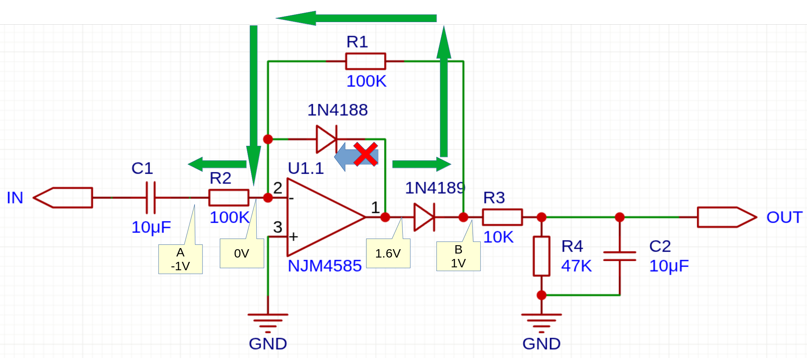
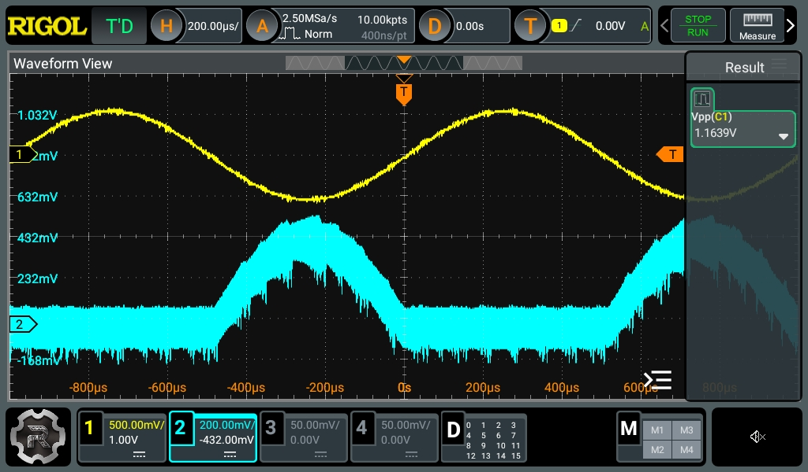
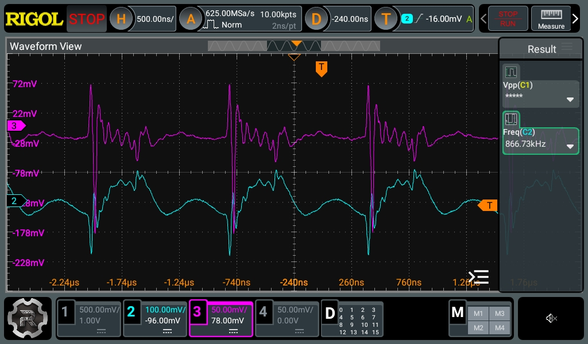

+++
date ="2026-1-4"
title = "理想ダイオード回路を検証"
[extra]
og_image = "/blog/ideal-diode/ogp.jpg"
+++

[理想ダイオード回路でオーディオ信号の大きさを測定する](/blog/smart-volume0)の回路、動作原理を確かめていなかったので、ちゃんと検証しておく。

過渡特性とかはともかく、OPアンプの基本動作原理は以下を理解しておけば、大抵は導けるはず。

- 2つの差動入力の間の電位差は0(イマジナリ・ショート)
- 2つの差動入力は高インピーダンス

仮にA点が-1Vであるとする。

差動入力+が0Vなので、差動入力-も0V(イマジナリ・ショート)。するとR2には1Vがかかる。オームの法則で流れる電流は、

$$
I = \frac{1}{100 ・ 1000} = 0.01mA
$$

差動入力-は高インピーダンスなので、電流は流れない。左のダイオードは向き的に電流が流れないので、以下の図の緑の線に従って電流が流れることになる(出力のR3以降の回路はとりあえず今回は除外する)。

R2に流れる電流は、この緑の経路しか無いので、R1に流れる電流とR2に流れる電流は等しい。またダイオードの順方向電位は一般的な0.6Vとする。ここから逆算していくと、B点の電位は1Vとなる。これは電圧が-0.5Vや-2Vなど変わっても負の電位である限りは変わらない。OPアンプの差動増幅の原理によって、ダイオードの順方向電位がうまい具合に相殺されて出力されている。

では逆に正の電位の場合はどうなるか？

今度は右側のダイオードは向き的に電流が流れないので、左のダイオードに電流が流れる。ダイオードの順方向電位が0.6Vとすると、OPアンプ出力は0.6Vなので、B点は0Vということになる。これは電位が変わっても正であれば0Vになる。

このことから、この回路は理想的な(ダイオードによる電圧降下のない)半波整流回路になる。実際の波形を見てみる。

上が入力信号(1kHz)で1div 500mVなので、Vppで1.2Vを切っている。一般的なシリコンダイオードであれば整流不可な電位。下が回路のOUTの部分(コンデンサーは外してある)。ちゃんと半波整流されている。重畳されている高周波ノイズがすごいが、おそらく電源由来だろう。確認しておく。

紫色が電源で、青がOUTの出力(横軸を500ns/divに拡大している)。ピッタリ同期しているので、電源由来のようだ。オシロによると868kHzとのことなので、まぁオーディオであれば聴感上は問題無いと思われるが気になる。[以前測定した時](/blog/15v)より増えているように見えるが、これはOPアンプだけで負荷が小さい事が理由だろう。後々電源回りはちょっと手を入れたくなるかもしれない。