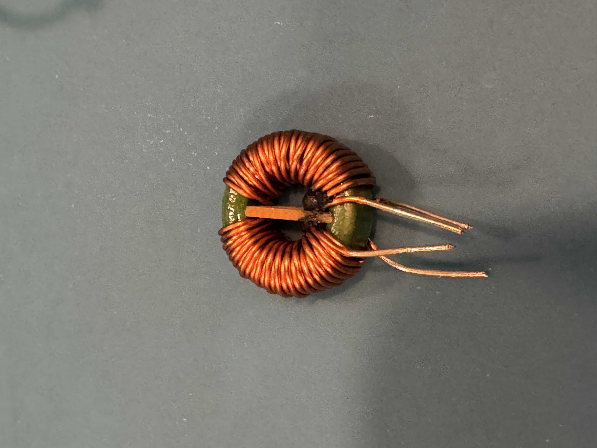
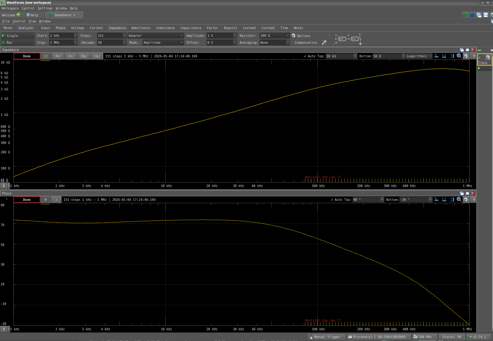
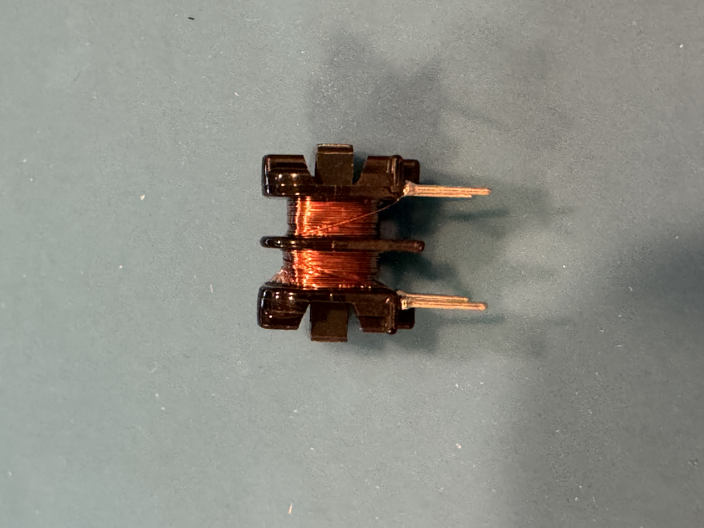
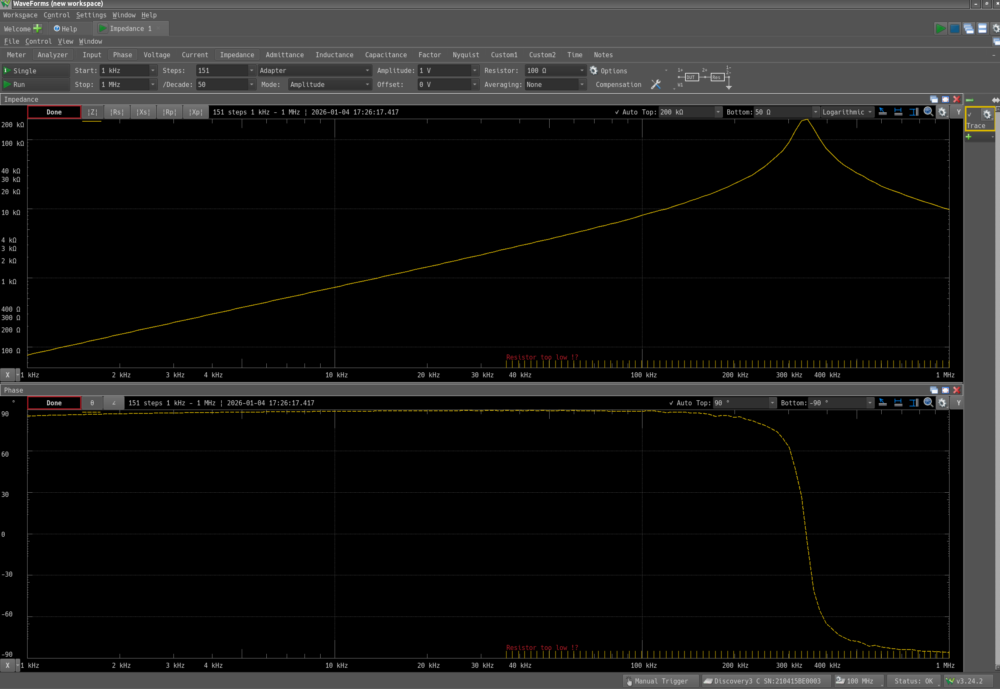
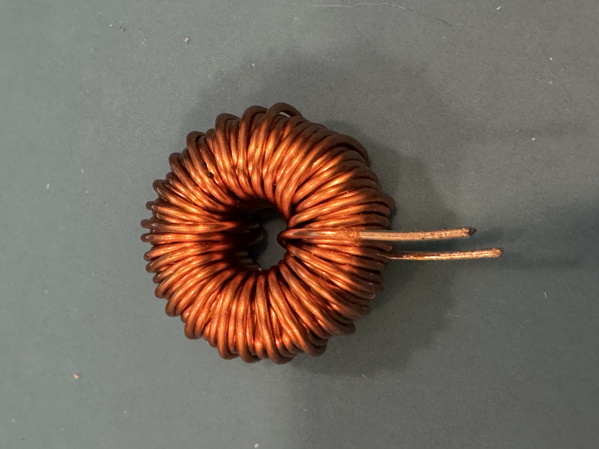
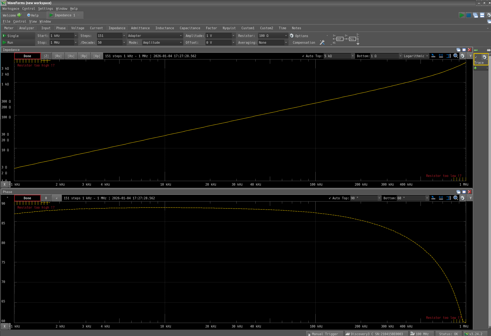
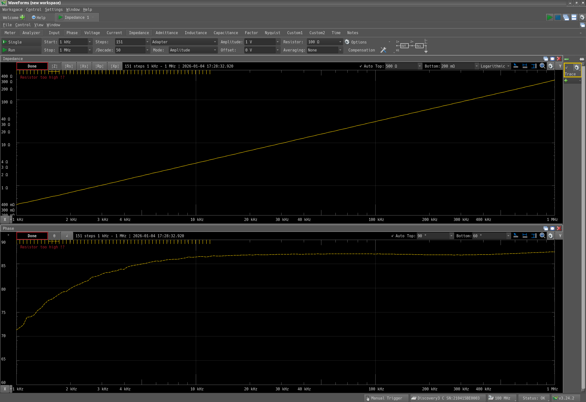

+++
date ="2026-1-4"
title = "ノイズ除去のためのインダクター"
[extra]
og_image = "/blog/inductor/ogp.jpg"
+++

±15V電源のノイズが気になるので、インダクターを入れてどの程度抑制できるのか色々試してみたのだが、インダクターによって結構違う。特に、インダクタンスが大きければ良い結果が出るわけではないので腑に落ちなかった。

これは昔Amazonで買ったコモンモードチョーク。6mHあるし、ちゃんとLCRメータでもその通り6mH程度ある。しかしこれはあまり効かなかった。

そこでインピーダンスアナライザで見てみる。

なるほど、数100kHz以降では位相が90°からどんどん離れてインダクタとして働かなくなってしまう。LCRメータも100kHzまでしかレンジが無いから気付かないわけか。そもそも低周波域でも90°から離れており、いまいちな感じ。

もう1つコモンモードチョーク。こちらは8mHもあるが、やはりあまり効かなかった。

低周波域は良い特性だが、400kHzあたりですとんと落ちてしまう。なるほど、こちらもインピーダンスアナライザで見ると一目瞭然だ。

普通のトロイダルコイル。470μHで、上のものよりインダクタンスは低いのだが、そこそこ効いた。

なるほど、だいぶ高周波数まで特性が伸びている。これが効いた原因か。

最後はパワーインダクターとして売られているもの。これも470μHだが、今回の中では一番小さいが一番ノイズ抑制の効果が見られた。

1MHzまできちんと仕事している。逆に低周波域はそうでもない。スイッチング電源のノイズ抑制は、パワーインダクターを使うのが良さそう。
