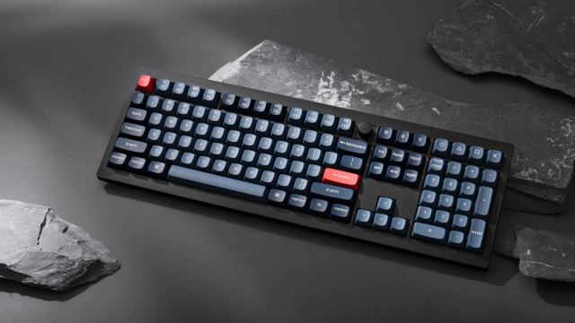
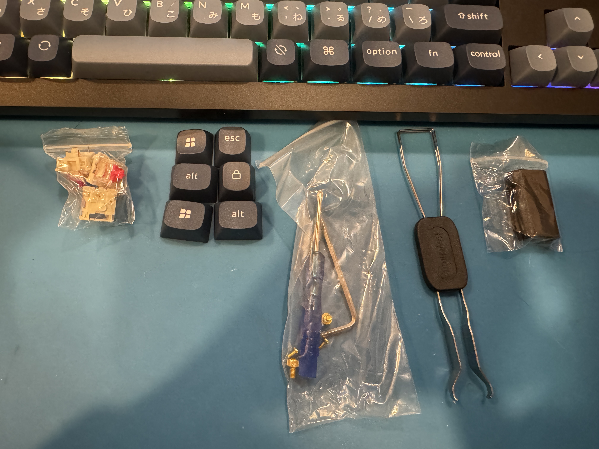
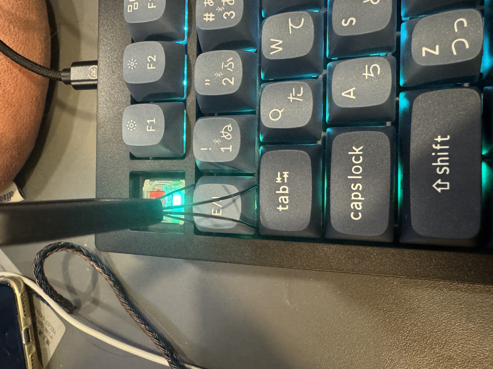
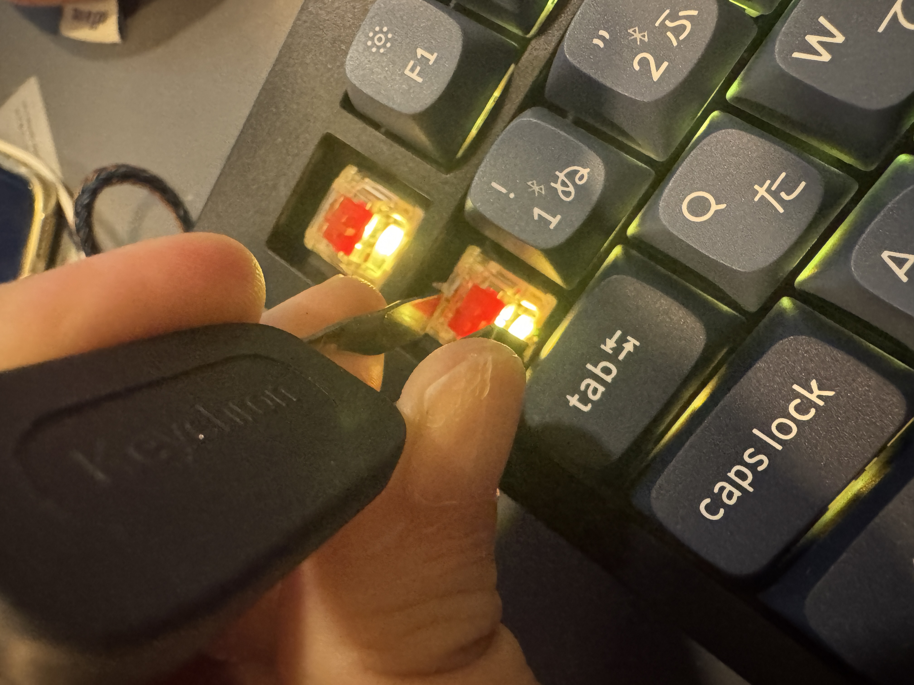
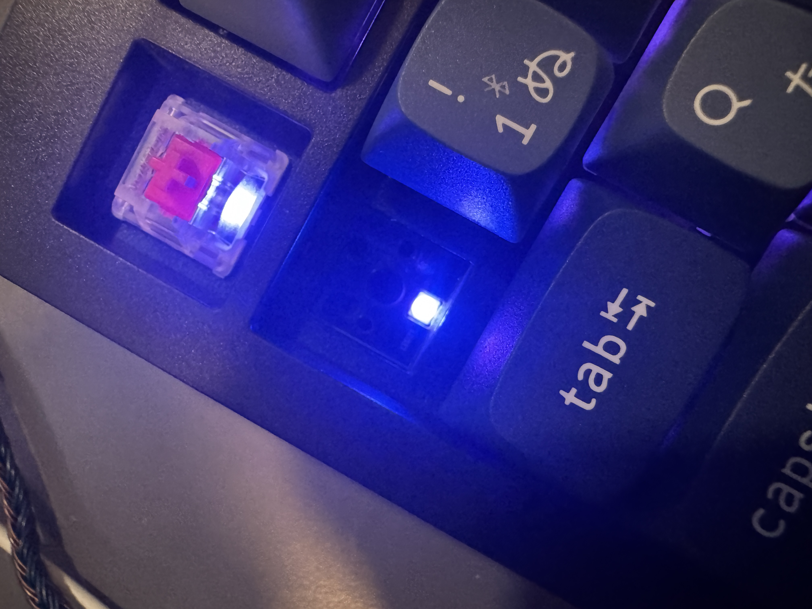
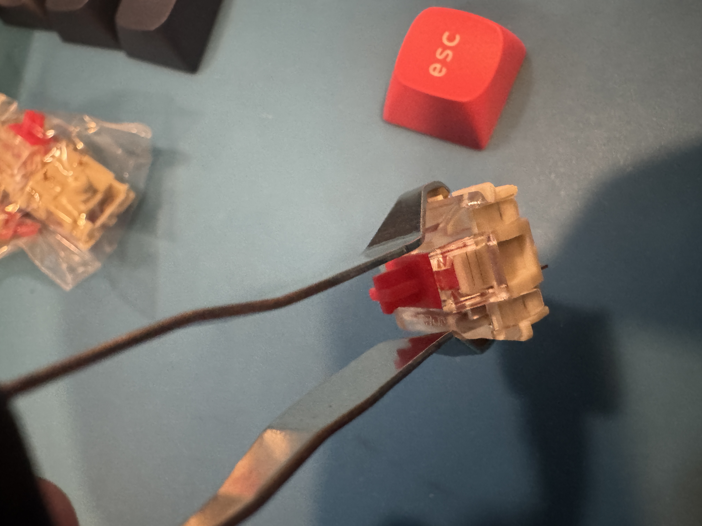
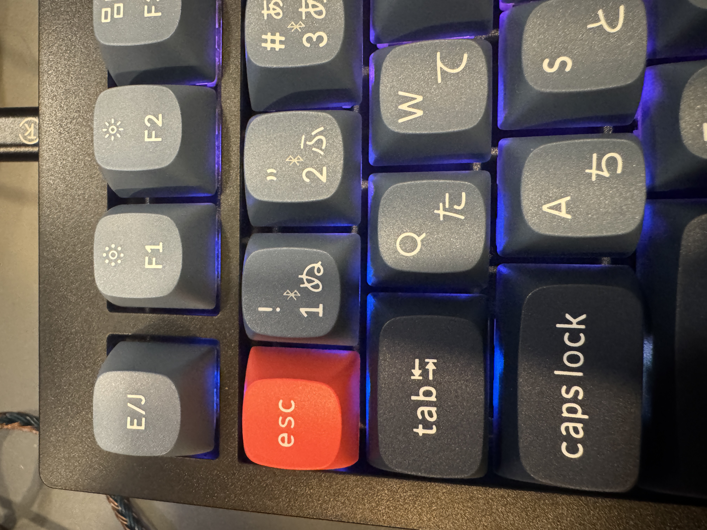
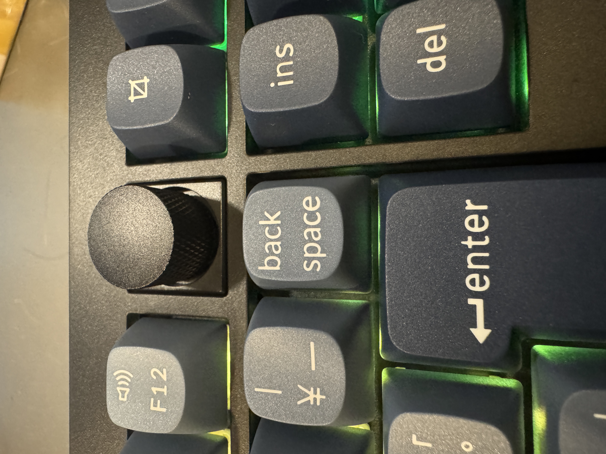

+++
date ="2025-12-14"
title = "キーボードをKeychronに変更"
[extra]
og_image = "/blog/keychron/V6-Max-11_2048x_54da72c7-6647-4a85-b980-8caa62f0f08a.jpg"
+++

ここ10年以上は、東プレのキーボードを使ってきた。初代106、USB対応したテンキー無し87、最近はRealForce R3。東プレのキーボードは耐久性が良いということが売りだったのだが、R3は使い始めて数年でCtrlキーなど良く使うキーに支障が出てきた。押した時に微妙にひっかかりがある感じで、使えないわけではないのだがストレスがたまる。そんな折、R4が出たので買い替え時なのかなぁと思っていたが、さすがに数年で買い替えが必要というのはどうなんだろうか。

試しにUSB87のRealForceを出してきて使ってみたら、やはり快適だ。個人的には東プレのキーボードはこのあたりが一番良かったな。このキーボードは常駐先にも持ち込んで相当に使い込んだけれど、まだキーはとても押しやすい。この出来なら数万払っても良いが、さすがに数年でダメになるのはつらい。

AIにおすすめを出してもらったが自分はファンクションキーもテンキーも使う派なので選択肢は割と狭く、Keychronに行きついた。KeychronはSNSでも良く評判になっているので、気にはなっていた。

ブラックフライデーで値引きになっており、どうしようかなぁと悩んでいたらダイアログで「分かりました、じゃぁあと1500円お引きしましょう」と言われて購入することに。16,123円だった。確か初代東プレ106がこのくらいの値段だったと思う。配送は思ったよりかかって2週間ほどで届いた。

キータッチはとても良い。ひっかかりが全く無いしブレもなくカッチリとしたタッチ。付属品はこんな感じ。

Keychronの利点の1つが、キースイッチが交換可能になっている点で、3っつのキースイッチが付属している他、[ここ](https://keychron.co.jp/collections/%E3%82%B9%E3%82%A4%E3%83%83%E3%83%81)でキースイッチだけ購入もできる。

試しにキーキャップを外してみる。

さらにキースイッチも外してみる。リムーバの反対側を使うとキースイッチを外すことができる。

無事ESCと全角半角キーを入れ替え。しかしこの「全角半角」キーというのも今となっては若い人には意味不明だろうな。

ひとつ気付いたのだが、このキーボード、ここにロータリエンコーダが付いている。

これを使うと音量が調整できて便利。押すとミュートのon/offができる。

キーをリマップするツールも配布されており、キーの入れ替えや、マクロ機能で文字列というか特定の任意のキーシーケンスが登録できるようになっている。多分ゲームを意識しているのだろう。Linuxもサポートと書いてあるがうまく動かなかった(どうも/dev/hidrawXXXにアクセスするようで、権限違反になる)。Macで設定すれば、キーボード側で覚えているので、そのままLinuxに差し替えれば大丈夫だった。

Bluetoothも、独自の無線ドングルも付属していて、もちろん有線接続も可能(Type-C/A)。これは人気が出るわけだね。耐久性は使ってみないと分からないけど、キー単位で交換できるので多分大丈夫だろうと思っている。あとはこの会社が長く続いてくれないと保守パーツが手に入らなくなる心配があることくらいか。
