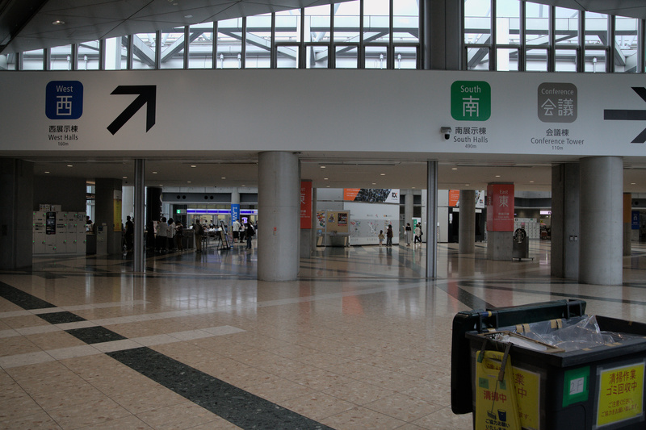
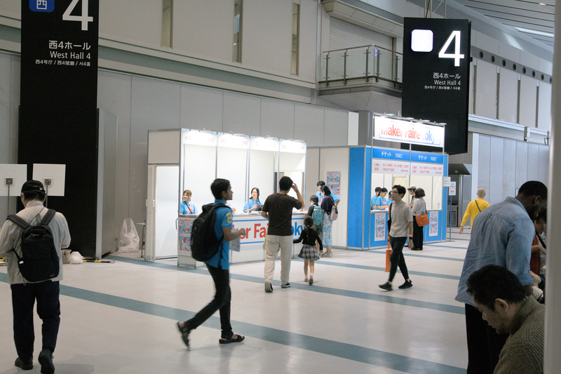
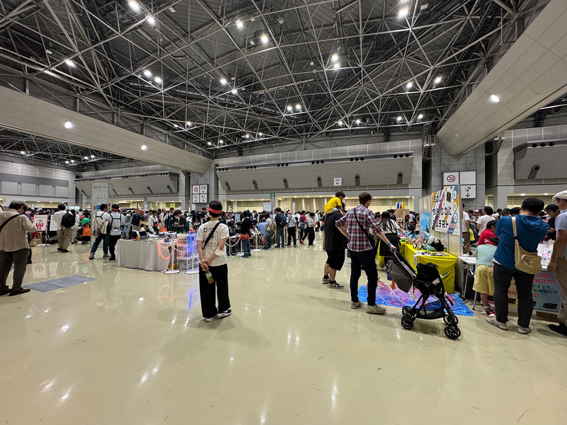
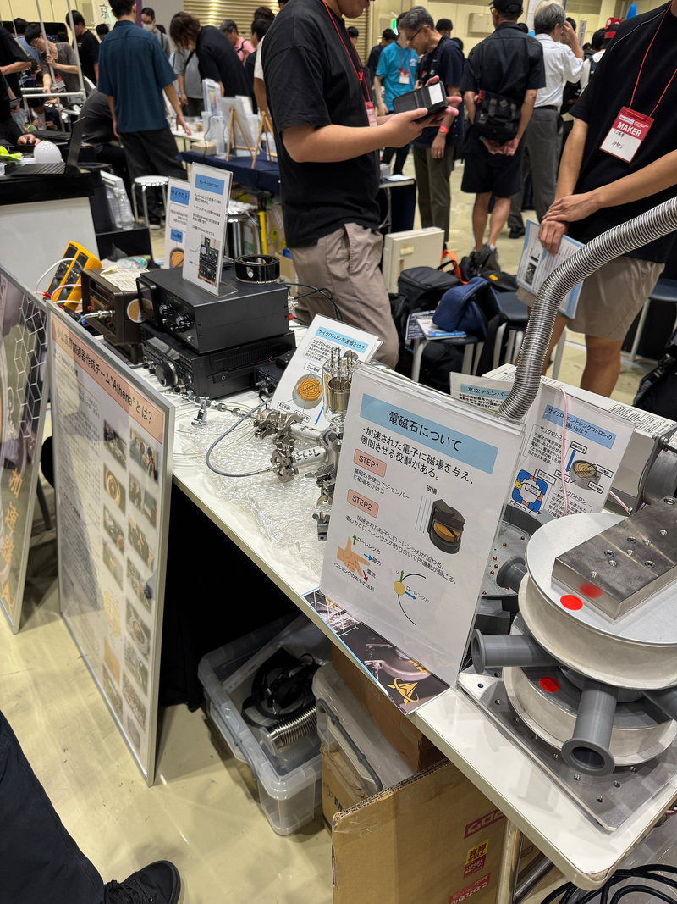
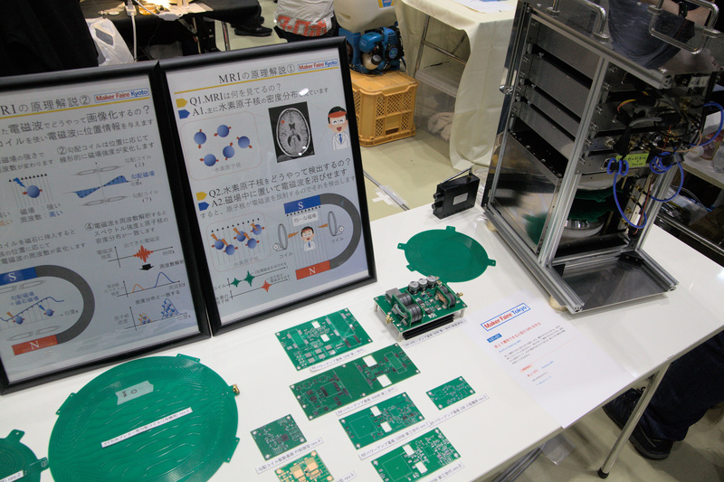
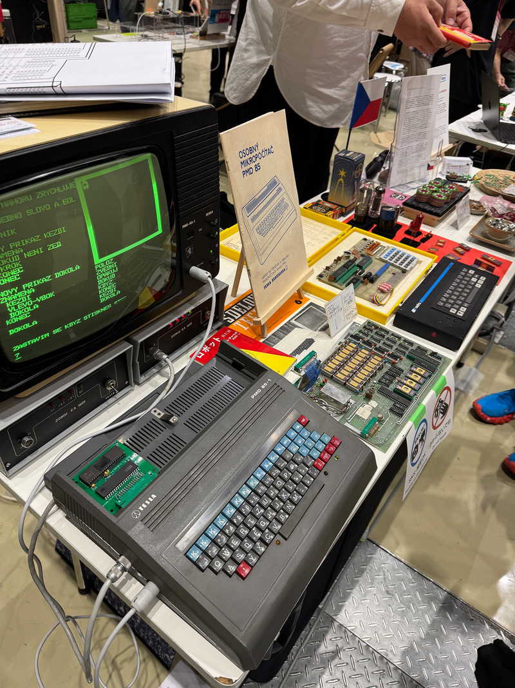
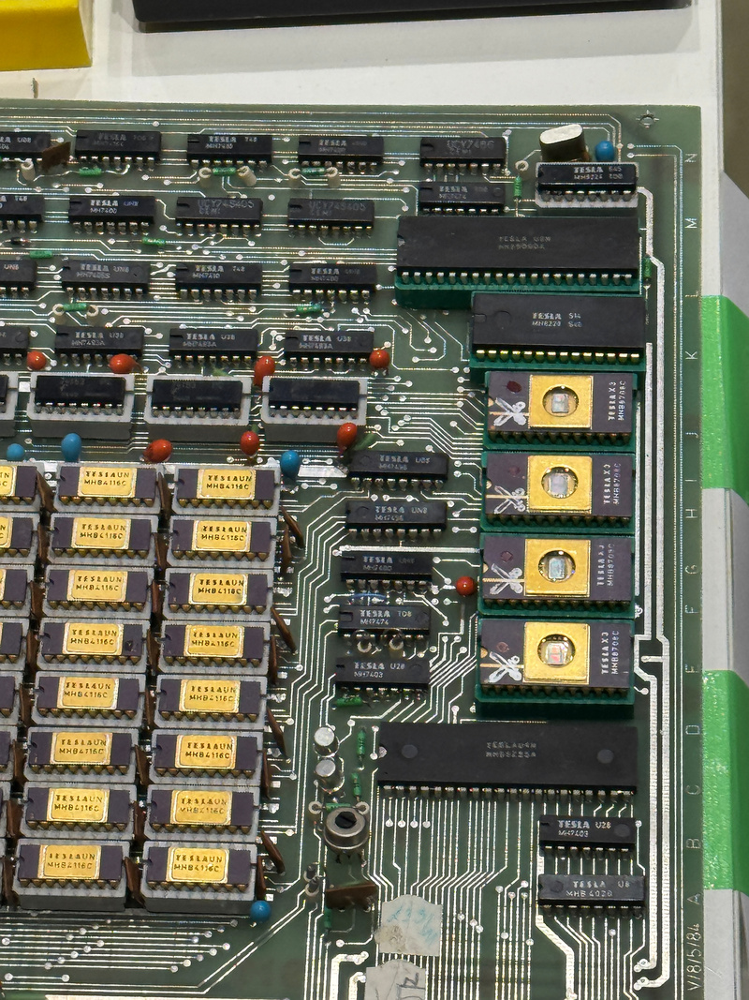
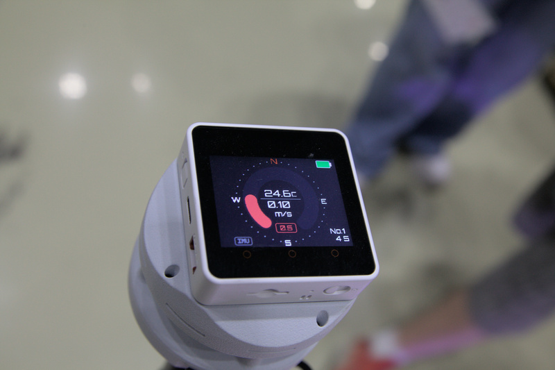
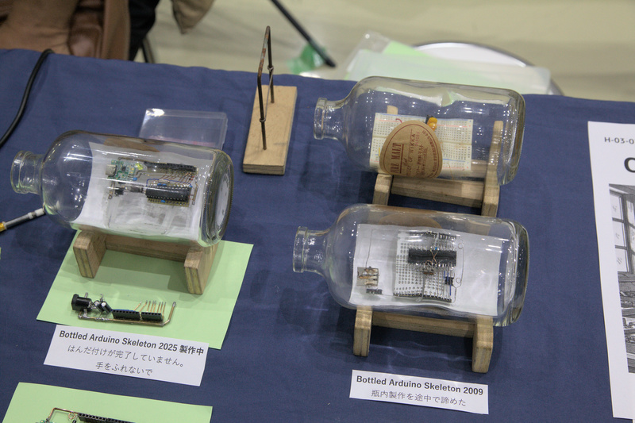
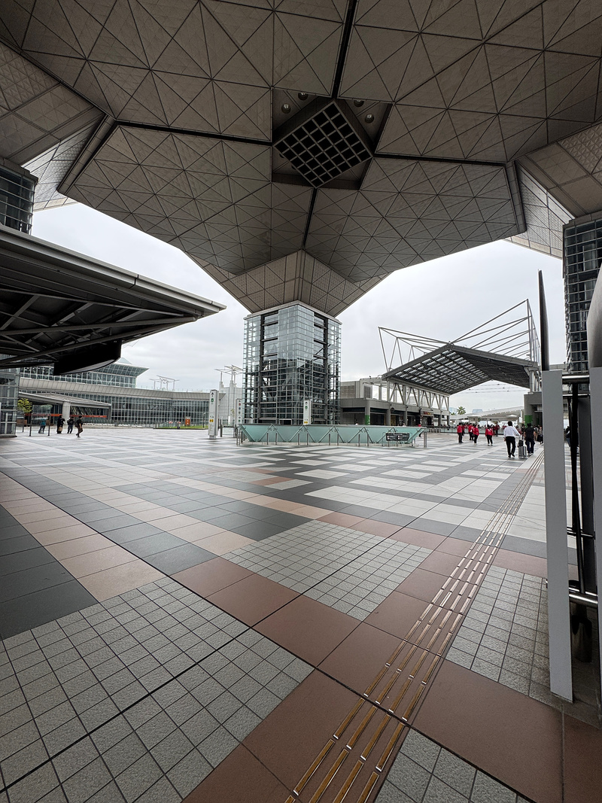

+++
date ="2025-10-4"
title = "Maker Faire 2025"
[taxonomies]
tags = ["DIY"]
[extra]
og_image = "/blog/makerfair2025/ogp.jpg"
+++

[Maker Faire](https://makezine.jp/)の存在は少し前から知っていたのだけど、いつも行こうと思いつつ気付いたら終わっていたというの繰り返していた。今回初めて行くことができた。

今回はビッグサイトでの開催。昔は仕事で良く行ったのだけど、最近は全然行っていなかった。おかげで記憶が幕張メッセとごっちゃになっていて、すっかり迷子。

受付を発見。

会場は思ったより大きくて、結構人も多かった。おもちゃ的なものが多いので子供連れが多かった。

粒子加速作ってみました。こういうところがMaker Faireの良いところ。アマチュアが作ってもビジネスになるの？ とかそういう無粋なことは言わない。好きだから作ってみました。以上。これが良い。趣味とはそういうもの。ちゃんと電子が加速するところまでは確認できたとのこと。

MRI作ってみました。MRIといえば強烈な磁石だけど、そんなに強い磁石でなくても、それなりに写るのだそう。

とても懐しい感じのマイコン。型番が85だから8085かなと思ったら、チェコスロバキアで昔、独自に作ったものらしい。

スマホで撮ったので文字のあたりが多分AIのせいでつぶれちゃった。EPROMとかDRAM、TTLあたりは汎用品っぽいけど、CPUは独自なのだそうだ。命令セットとかは分からなかった。

超音波を使った風速計。スマホのビデオ録画との相性が悪くてモアレが出ちゃっているのだけど、床の部分に白い点が沢山描画されていて、それが風の流れに沿って動く。

<iframe width="315" height="560" src="https://youtube.com/embed/lkfmRc48xqc?playsinline=1" title="YouTube video player" frameborder="0" allow="accelerometer; autoplay; clipboard-write; encrypted-media; gyroscope; picture-in-picture; web-share" allowfullscreen></iframe>

これが四隅に配置された風速計。超音波は風が吹いている方には、その分速く伝わるので、それを検出する仕組みとのこと。これを四隅に置いてそれぞれの風向きから計算しているのだと思う。

爆笑してしまった。賞状とかを入れる筒を開ける時の音が好きだから、自動で鳴らせるようにしてみました。

<iframe width="315" height="560" src="https://www.youtube.com/embed/P277bhaLa8s?playsinline=1" title="YouTube video player" frameborder="0" allow="accelerometer; autoplay; clipboard-write; encrypted-media; gyroscope; picture-in-picture; web-share" allowfullscreen></iframe>

ボトルシップならぬボトル基板。「途中で諦めた」というのもあって良いw。ブレッドボードはどうやって中に入れたんだろう。

帰りはすっかり雨

帰り道にひまわりがまだ咲いていた。小ぶりなので品種が違うのかな。

こういうイベントはなかなか無いので、運営してくれたImpressさんに感謝。出展されている人が若い人から年配の人まで幅広かったのも良かった。

P.S. [wikipedia](https://en.wikipedia.org/wiki/PMD_85)によると、CPUは独自ではなく8080みたいだ。
