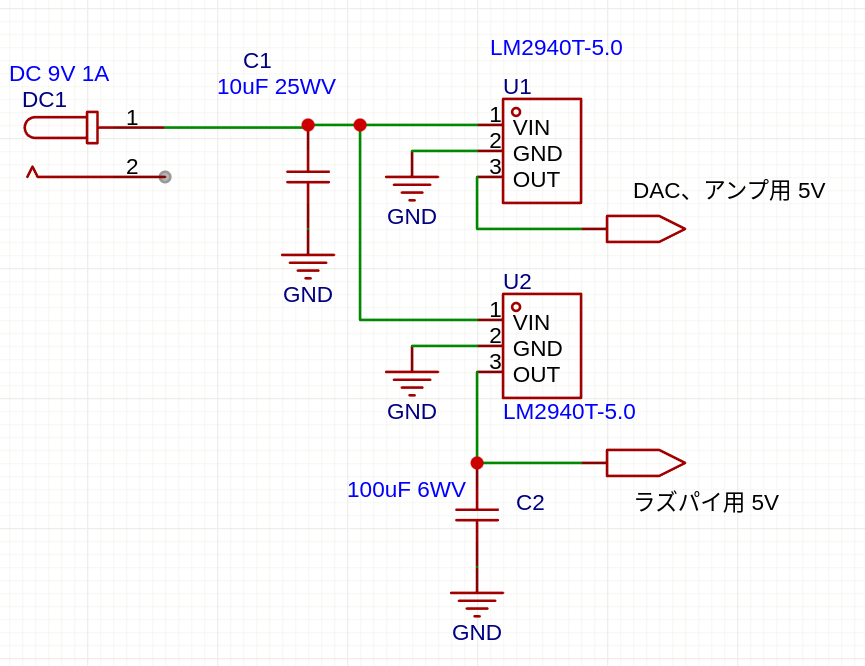

+++
date ="2025-05-17"
title = "激安アンプのその後"
[extra]
og_image = "/raspi-audio-power/raspi-audio.drawio.svg"
+++

以前購入した[激安アンプ](https://www.ruimo.com/showArticle/1667)、ラズパイオーディオの出力に使っている。

ラズパイZero Wに[mpd](https://github.com/laheym/rpi-mpd)をインストールし、PCから[ncmpc](https://www.musicpd.org/clients/ncmpc/)で再生している。DACはI2S接続。これはLine outしかない(3.5mmジャックが付いているが、これも実はLine out)ので、激安アンプを接続してヘッドホンを接続している。

しばらく使ってみて色々特徴が分かった。

## 無音時はノイズが無い

なかなか優秀。ホワイトノイズやハム的なものが全然無い。

## クリップが分かりにくい

A級、B級アンプと比べてクリップした時の音質変化が分かりにくい。DACの出力がかなり大きいので十分に絞らないとクリップする。

## 再生時にノイズが乗る

静かな曲の再生時に「ガサガサ」というノイズが乗っていることに気付いた。最初はアンプの問題なのかと思ったが、この感じはラズパイのCPUの負荷変動による電源へのノイズがアンプに回り込んでいる可能性が高い。A級、B級アンプ時は「ビヨビヨ」という感じのノイズで聞こえたものだが、D級アンプだと静かな「ガサガサ」というノイズになるようだ。PAM8403の電源からのノイズに対する耐性が高いのだろう。

高級アンプなんかは、デジタル系とアナログ系で別の電源を用意したりするが、まずは三端子レギュレータで電源を分けてみる。

電源は9VのACアダプタにし、三端子レギュレータを2つ使ってラズパイ用と、DAC+アンプ用とに分けている。パスコンは積層セラミックコンデンサを使用。入力は10uFを使用。出力側のパスコンは、アンプ側には470uFの固体コンデンサがパスコンとして入っているので、省略。ラズパイ側だけ100uFを入れた。LM2940は低損失タイプの三端子レギュレータなので入力は6Vでも十分だろう。

これでノイズは全く分からなくなった。
