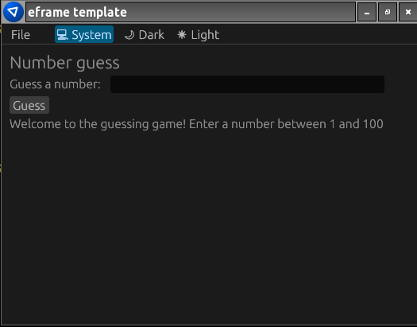
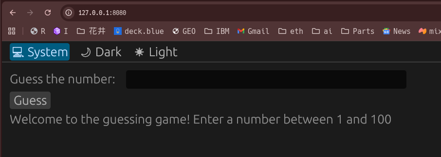

+++
date ="2026-01-01"
title = "WebAssemblyでRustを使いWebSocketのクライアントを書く"
[extra]
og_image = "/blog/rust-ws-client/ogp.jpg"
+++

また自動ボリュームの話。装置はESP32とMUSES72323を使うので、オーソドックスなアーキテクチャはこんな感じだろう。



SPAのコンテンツはサイズの関係からGitHub Pagesあたりに置き、ESP32上のサーバーをHTTP RESTで叩く感じ。ただSPAはダルい。できれば関わりたくないアーキテクチャだ。そもそも仕事じゃなくて趣味なんだから、ニッチに振り切っても良いのではないか。

例えば以下なら全部Rustで書ける。



まぁ見た目はほとんど同じなのだけど、ESP32側もフロントエンドもRustで書けるし、WebSocketはRESTよりも応答性が良いはず。

とはいえWebAssemblyは、機会がある度に調べたり、他の人の資料(Javaあたり)を見たりしてきたが、結構面倒な印象が拭えずなので不安が残る。ちょっと探ってみることにする。

RustでのGUIアプリケーション開発は、最近はもっぱら[egui](https://docs.rs/egui/latest/egui/)を使用している。WebAssemblyにも対応しているので、これが良いなら慣れているので良い候補だ。

eguiのアプリケーション開発はテンプレートがあるので、これを使うのが良い。本当はcargo generateが使えるようだが、エラーで動かないので普通にcloneする。

```
git clone https://github.com/emilk/eframe_template.git smart_volume_client
cd smart_volume_client
rm -rf .git
```

さて、ESP32側でWebSocketサーバを動かしてみる話は[ここ](/diy/micro-controller/esp32/web-socket/)に書いたので、このクライアント側はeguiで書いてみることにする。

まずは、Cargo.tomlにWebSocket用のcrateを追加しておく。

```toml
[dependencies]
...
ewebsock = "0.8.0"
```

src/app.rsを数当てゲーム用に書き直す。

```rust
pub struct TemplateApp {
    number: String,
    answer: String,
    ws_sender: ewebsock::WsSender,
    ws_receiver: ewebsock::WsReceiver,
}

impl Default for TemplateApp {
    fn default() -> Self {
        let options = ewebsock::Options::default();
        let (ws_sender, ws_receiver) = ewebsock::connect("ws://192.168.0.252/ws/guess", options).unwrap();
        Self {
            // Example stuff:
            number: String::new(),
            answer: String::new(),
            ws_sender,
            ws_receiver,
        }
    }
}

impl TemplateApp {
    pub fn new(_cc: &eframe::CreationContext<'_>) -> Self {
        Default::default()
    }
}

impl eframe::App for TemplateApp {
    fn update(&mut self, ctx: &egui::Context, _frame: &mut eframe::Frame) {
        if let Some(event) = self.ws_receiver.try_recv() {
            match event {
                ewebsock::WsEvent::Opened => println!("WebSocket opened."),
                ewebsock::WsEvent::Message(ws_message) => {
                    match ws_message {
                        ewebsock::WsMessage::Binary(items) => {},
                        ewebsock::WsMessage::Text(msg) => {
                            self.answer = msg;
                            ctx.request_repaint();
                        }
                        ewebsock::WsMessage::Unknown(_) => {},
                        ewebsock::WsMessage::Ping(items) => {},
                        ewebsock::WsMessage::Pong(items) => {},
                    }
                }
                ewebsock::WsEvent::Error(_) => println!("WebSocket error"),
                ewebsock::WsEvent::Closed => println!("WebSocket closed."),
            }
        }

        egui::TopBottomPanel::top("top_panel").show(ctx, |ui| {
            egui::MenuBar::new().ui(ui, |ui| {
                let is_web = cfg!(target_arch = "wasm32");
                if !is_web {
                    ui.menu_button("File", |ui| {
                        if ui.button("Quit").clicked() {
                            ctx.send_viewport_cmd(egui::ViewportCommand::Close);
                        }
                    });
                    ui.add_space(16.0);
                }

                egui::widgets::global_theme_preference_buttons(ui);
            });
        });

        egui::CentralPanel::default().show(ctx, |ui| {
            ui.heading("Number guess");

            ui.horizontal(|ui| {
                ui.label("Guess a number: ");
                ui.text_edit_singleline(&mut self.number);
            });

            if ui.button("Guess").clicked() {
                self.ws_sender.send(ewebsock::WsMessage::Text(self.number.clone()));
            }

            ui.label(self.answer.clone());
        });
    }
}
```

eguiはImediate modeというアーキテクチャのGUIフレームワークなので、update()というメソッドで毎回画面全体を書き直す。そのため、プログラミングは素直で分かりやすい。以下の部分はESP32のIPアドレスに変更しておく。

```rust
        let (ws_sender, ws_receiver) = ewebsock::connect("ws://192.168.0.252/ws/guess", options).unwrap();
```

あとmain.rsでTemplateAppを使っているところが2箇所あり、crate名がeframe_templateになっているので、もしもパッケージ名を変更した時は、ここを直さないとエラーになる。

まずは、cargo runしてみると、ローカルアプリとして起動する。




次にWebAssemblyの環境だが、trunkというツールを使うのだそうだ。

```
cargo install --locked trunk
```

で、起動はtrunk serve。

```
trunk serve
```

port 8080で待ち受けるので、ブラウザで http://127.0.0.1:8080 を開く。ソースコードを編集すると自動検出でビルドが走る。このあたりはSPAと同じだ。



正直、え？ これだけ？ あの面倒な印象はどこへ？ という印象。

次にデプロイ。

```
trunk build --release
```

distというディレクトリができるので、これをWebServerにデプロイすれば良い。

```
$ tree dist
dist
├── assets
│   ├── icon-1024.png
│   ├── icon-256.png
│   ├── icon_ios_touch_192.png
│   └── maskable_icon_x512.png
├── favicon.ico
├── index.html
├── manifest.json
├── smart_volume.js
├── smart_volume_bg.wasm
└── sw.js

1 directory, 10 files
```

nginxにデプロイしてみる。

```
docker run -p 9000:80 -v (pwd)/dist:/usr/share/nginx/html:ro nginx
```

私はfish shellなので(pwd)としているが、bashなら\$(pwd)にすれば良い。これでブラウザで http://localhost:9000 を開けば使えるようになった。
こんなに簡単になっていたのか。スマホでもサクサク動くし、もうプライベートの開発用途だとSPAいらないなこれは。
