+++
date ="2025-10-10"
title = "しながわ花海道"
[taxonomies]
tags = ["散歩"]
[extra]
og_image = "/blog/shinagawaHanaKaido2025/IMG_6837.jpg"
+++

[しながわ花海道](https://www.hanakaido.org/)は、学校や地域の人が花を植えてくれているらしい。

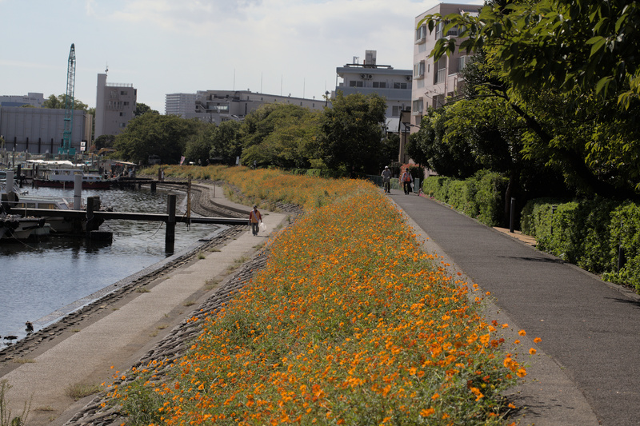

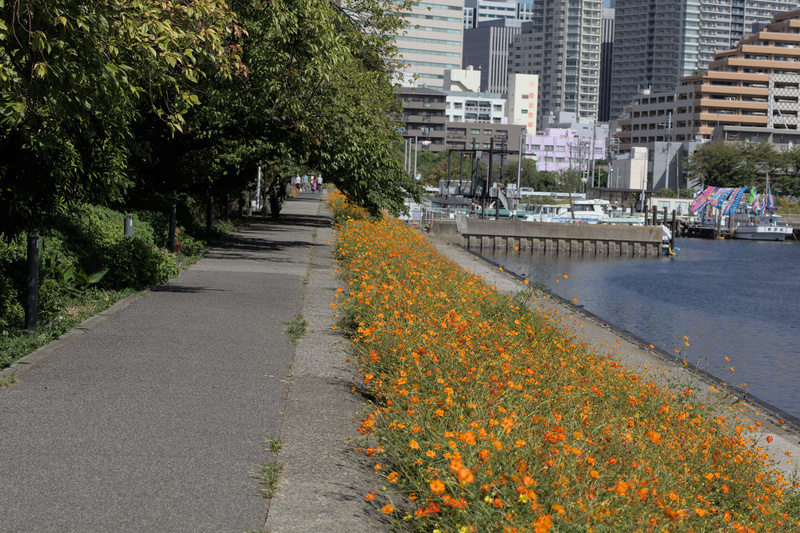
今の時期はキバナコスモスがメイン。

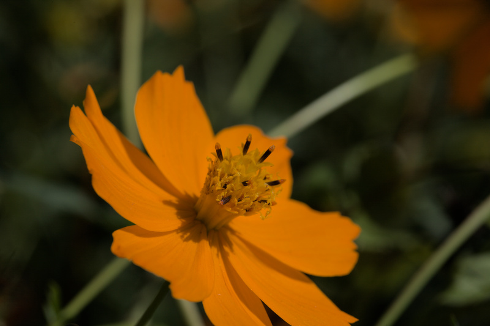

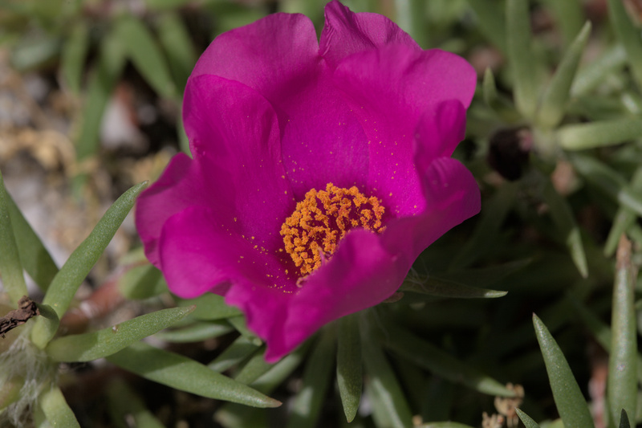
なぜか松葉ボタンも咲いてた。

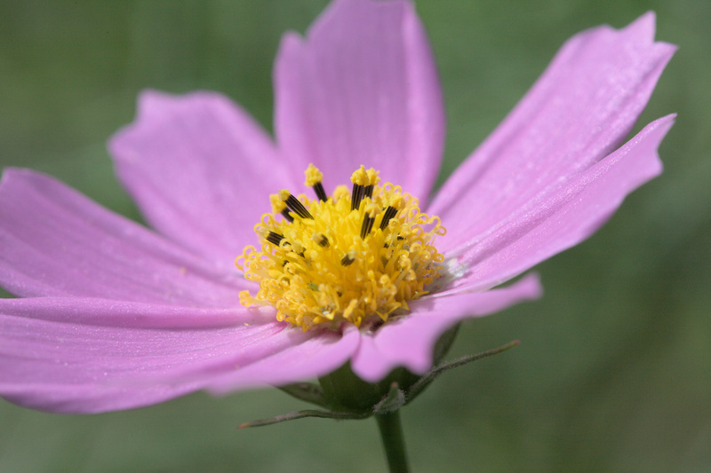
昔ながらのピンクのコスモス。うちの近所だと、昔ながらのピンクのコスモスが酷暑のせいか咲いてなかった。

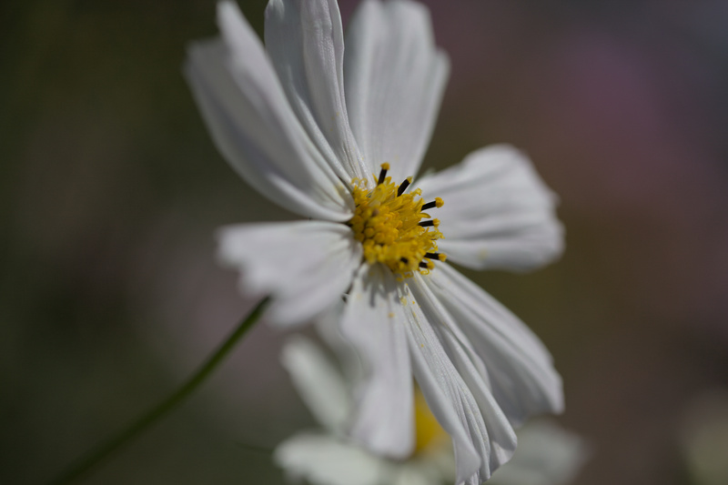
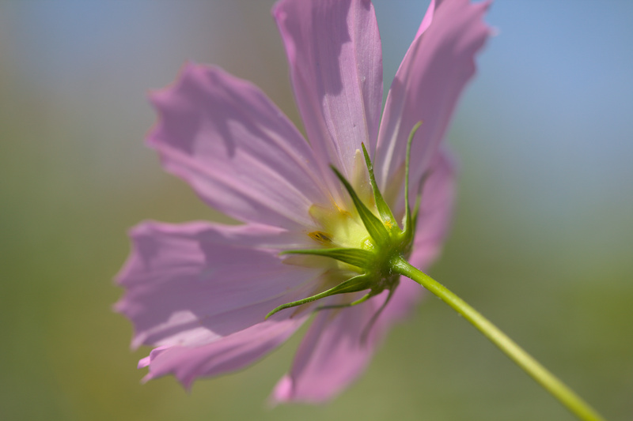
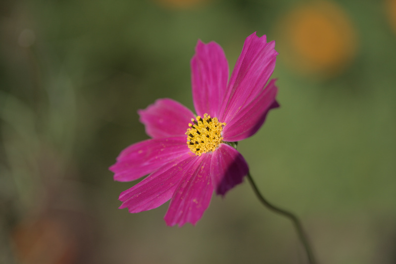
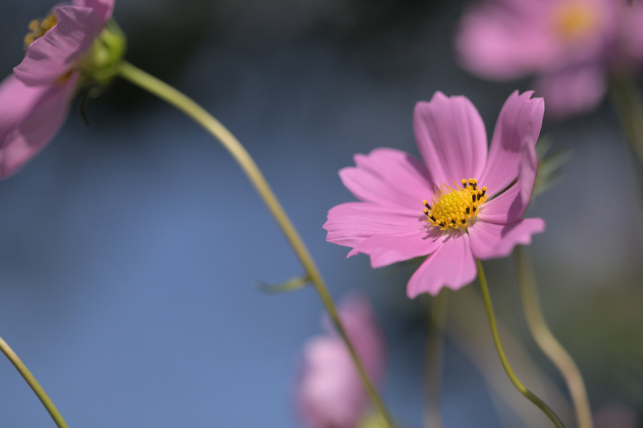
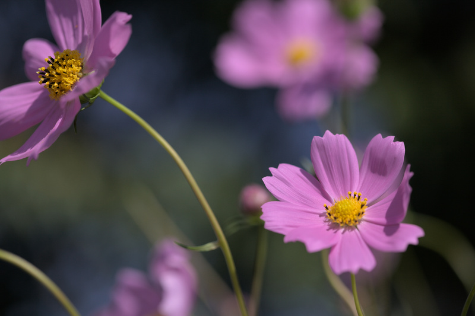
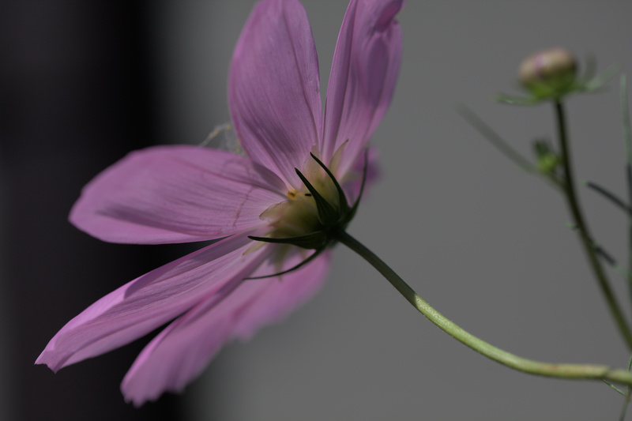

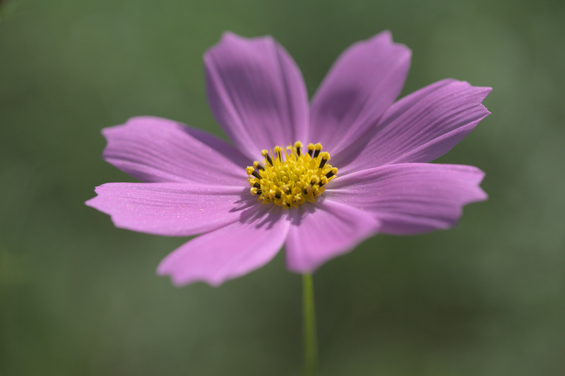
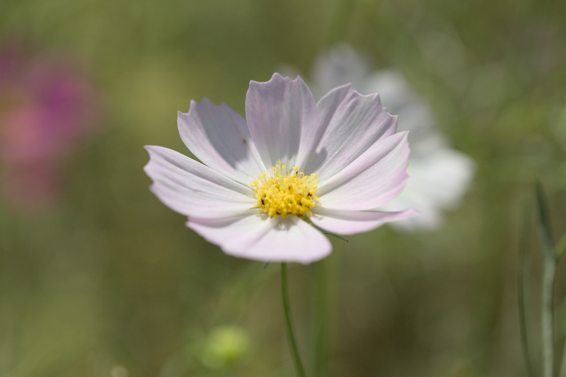

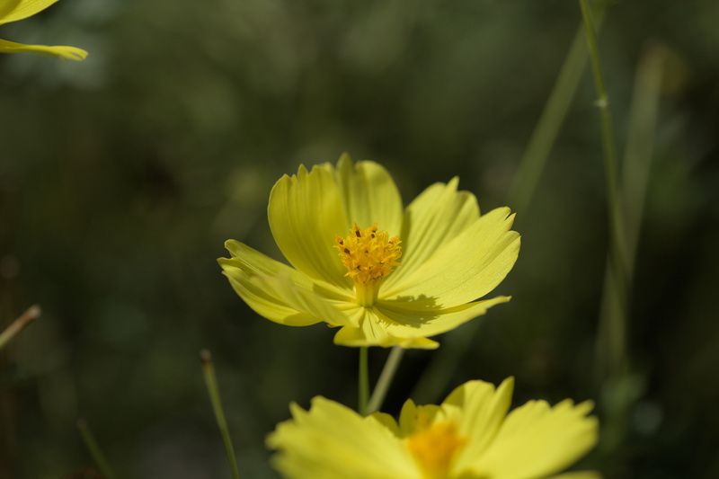

