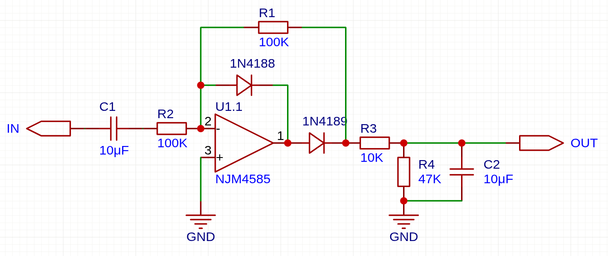
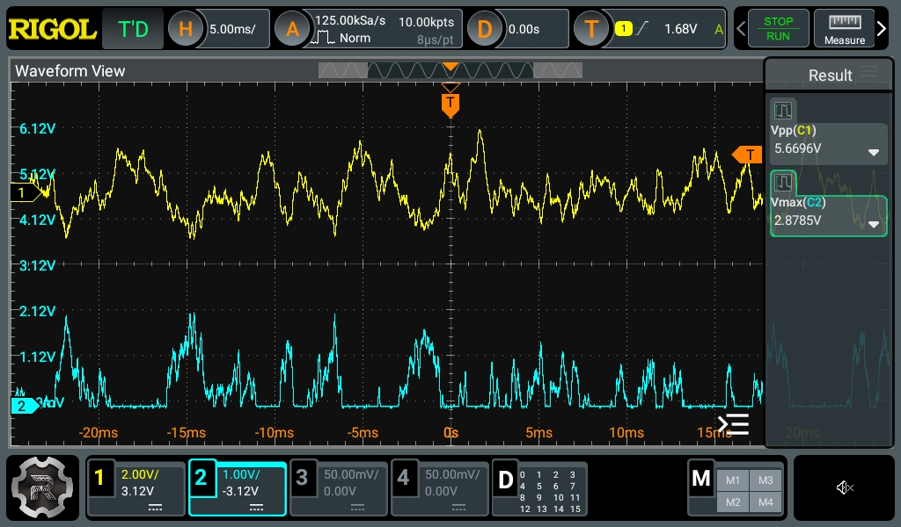
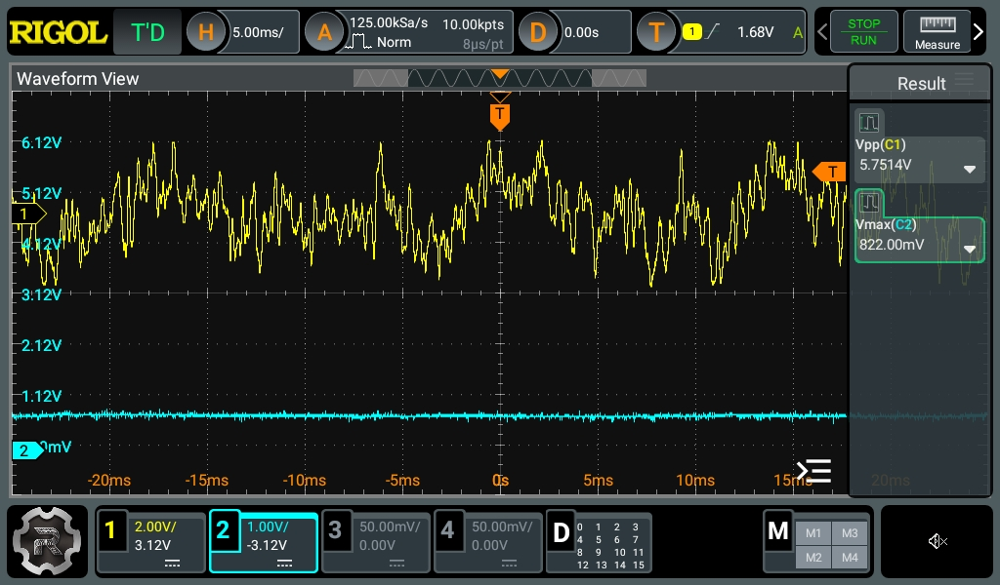

+++
date ="2025-12-31"
title = "理想ダイオード回路でオーディオ信号の大きさを測定する"
[extra]
og_image = "/blog/smart-volume0/ogp.jpg"
+++

次に試作したい装置は自動ボリューム。音が大き過ぎる時には自動でボリュームを絞るような装置。[電子ボリュームの動作は確認できた](https://www.ruimo.com/blog/esp32-muses72323/)ので、次は入力信号の大きさを測定したい。オーディオ信号の大きさを測定するには、信号を整流してその電圧を見れば良いが、一般的なシリコンダイオードは順方向電位が0.6Vくらいあるので、オーディオ信号のような微弱な電圧だと音量が小さいケースでは測定不能になってしまう。こういうケースは理想ダイオード回路を使うのが良いようだ。出力に電力は不要なのでオペアンプを使う回路が簡単そうだ。

Webで検索するとボルテージフォロア(非反転)回路を使ったものが見つかる。ボルテージフォロアなら入力インピーダンスも高くて良さそうなのだが、回路を構成して電源を入れるとものすごい電流がオペアンプに流れて壊れそうになる。これ、合っているのだろうか...

仕方無いので普通に反転増幅回路を使うことにする。

これで実際にオーディオ信号(Line out)を入力してみる。最初はコンデンサーを外してみて、整流できているか確認。

上が入力信号で、下が整流結果。反転増幅回路なので、入力波形の下半分が出てきている。ちゃんと0.6V未満の電圧も出てきている。

次にコンデンサーを接続してみる。

平滑されて入力が5.7V PPの時に800mVくらいになっている。これをESP32のA/D変換に入力してやれば測定できそうだ。しかし、この手のアナログ回路をブレッドボードでやると、すぐノイズまみれになってしまうな。もう基板おこしちゃうかな。基板おこすと設計変更が必要になるジンクスがあるし悩む。
