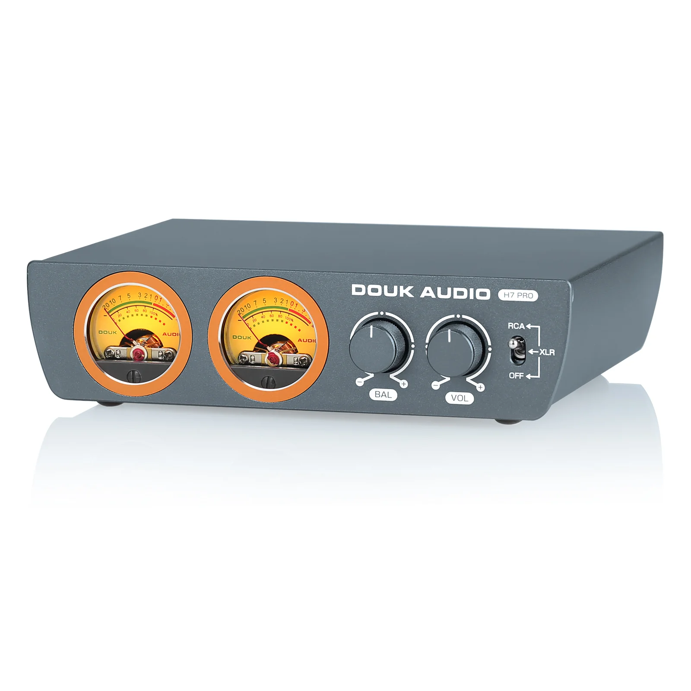
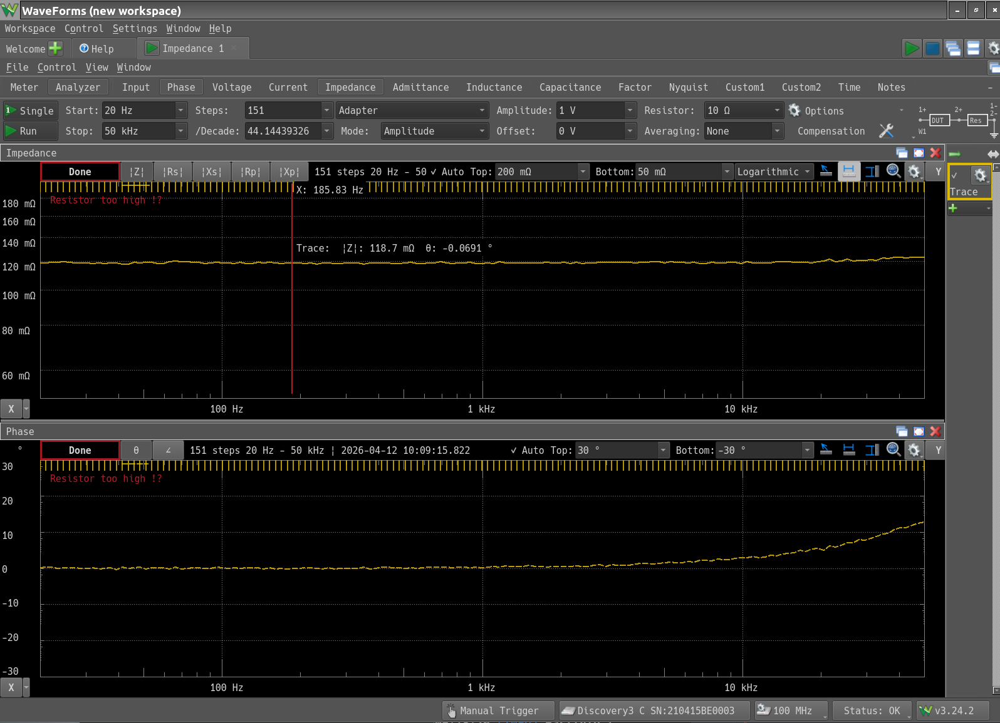
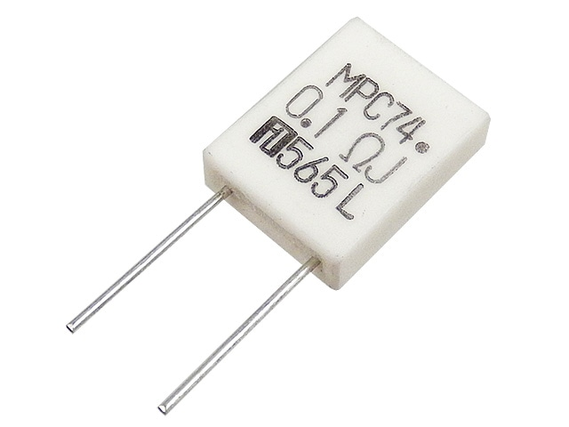

+++
date = "2026-04-12"
title = "スピーカー電力計"
[taxonomies]
tags = ["スピーカー電力計"]
+++

良くオーディオアンプのレビューで「最大出力が大きいので小さな音での鑑賞でも余裕が感じられる」的なのがあるが、あれは本当なのだろうか。今回はこのあたりを研究してみたい。

大昔に書籍で読んだ限りでは家庭では5Wも出せば近所迷惑なので、アンプの出力は10Wもあれば十分的なことが書かれていた。もっともスピーカーの音量は電力だけでは決まらない。能率があるからだ。そしてこの5Wも平均の電力だろうから瞬間最大風速的にはどうなのか。

昔のアンプは、ものによってはアナログメーターが付いていて、出力が分かるものがあった。[今もあるみたいだ](https://doukaudio.com/products/douk-audio-h7pro-tpa3255-digital-amplifier-w-vu-meter-300w-home-stereo-power-amp)。

まぁ、こういうのは出力を正確に把握するというより、見た目を楽しむのが目的だろう。

そもそも最初の「最大出力が大きいので小さな音での鑑賞でも余裕が感じられる」を検証するなら、過渡特性を見るべきだ。スピーカーの電力はスピーカー両端の電圧と、流れている電流を測定すれば良い。これを40kHzくらいのサンプリング周波数で取得して、乗算すれば電力の過渡特性が分かるだろう。電流を測定するには直列に抵抗を入れて電圧降下を見れば良い。

$Va-Vb$がスピーカー両端の電圧。抵抗の両端の$Vb$を測定すれば抵抗値から電流値が計算できる。手元に0.12Ωのセメント抵抗があるので周波数特性を測定してみる。

10kHzあたりから、若干インダクタンス成分が出てくるようだ。セメント抵抗は巻線抵抗をセメントで固めたものなので、ある程度のインダクタンス成分は仕方が無いだろう。もっとも、このあたりだと測定器の測定限界な気もする。秋月電子に[金属板抵抗](https://akizukidenshi.com/catalog/g/g110697/)があったので試しに注文してみた。届いたらこちらも測定してみよう。

