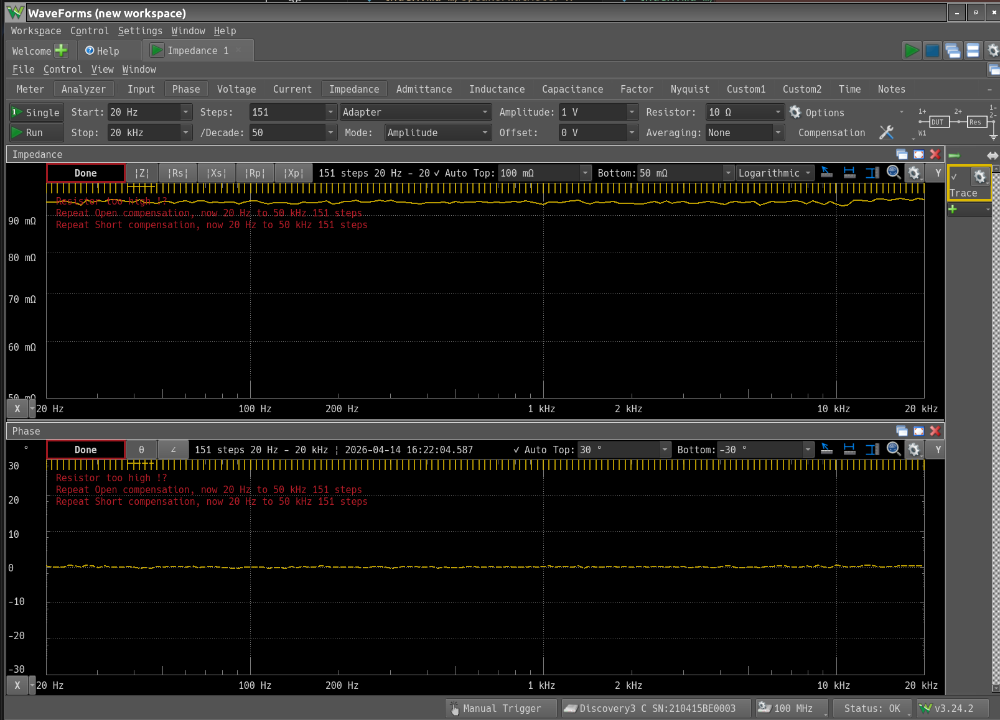
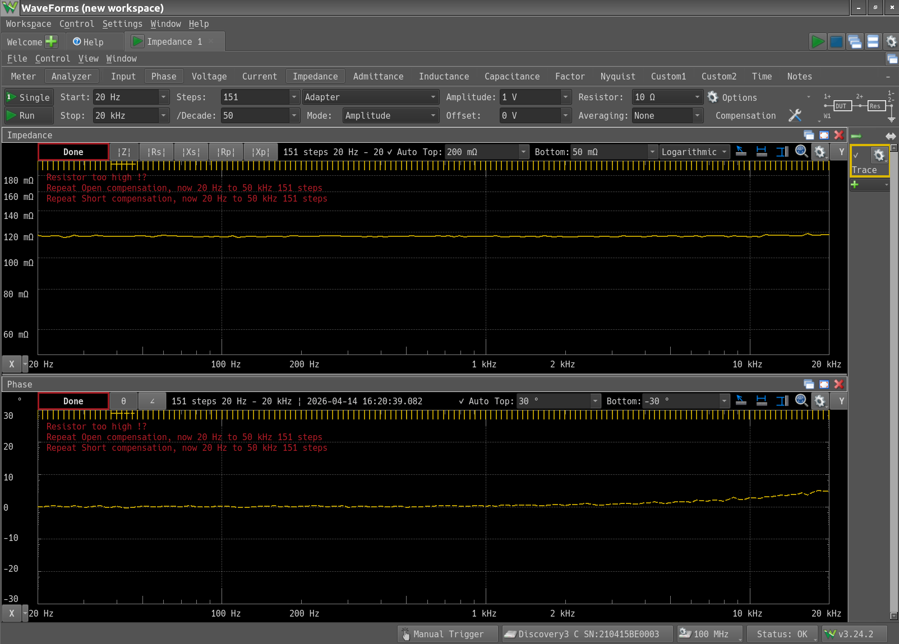

+++
date = "2026-04-14"
title = "スピーカー電力計"
[taxonomies]
tags = ["スピーカー電力計"]
+++

秋月電子の[金属板抵抗](https://akizukidenshi.com/catalog/g/g110697/)が届いた。

早速測定。

こちらは以前測定したセメント抵抗(前回、測定レンジが|Z|になっていなかったので、取り直した)。

やはり高周波域の位相は金属板抵抗の方が良好だ。
