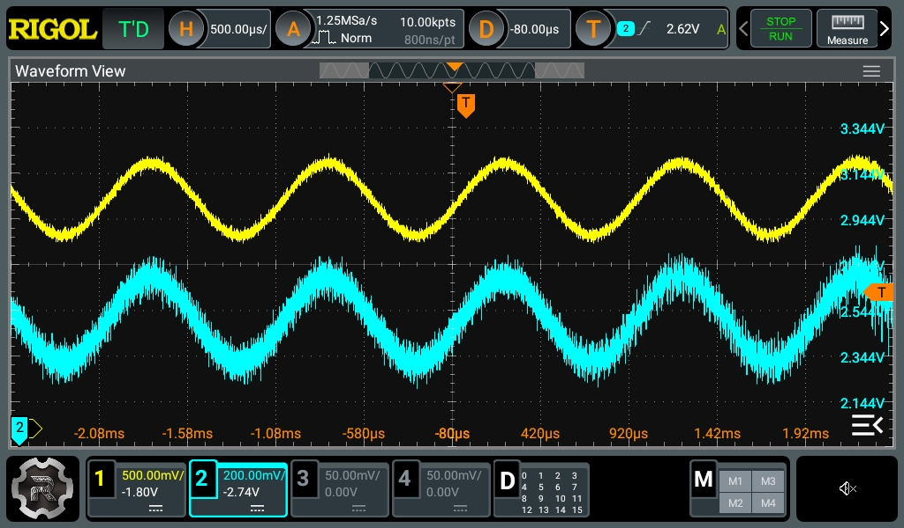

+++
date = "2026-04-19"
title = "スピーカー電力計 - 電圧、電流測定"
[taxonomies]
tags = ["スピーカー電力計"]
+++

スピーカー電力計、今回は電圧と電流の測定回路の検証。

  <iframe src="SCH_Schematic1_2026-04-19.pdf#toolbar=0" style="width: 100%; aspect-ratio: 4 / 3; border: 1px solid #ccc;">
  </iframe>
  
  

    <a href="SCH_Schematic1_2026-04-19.pdf" target="_blank" rel="noopener noreferrer">📥 回路図を別タブ表示</a>
  

- アンプの-とスピーカーの-の間にシャント抵抗を入れて、その両端の電圧を測定することで電流を測定。
- マイコンのA/D変換は正電圧でないと測定できないので、2.5Vのゲタをはかせる。

とりあえずLチャンネルだけ回路を組んで測定してみた。

入力は1kHzの正弦波。アンプを通してFOSTEXのフルレンジに接続。アンプはFX-AUDIOのFX-202A。最初、数100kHzの盛大なノイズが0.3秒ごとに押し寄せるという事象が起きて、回路が発振でもしているかと思ったら、どうもアンプにつないでいたACアダプタが良くなかったみたいだ。別のものに交換したら収まった。

黄色が電圧、青色が電流。もっと大きく位相がずれるのかと思ったら、ごくわずかな差異のようだ。電流測定回路の出力はVppで0.5Vくらいかな。Opアンプで10倍に増幅しているので、実際の振幅は0.05V。抵抗値が0.1Ωなので、ピークで0.5Aくらい流れている計算。電圧の方はオシロのレンジが500mVになっているから、Vppで1V切るくらいかな。このフレンジスピーカーだと0.5Wもかければ、それなりの音で鳴るということになるので、昔書籍読んだ「10Wもあれば十分」説が裏付けられたように思う。

この後の予定は、

- これをRチャンネル側にも作って、BTLアンプでもこの回路で大丈夫なのか検証
- マイコンで50kHzくらいのサンプリング周波数でA/D変換で測定値を取る
- 平均、ピーク電力を300msごとくらいに表示するアプリを作る

今のところ前段にCH32V203を2つ置いてA/D変換(CH32V203はA/D変換が2つ搭載されていて、同時に2点を測定できる)。後段にESP32を置いてそこにSPIで測定データを送り、ESP32でWebSocketサーバーでも動かして、PCのブラウザで測定値を表示できるようにする予定。