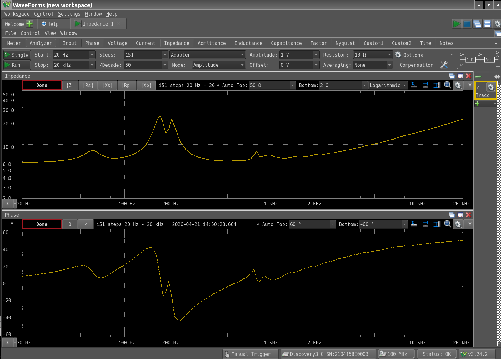

+++
date = "2026-04-21"
title = "スピーカー電力計 - インピーダンスチェック"
[taxonomies]
tags = ["スピーカー電力計"]
[extra]
og_image = "/blog/speakerwatmeter4/ogp.jpg"
+++

[前回、スピーカーの電圧と電流にほとんど位相差が無かった](/blog/speakerwatmeter3)のが気になっていたので、インピーダンスアナライザで確認してみた。

なるほど。1kHz近辺ではほぼ位相が0なのか。スピーカーの位相ってこんなに暴れるものなのね。面白い。
