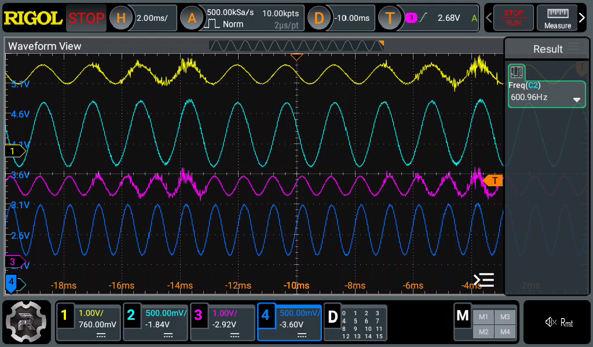

+++
date = "2026-05-04"
title = "スピーカー電力計 - 電圧、電流測定"
[taxonomies]
tags = ["スピーカー電力計"]
[extra]
og_image = "/blog/speakerwatmeter5/ogp.jpg"
+++

スピーカー電力計、とりあえずアナログ回りはこんな感じ。

  <iframe src="SCH_Schematic1_2026-05-04.pdf#toolbar=0" style="width: 100%; aspect-ratio: 4 / 3; border: 1px solid #ccc;">
  </iframe>
  
  

    <a href="SCH_Schematic1_2026-05-04.pdf" target="_blank" rel="noopener noreferrer">📥 回路図を別タブ表示</a>
  

- BTLアンプ対応のため、入力は差動増幅で、rail-to-railのオペアンプを使用。
- マイコンのA/D変換で受けるため3.3V/2を中点に。
- プログラマブルゲインアンプを入れて、マイコンから測定レンジを切り替えられるように。

オペアンプの出力段での測定結果はこんな感じ。一番上から左電圧、左電流、右電圧、右電流。

左右で違う周波数を入れてみて、影響が出ていないか確認したが特に波形の乱れは無いので大丈夫そう。全体のテストはしていないけど、プログラマブルゲインアンプの部分は単純だし、大丈夫でしょう(フラグ)ということで基板を発注。
