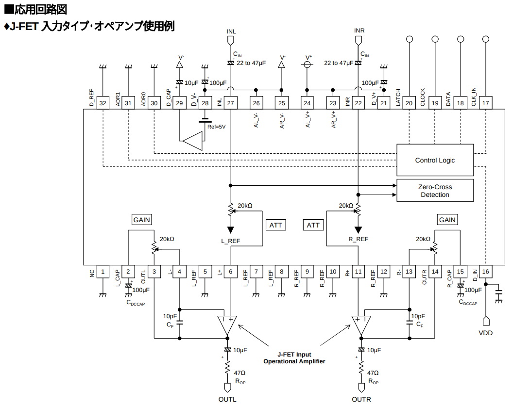

+++
date ="2025-12-30"
title = "SSOPの半田付け"
[extra]
og_image = "/blog/ssop/ogp.jpg"
+++

SSOPの半田付けは気合いが必要。とはいえ「やる気が出たらやろう」は永遠に先延ばしになるフラグなので、えいやっと始めてしまうのが吉。

{{ clickable_img(src="IMG_3008.JPG", alt="photo") }}

{{ clickable_img(src="IMG_3009.JPG", alt="photo") }}
クリーム半田を盛る。これはマズイ例。内側に半田を盛り過ぎ。これだと内側で半田ブリッジになる可能性があり、その場合ICの下になってしまうので修復が困難になる(実際、最初はこの状態で進めたところ、最後のチェックでショートが発見されてやり直しに)

{{ clickable_img(src="IMG_3020.JPG", alt="photo") }}
こんな感じで外側に半田を盛りましょう。

{{ clickable_img(src="IMG_3010.JPG", alt="photo") }}
そっと乗せる。大抵1番ピンのところに丸いマークがあるか、U字型の切り欠きがあるので、それを基板側に合わせる。

{{ clickable_img(src="IMG_3011.JPG", alt="photo") }}
顕微鏡で見ながら位置合わせ。

{{ clickable_img(src="IMG_3012.JPG", alt="photo") }}
リフロー開始。150℃で余熱してから200℃に上げて半田が溶けたら引き上げ。こういうリフロー炉があると便利。特に間違いが見つかってICを剥がさなきゃいけない時なんかも簡単にできる。

{{ clickable_img(src="IMG_3013.JPG", alt="photo") }}
リフローが終わったところ。

{{ clickable_img(src="IMG_3015.JPG", alt="photo") }}
半田ブリッジを取り除く。作業する時は距離感が分かるように複眼式顕微鏡を使用。もしも単眼式しか持ってなかったら、作業用に複眼式も購入することをお勧めしたい。作業効率が圧倒的に違う。

{{ clickable_img(src="IMG_3016.JPG", alt="photo") }}
半田吸い取り器で余分な半田を吸い取る。

{{ clickable_img(src="IMG_3017.JPG", alt="photo") }}
どうかな？

{{ clickable_img(src="IMG_3018.JPG", alt="photo") }}
顕微鏡で確認。こちらは扱いが簡単な単眼式の液晶顕微鏡。

テスターで導通と他のピンとのショートが無いかを確認して終了。動くといいな。
なお、25, 26, 28ピンがショートしていてあわてたのだけど、もう1つ予備で買っておいた半田付け前のICで確認したところ、このICはそういうものみたいだ。回路例でもこれらはショートして使うものみたいで問題なさそう。

もっとも21, 23, 24ピンはショートしていないので、不思議な仕様だ。こういう時のため予備は最低1つ買っておくと良い。
