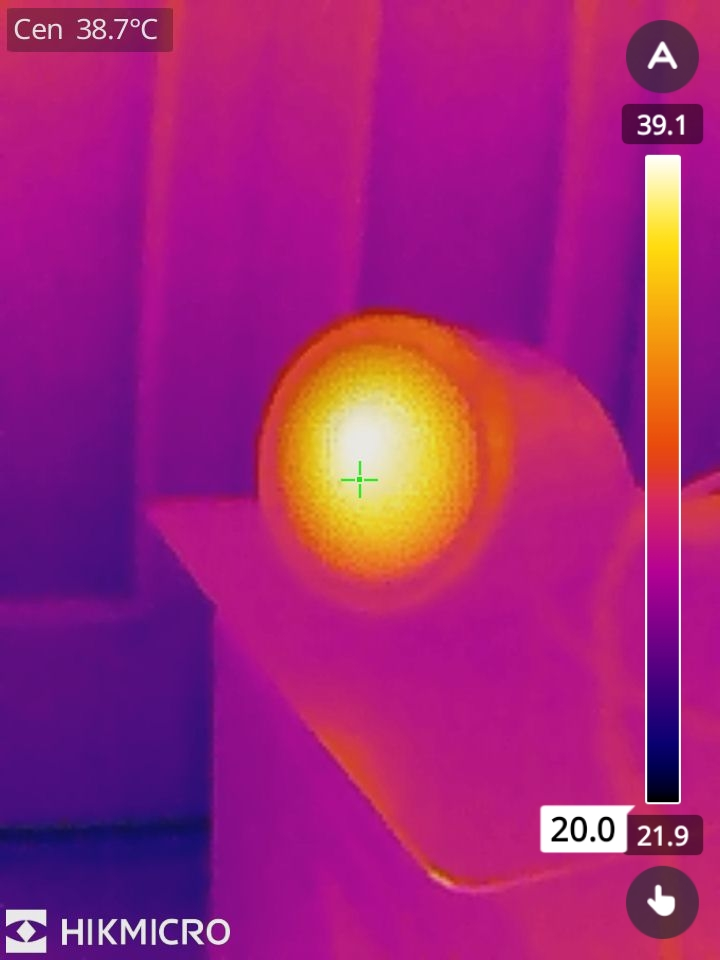
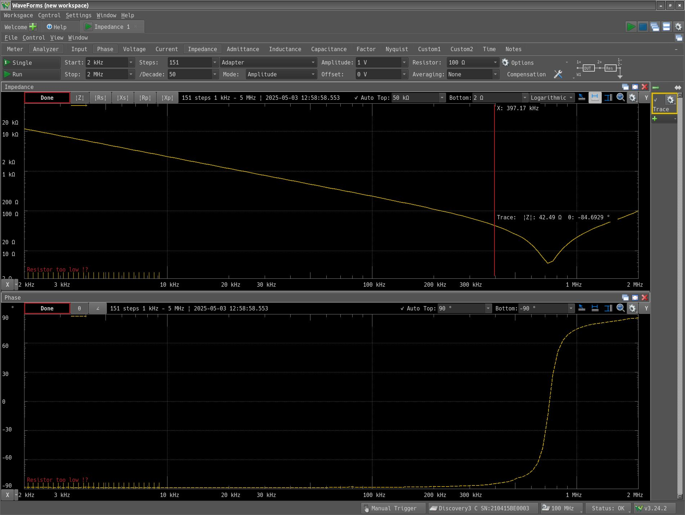

+++
date = "2025-05-03"
title = "超音波振動子の測定ふたたび"
[taxonomies]
tags = ["Analog Discovery 3", "超音波洗浄器"]
+++

MOS-FETでスイッチング回路を作って、100kHzくらいを数分かけてみた。

だいたい39℃くらいに温まっているので、再度インピーダンス測定。

確かに700kHzくらいまで下がっている。とはいえこの程度だと75kHzには程遠い。やはり魚群探知機に長年使われて経年変化で共振周波数が高くなってしまったものが売られていたのかもしれない。
