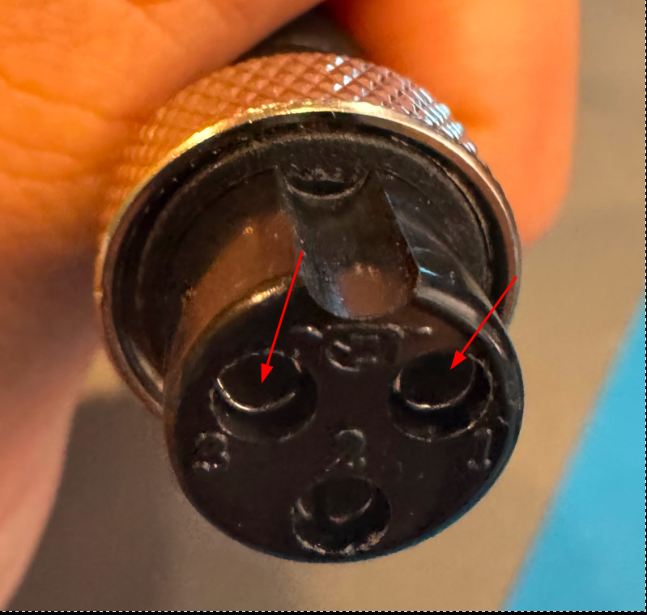
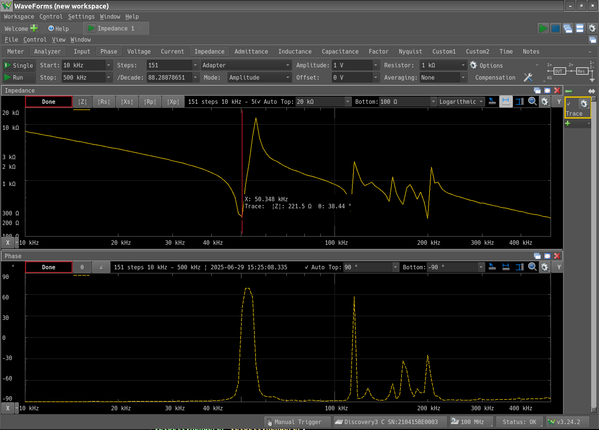
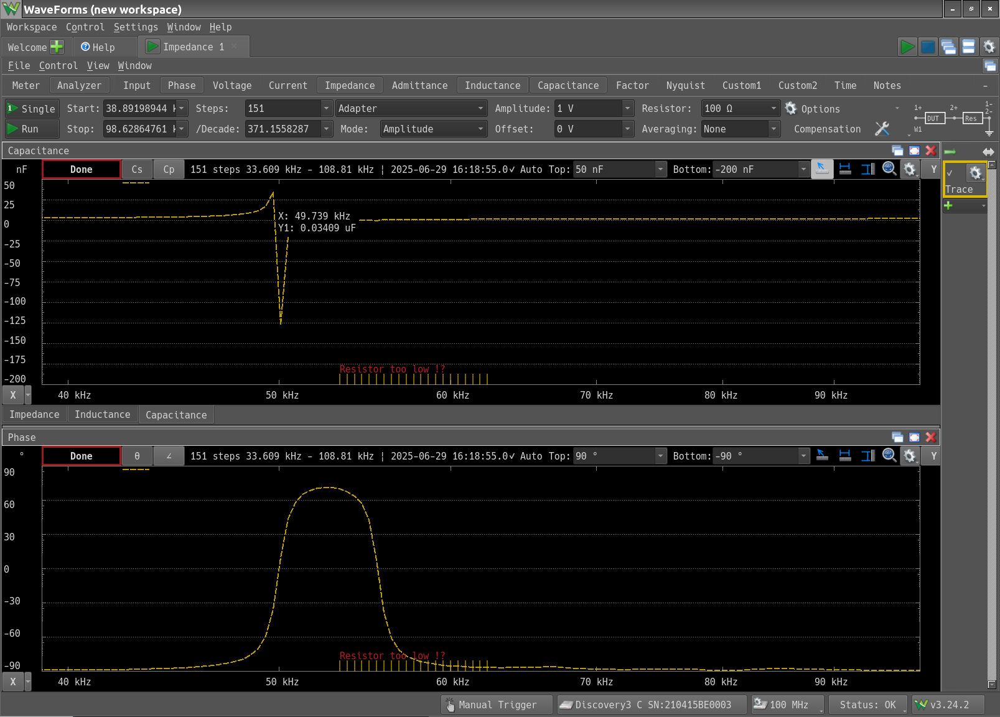

+++
date = "2025-06-29"
title = "新たな超音波振動子"
[taxonomies]
tags = ["Analog Discovery 3", "超音波洗浄器"]
[extra]
og_image = "/blog/tranceducer2/tranceducer.png"
+++

どうも秋月の超音波振動子の挙動がおかしいので別のものを買ってみた。

[AliExpressで購入した超音波振動子](https://ja.aliexpress.com/item/1005008873671176.html)

説明では50kHz/200kHzで共振するとのこと。3ピンのMICコネクタが付いている。

インピーダンスンアナライザで測定してみると、1, 3ピンで接続で良さそう。

200kHzの方は少々怪しいが、50kHzの方はちゃんとインピーダンスが最小になっている。この時$Z=222Ω$くらいのようだ。容量も測定。

49.7kHzで0.034μFくらい。ここから周波数が上がると急激に位相が反転してインダクタとして動作するようになるようだ。

次に、回路にインダクタを入れて直列共振させることで振動子に電流を多く流せるようにする。直列共振回路の式は以下なので、

$$
f = \frac{1}{2 \pi \sqrt{LC}}
$$

変形して

$$
L = \frac{1}{(2\pi f)^2C}
$$

結果は

$$
L = 0.3mH
$$

というわけで0.3mHのインダクタを用意することに決定。あと結構周波数の範囲がシビアなので最適な周波数を探す仕組みが必要そう。
