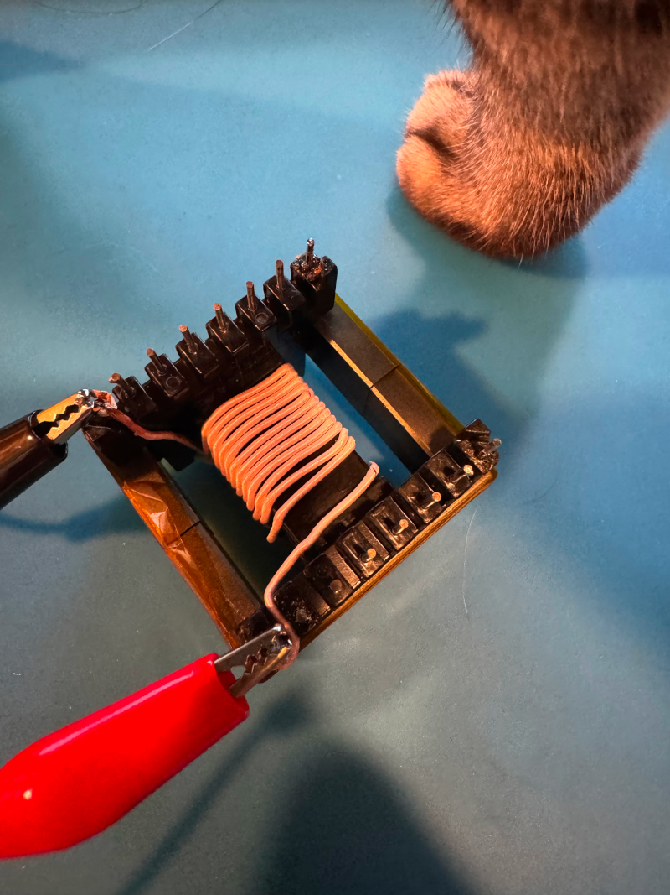
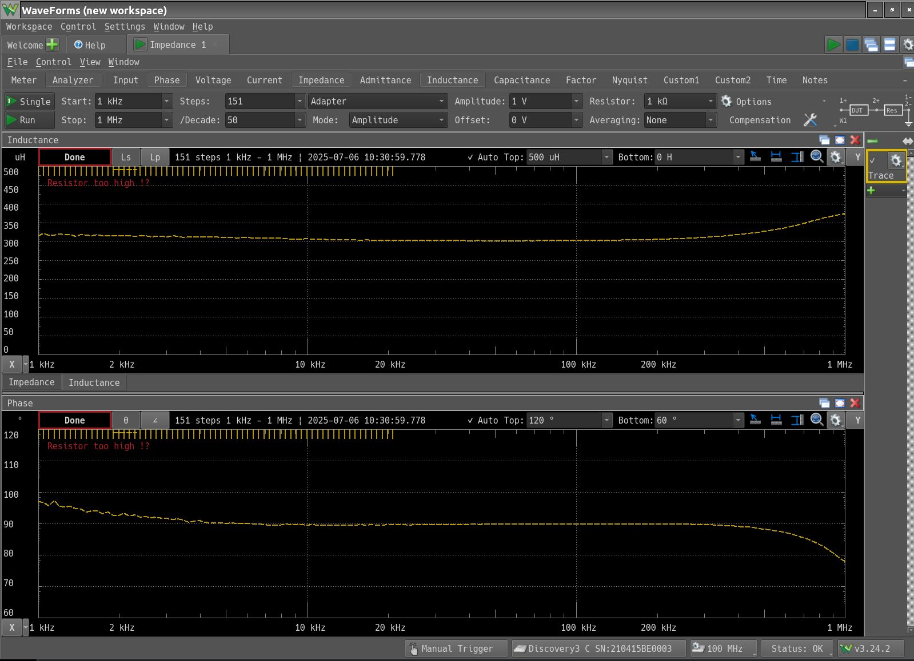
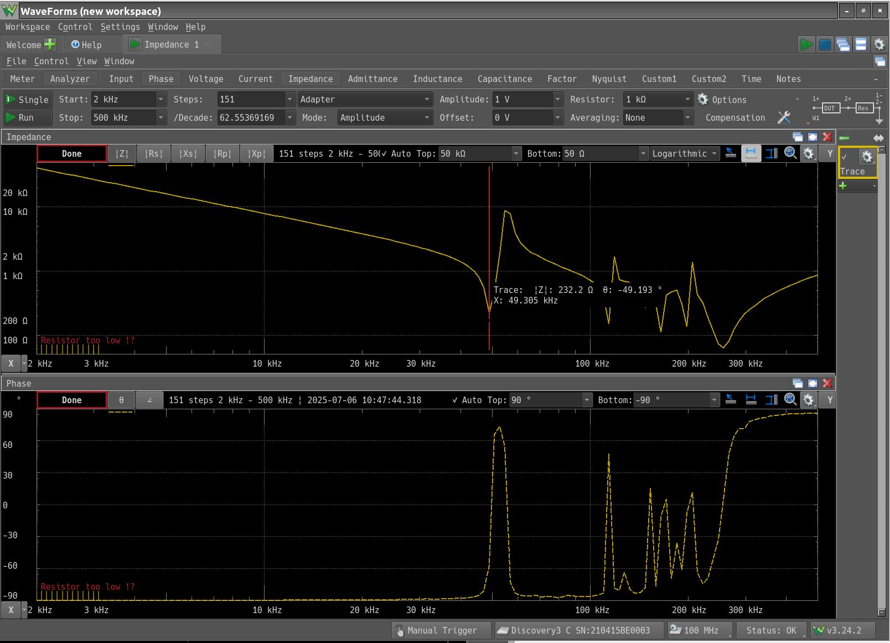
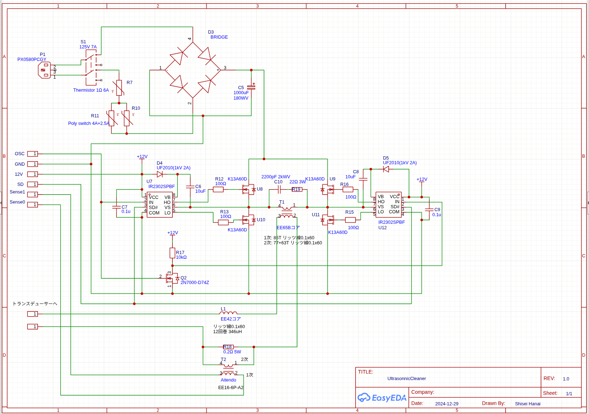

+++
date = "2025-07-06"
title = "超音波振動子を共振させる"
[taxonomies]
tags = ["Analog Discovery 3", "超音波洗浄器"]
[extra]
og_image = "/blog/tranceducer3/inductor.jpg"
+++

[前回](/blog/tranceducer2)、インダクタを0.3mHにすれば良いことが分かったので。インダクタを巻く(猫の脚は商品に含まれませんw)。

AliExpressで購入したEE42のフェライトコアに0.1mm x 100のリッツ線を21回巻いたもの。インダクタンスを測定してみる。

ほぼ300uHで良い感じ。トランスデューサと直列に接続してインピーダンスを測定してみる。

50kHz近辺でのインピーダンスは230Ωくらい(共振させたら、もっと下がるのかなと思ったけどなぜだろう..)。実効値で230Vくらいかければ、1A流れて230W出力になる計算。用意した駆動回路はこんな感じ。

100Vを整流してMOS FETでスイッチングしてフライバックトランスで昇圧、トランスデューサを駆動する。100Vを直接整流しているので突入電流軽減のために1Ω 6AのNTCサーミスタを入れてある。電源スイッチも感電予防のため両極をOn/Offするようにした。

ハーフブリッジはIR2302SPBFで、耐圧600Vあるので今回の用途にはぴったり。2つ使ってフルブリッジを構成している。フライバックトランスは、これまたAliExpressで購入したEE65Bコア。2次側は試行錯誤しながら巻いたので77+63回巻きになっている。トランス1次側は高調波吸収のためスナバ回路を入れておいた。

トランスデューサに流れる電流を監視して制御したいので0.2Ωを直列に入れて、そこで発生した電圧降下をトランスで絶縁して、制御側に渡せるようにしてある。このトランスは[aitendoで買ったもの](https://www.aitendo.com/product/19833)で、おそらく12Vの電源アダプタのフライバックトランス用だろう。

50kHzをOSCに印加して、電流計付きのスライダックで電源を上げていったところ、70Vくらいかけたところで4Aくらい流れたのでこの回路で十分に駆動できそうだ。あとは制御部の作り込みだ。
