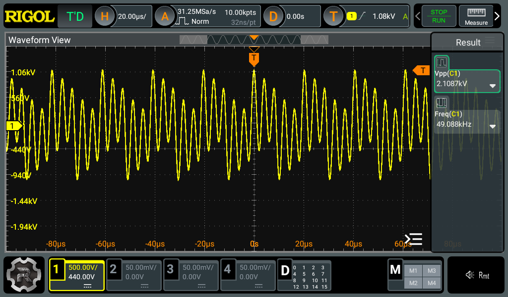

+++
date = "2025-07-21"
title = "超音波振動子の駆動"
[taxonomies]
tags = ["Analog Discovery 3", "超音波洗浄器"]
[extra]
og_image = "/blog/tranceducer4/capture.png"
+++

少し回路を変更。

- トランスデューサに直列に入れたインダクタは無くてもあまり影響が見られなかったので省略
- 盛大にノイズが出るのでコモンモードチョークを入れた

トランスデューサにかかっている電圧をオシロで見ると、こんな感じだった。

Vppで2,100Vくらい。波形を見ると10kHzくらいの波が重畳されているように見えるが、原因は不明。回路の実装的に10kHzで共振する箇所があるのかもしれない。
