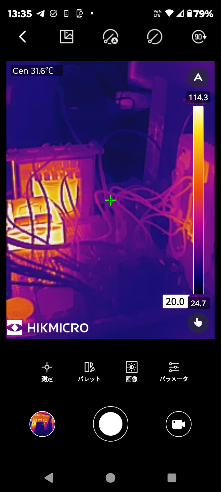
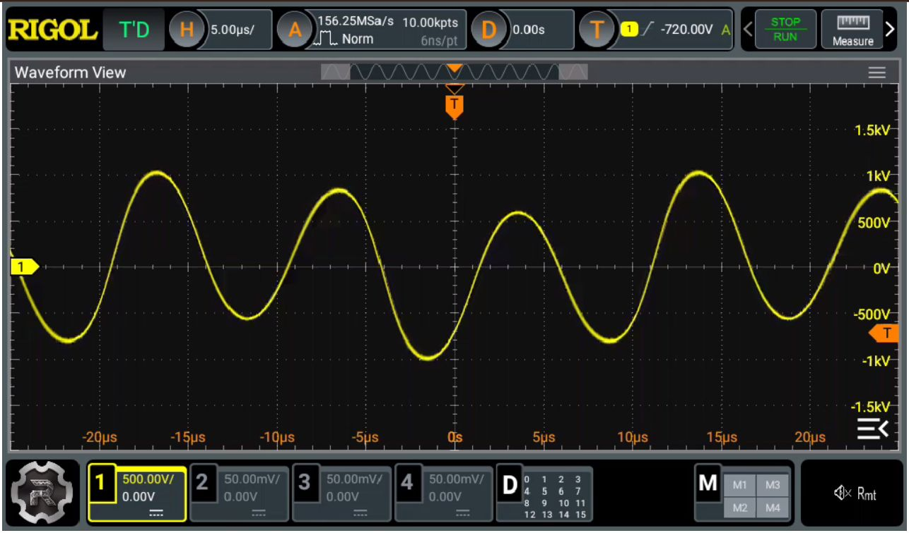
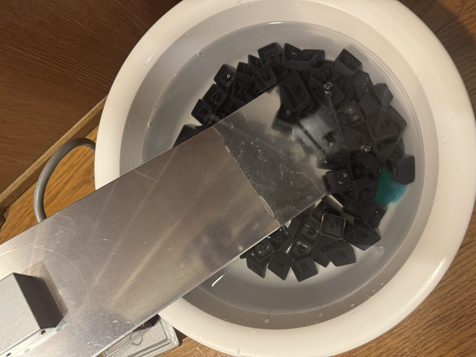

+++
date ="2025-11-16"
title = "新しい超音波振動子"
[taxonomies]
tags = ["超音波洗浄器"]
[extra]
og_image = "/blog/tranceducer5/Screenshot_20251013-133553.png"
+++

[以前紹介した魚群探知機用の超音波振動子](/blog/tranceducer2/)は、数分稼動すると底面のプラスチック部分が膨らんできてしまう。明らかにやばい感じ。多分、魚群探知機用のって、長時間使うんじゃなくてパルス駆動で使うのではないかなと。

そこでAliExpressで超音波洗浄器用のトランスディーサーを買ってみた。こういうやつ。

さっそくインピーダンス測定。

27kHzあたりで120Ωくらい。これまでの回路だと電圧がかかり過ぎになりそうなので、フライバックトランスの2次側を140回巻きから、100回巻きまで減らしてみた。これで数分稼動してパーツの温度を見てみる。

数分稼動後の温度は、インダクタのフェライトコアが120℃近くまで上がる。巻線側ではなくてコア側の発熱なのでカプトンテープ使っているし大丈夫じゃないかなと様子見。

トランスデューサーにかかっている電圧を測定してみた。

Vppで1kVくらいかな。なかなかおっかないのだが、面倒なことにこのトランスデューサー、端子の片方が筐体とつながっているのだ。苦労して絶縁した。さっそくキーボードのキーキャップの洗浄をしてみる。

超音波洗浄器って、市販のものだとジーという音がするものが多いが、全く音が聞こえない。ただ考えてみれば「超音波」なのだから聴こえないのは当然な気もする。水面を見ていると対流しているし、10分くらい使ってみたらちゃんと綺麗になったので、とりあえずは成功かな。
