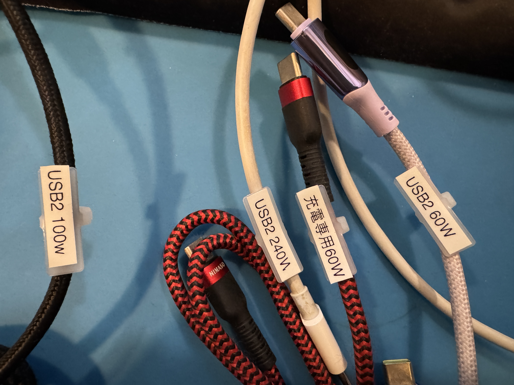

+++
date ="2025-9-23"
title = "USBケーブルチェッカ"
[extra]
og_image = "/ruimo-blog/blog/usbcablechecker/IMG_2717.JPG"
+++

[USB Cable Checker3](https://www.pc-koubou.jp/products/detail.php?product_id=1175815)が出ていたので買ってみた。

使い方は簡単でケーブルをつなぐだけ。電池は単四2本(ニッケル水素電池でも起動した)。表示は最大2ページ。

直流抵抗値も表示されるので、え、そんな細いのに240W対応なの？ 5Aも流せるの？ というケーブルについては直流抵抗も見てみると良いかも。手元にあった240Wケーブルの1つは200mΩ強あったので、5Aも流したら1Vくらい電圧降下しそうだ。というわけでタグを付けてヨシ!

タグはヘラマンタイトンのIT18Rを使用。

