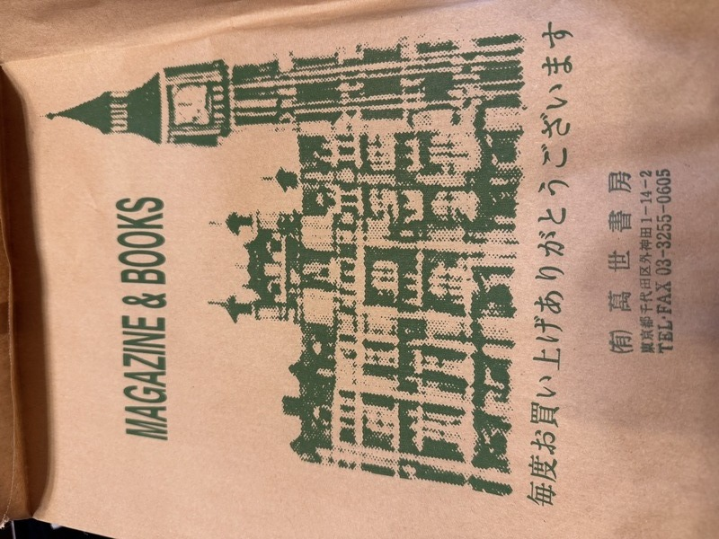

+++
date ="2025-12-20"
title = "万世書房でyoのけそうぶみ"
[extra]
og_image = "/blog/yo/IMG_2979.JPG"
+++

万世書房さんが閉店とのことで、噂によると2025/12/21(日)で閉店。金曜日の昼休みに見に行ったのだが、お昼休みだったみたいで「14:30まで戻りません」と札がかかっていて、15:00から会議があったのであきらめて帰ってきた。

気をとり直して今日行ってみた。Webでは10:30開店とあったので10:45くらいに行ってみたが閉まっていて、ありゃ、前倒しで閉店しちゃったのかなと今度こそあきらめたのだが、その後、秋月で買い物などしてから帰りに寄ってみたら、やっていた!

yoのけそうぶみは、昔のマイコン雑誌ASCIIに掲載されていたエッセイ(?)で、私の世代のマイコン少年はみんな知っているだろう。今読み返してみても、これがなぜマイコン雑誌に掲載されていたのか不思議だが、当時はそれだけ懐が深かったのだろう。
