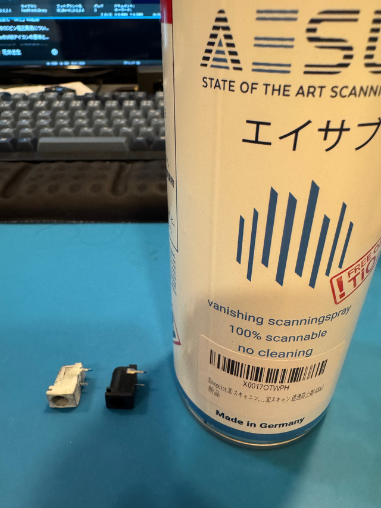
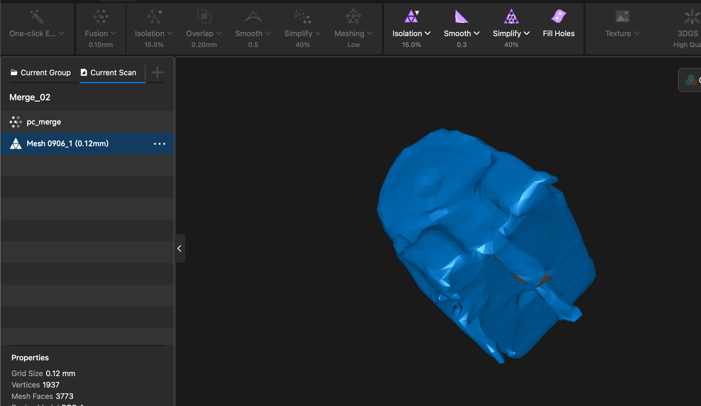
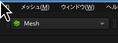
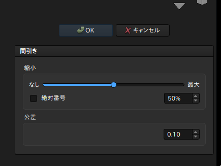
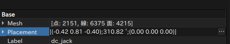
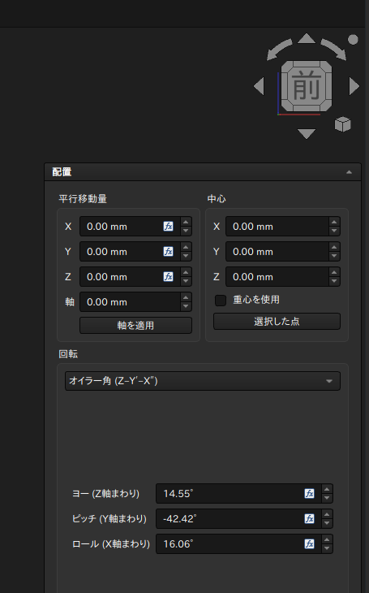
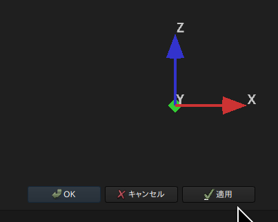
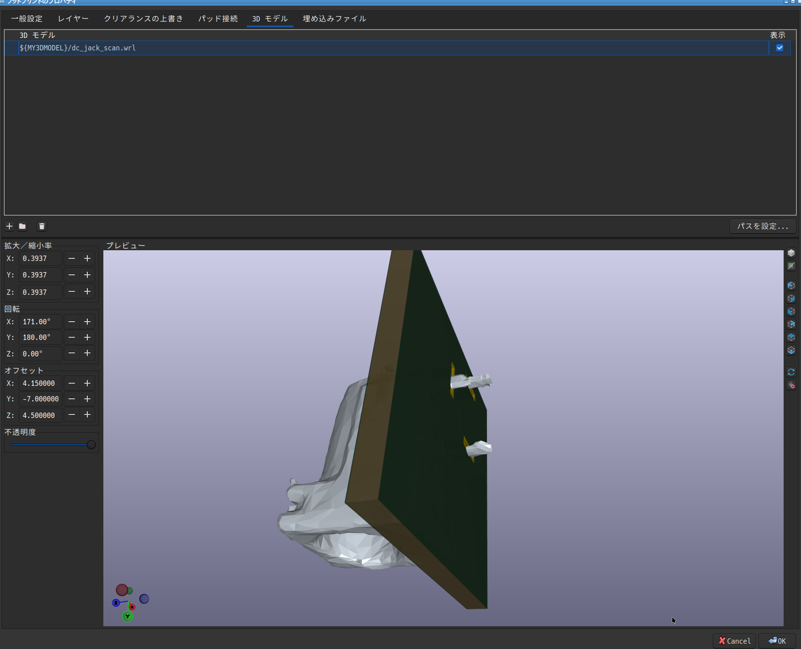

+++
title = "3Dスキャンして、KiCadに取り込む"
date="2026-09-06"
[extra]
og_image = "/diy/3dscan-kicad/ogp.jpg"
+++

# 概要

KiCadの部品の3Dデータをスキャンから作成する方法を記録。

# 諸元

- スキャナ: [revopoint POP 4](https://www.revopoint3d.jp/products/pop4-wireless-hybrid-3d-scanner)
- CAD: [FreeCad 1.1](https://www.freecad.org/index.php)
- KiCad: [KiCad 10.0](https://www.kicad.org/)
- 部品は[DCジャック](https://www.aitendo.com/product/2160)

# スキャン

## スプレー

黒、金属主体なので、そのままだと満足にスキャンできず。

左がスプレーしたもの。あらかじめアルコールを浸した綿で油分を取っておく。少し離しながら軽くスプレー。スプレー直後は透明で少しすると白くなるので、それを見ながら足りないところに追いスプレーする。

## スキャン

レーザーでのスキャンを使用。ターンテーブルに乗せてサンプル数2000を超えるくらい。露出とかは自動で大丈夫だった(むしろ、ここをいじると結果が悪化)。
1つスキャンしたら、ひっくり返してもう1回スキャン。

Fusionを0.1mmで実行してから、Merge Alignmentで2つのスキャンを結合。
結合したら、メッシュ化。破綻しない程度にSimplifyボタンを何度か押す。
ここまでできたら.stlファイルとして保管する。

で、この状態だと、複雑すぎてKiCadで表示できなかったので、間引きをする。

## 加工

.stlファイルをFreeCadで開き、Meshに切り替えて、

メニューのメッシュ=>間引きを何度かやる

ここの「面」のところが数千くらいまで減れば大丈夫みたいだ。

あと、スキャンしていると角度が適当でKiCad上での位置合わせに苦労するので、上記のPlacementの右端にある...をクリックする。

「前」がこのように表示されるようにしてから、回転のところを「オイラー角」にして、ヨー、ピッチ、ロールをマウスホイールころころしてパーツが正対するように調整して、下の方にあるOKをクリックする。OKボタンはかなり下にあるので注意。

ここまでできたら、Ctrl+Eでエクスポートを選び、形式にVRML V2.0を選んで保管する。

## KiCadへの設定

フットプリントエディターで、図面の何も無いところをクリックしてから`E`を押す

3Dモデルのタブを選び、上でエクスポートしたwrlファイルを選ぶ。拡大率は0.3937(これは1/2.54。stlファイルには長さの単位が入っていないそうで、インチとmmとでずれるらしい)。あとはフットプリントの穴に合うようにオフセットを調整してやればOK
