+++
title = "3Dスキャンして、KiCadに取り込む"
date="2026-09-06"
[extra]
og_image = "/diy/3dscan-kicad/ogp.jpg"
+++

# 概要

KiCadの部品の3Dデータをスキャンから作成する方法を記録。

# 諸元

- スキャナ: [revopoint POP 4](https://www.revopoint3d.jp/products/pop4-wireless-hybrid-3d-scanner)
- CAD: [FreeCad 1.1](https://www.freecad.org/index.php)
- KiCad: [KiCad 10.0](https://www.kicad.org/)
- 部品は[DCジャック](https://www.aitendo.com/product/2160)

# スキャン

## スプレー

黒、金属主体なので、そのままだと満足にスキャンできず。

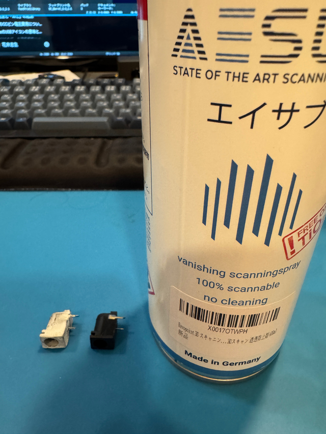

左がスプレーしたもの。あらかじめアルコールを浸した綿で油分を取っておく。少し離しながら軽くスプレー。スプレー直後は透明で少しすると白くなるので、それを見ながら足りないところに追いスプレーする。

## スキャン

レーザーでのスキャンを使用。ターンテーブルに乗せてサンプル数2000を超えるくらい。露出とかは自動で大丈夫だった(むしろ、ここをいじると結果が悪化)。
1つスキャンしたら、ひっくり返してもう1回スキャン。

Fusionを0.1mmで実行してから、Merge Alignmentで2つのスキャンを結合。
結合したら、メッシュ化。破綻しない程度にSimplifyボタンを何度か押す。
ここまでできたら.stlファイルとして保管する。

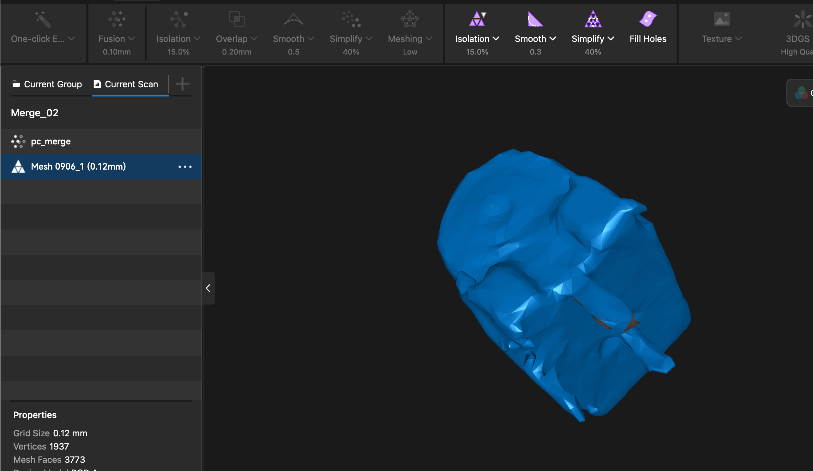

で、この状態だと、複雑すぎてKiCadで表示できなかったので、間引きをする。

## 加工

.stlファイルをFreeCadで開き、Meshに切り替えて、

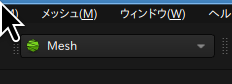

左端の「選択オブジェクトのリスト」でモデルをクリックして選択状態にする(この例では"dcbarrel"と書かれているところ)

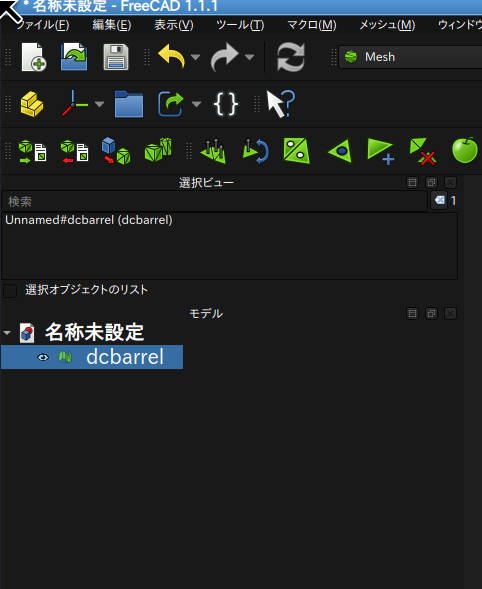

メニューのメッシュ=>間引きを何度かやる

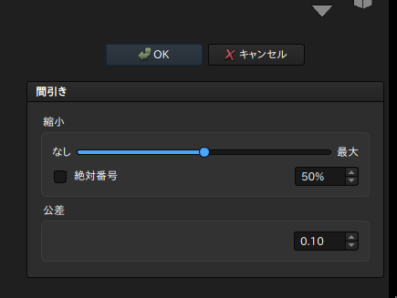

ここの「面」のところが数千くらいまで減れば大丈夫みたいだ。

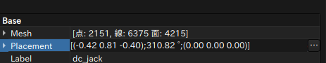

あと、スキャンしていると角度が適当でKiCad上での位置合わせに苦労するので、上記のPlacementの右端にある...をクリックする。

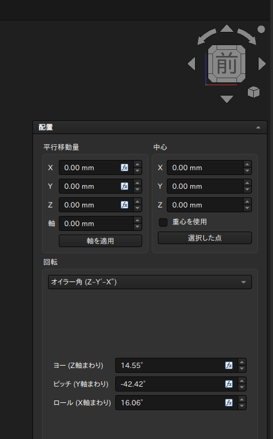

「前」がこのように表示されるようにしてから、回転のところを「オイラー角」にして、ヨー、ピッチ、ロールをマウスホイールころころしてパーツが正対するように調整して、下の方にあるOKをクリックする。OKボタンはかなり下にあるので注意。

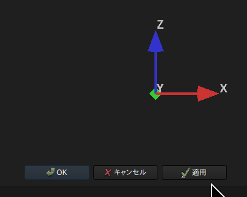

この向きが角度0になるようにするため、表示=>パネル=>Pythonコンソールで以下を実行する。


今回、先に角度を修正=>原点移動したけど、多分逆の順序でやった方が楽だと思う。


```python
import FreeCAD as App

doc = App.ActiveDocument
src = Gui.Selection.getSelection()[0]

pl = src.Placement
shape = src.Shape.copy()

# Placementを形状へ焼き込む
shape.Placement = App.Placement()
shape = shape.transformGeometry(pl.toMatrix())

# 新しい固定済みシェイプを作成
obj = doc.addObject("PartDesign::Feature", src.Label + "_zero")
obj.Shape = shape
obj.Placement = App.Placement()

doc.recompute()
```

メッシュのままだと、最終的にkicadのPCBから3Dをエクスポートできないので、ここでメッシュからシェイプに変換しておく。まずメニューをpartにし、

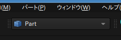

パートメニューで「メッシュからシェイプへ」を選ぶ。縫い合わせはチェックせずに実行。こんな風に2つ「選択オブジェクトのリスト」に表示されるので下の立方体アイコンが付いている方を選択する。

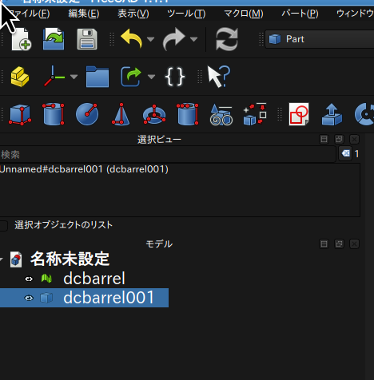

3Dスキャンしていると、原点とはかけ離れた場所に存在することが多く、kicad上での位置合わせが大変なので重心を原点に移動する。freecadのPythonコンソールで以下を実行。

```python
exec("""
import FreeCAD as App
import FreeCADGui as Gui

doc = App.ActiveDocument
sel = Gui.Selection.getSelection()

if not sel:
    raise RuntimeError("元のオブジェクトを1つ選択してください")

src = sel[0]
shape = src.Shape.copy()

if shape.Solids:
    elements = shape.Solids
    weights = [x.Volume for x in elements]
    centers = [x.CenterOfMass for x in elements]
    center_type = "体積重心"
elif shape.Faces:
    elements = shape.Faces
    weights = [x.Area for x in elements]
    centers = [x.CenterOfMass for x in elements]
    center_type = "面積重心"
elif shape.Edges:
    elements = shape.Edges
    weights = [x.Length for x in elements]
    centers = [x.CenterOfMass for x in elements]
    center_type = "線重心"
else:
    raise RuntimeError("重心を計算できる要素がありません")

total = sum(weights)
if total <= 0:
    raise RuntimeError("重心計算に使える要素がありません")

center = App.Vector(0, 0, 0)
for point, weight in zip(centers, weights):
    center += point * weight
center /= total

container = doc.addObject("App::Part", src.Name + "_CenteredPart")
container.Label = src.Label + "_CenteredPart"

result = doc.addObject("Part::Feature", src.Name + "_CenteredShape")
result.Label = src.Label + "_CenteredShape"
result.Shape = shape
container.addObject(result)

# 重心を原点へ移動
result.Placement = App.Placement(
    App.Vector(-center.x, -center.y, -center.z),
    App.Rotation()
)

src.Visibility = False
doc.recompute()

Gui.Selection.clearSelection()
Gui.Selection.addSelection(result)

print("重心の種類:", center_type)
print("移動前の重心:", center)
print("移動量:", result.Placement.Base)
print("新しいオブジェクト:", result.Name)
""")
```

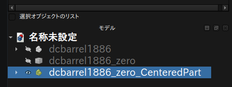

一番下のbodyを選んでCtrl+Eでエクスポートを選び、形式にSTEPを選んで保管する。

## KiCadへの設定

フットプリントエディターで、図面の何も無いところをクリックしてから`E`を押す

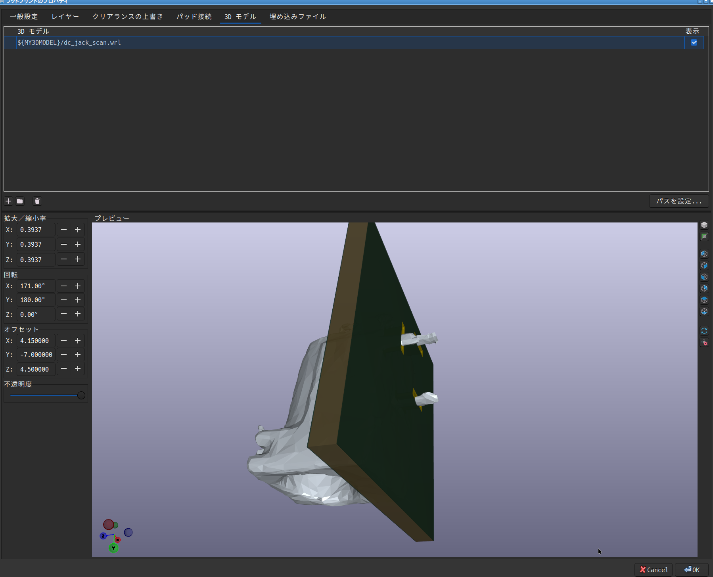

3Dモデルのタブを選び、上でエクスポートしたSTEPファイルを選ぶ。フットプリントの穴に合うようにオフセットを調整してやればOK。


STEPファイルでエクスポートせず、wrlファイルなどにするとkicad側がインチだと誤解するようで、サイズが合わなくなるので注意。拡大率で帳尻を合わせることも可能だが、そうすると基板全体を3Dファイルで書き出す時に警告が表示され、うまくレンダリングされなくなる。
