+++
title = "プログラマブル・ゲイン・アンプ MCP6S21のテスト"
date="2026-05-06"
[extra]
og_image = "/diy/pga-mcp6s21/ogp.jpg"
+++

MCP6S21は、SPI制御で増幅率を指定できるアンプ。ラズパイを使って動作確認してみる。

[ラズパイによるSPI制御はこちら](/diy/raspberrypi/spi)

MCP6S21は8PINしかないので接続は簡単。CH0が入力でV<sub>OUT</sub>が出力。

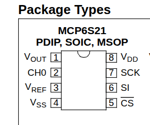

SPIによる制御は簡単。[2バイトを送れば良い](https://akizukidenshi.com/goodsaffix/mcp6s2x.pdf)。

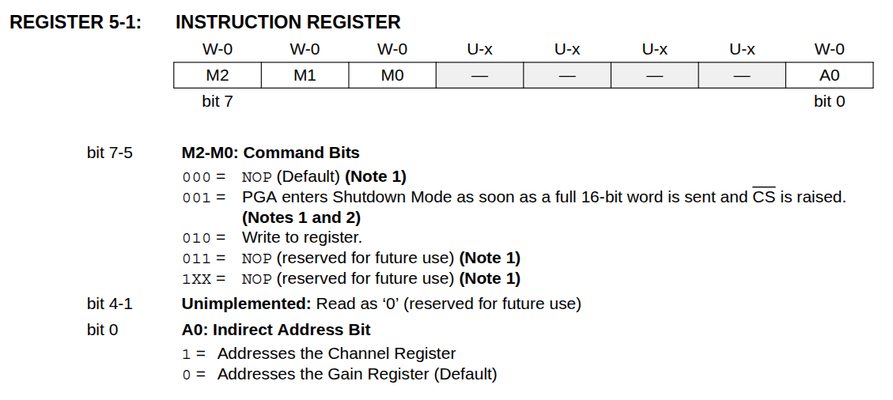1バイト目がInstruction。Write to registerは、010で、gain registerが0だから、1バイト目は0x40

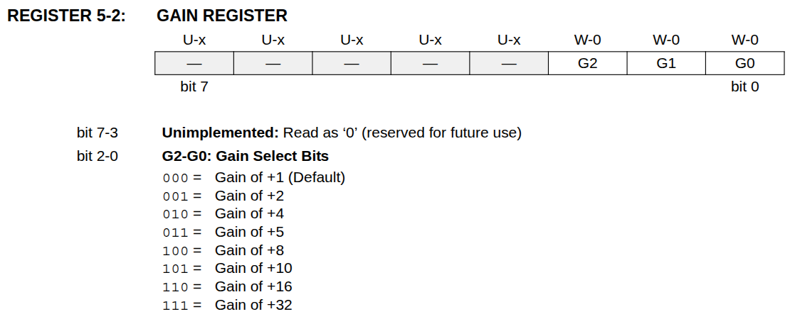2バイト目でgain registerに値を書く。例えば0x05なら10倍になる。

書き込みはラズパイのspi-pipeを使えば簡単。

```
echo -ne "\x40\x05" | spi-pipe -b 2 -d /dev/spidev0.0 -s 1000000 | od -t x1
0000000 00 00
0000002
```

まずはV<sub>REF</sub>を0Vにして増幅率を変えてみる。電源投入直後は増幅率が1になっている。

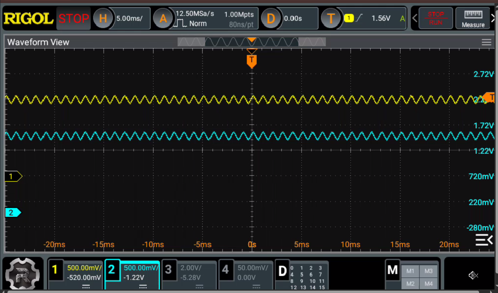上が入力(1kHz)で下が出力。

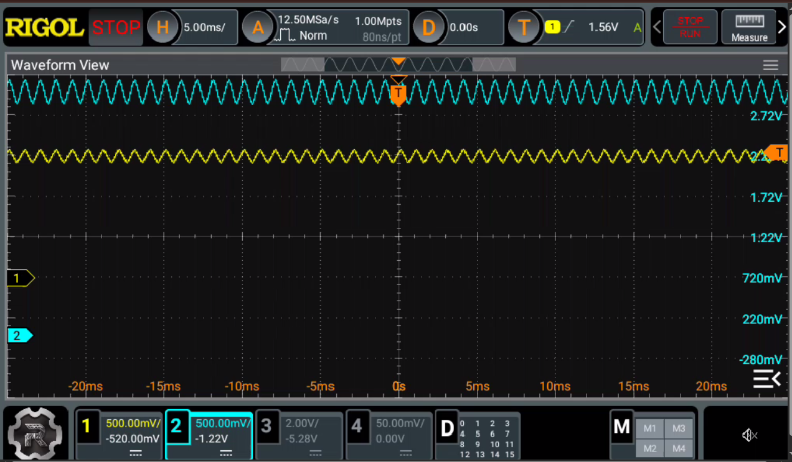2倍にしてみる。右側の縦軸を見ると中点が3V以上になっている。元の入力には1.6Vくらいのオフセットを付けている。これはCH32V203のA/D変換を使うためで、この手のA/Dは、0V以上しか変換できないから、0から3.3Vの間に測定範囲が収まるようにゲタを履かせてあるのだ。このため、そのまま2倍に増幅すると3.2Vくらいが中点になってしまう。

これでは困るので、中点を維持するため、V<sub>REF</sub>に1.6Vをかける。

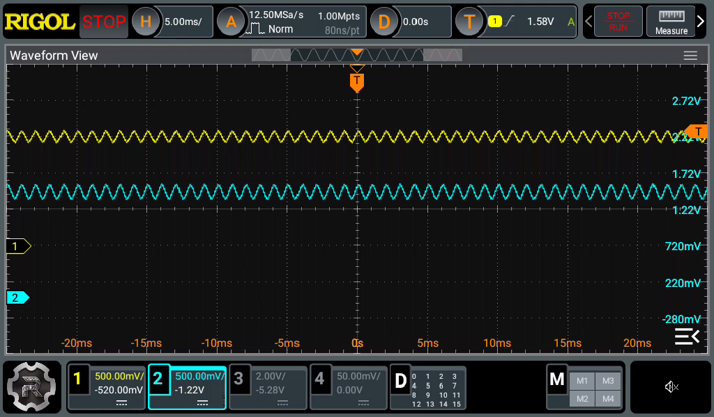

今度は中点が1.6Vに維持された。

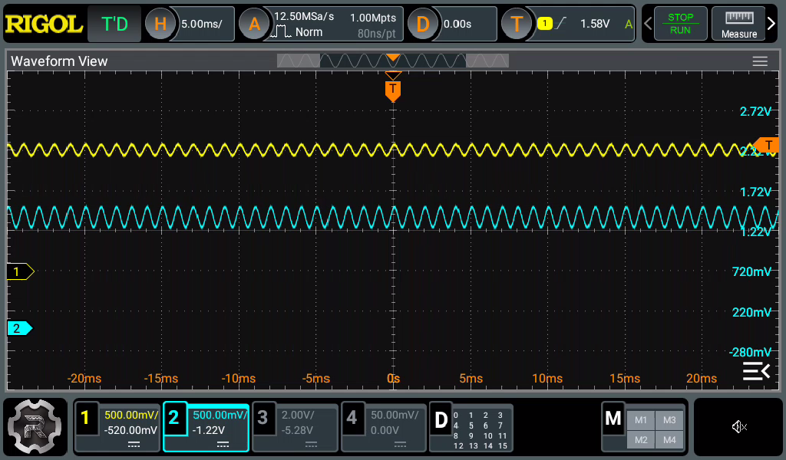10倍に上げてみると、様子が変だ。とても10倍には見えない。

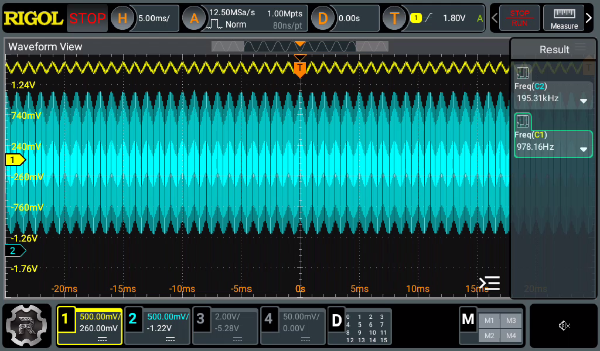16倍にすると、発振してしまっているように見える。

実は最初のテストではV<sub>REF</sub>の供給は以下のような回路にしていた。

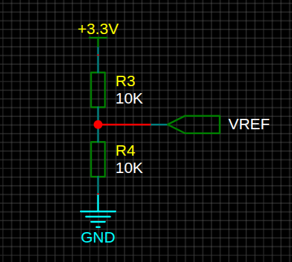

しかし、[マニュアル](https://akizukidenshi.com/goodsaffix/mcp6s2x.pdf)を見ると、

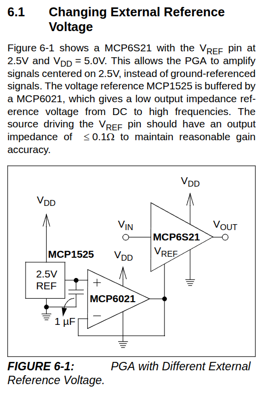V<sub>REF</sub>は十分小さなインピーダンスで駆動せよ(≦0.1Ω!)とのこと。

というわけでV<sub>REF</sub>の供給回路を変更。

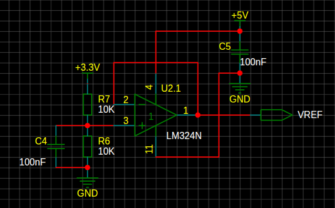

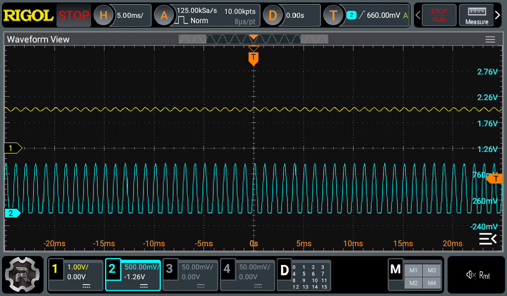まともな振幅になった(振り切ってしまって、下の方の波形がつぶれているが)。
