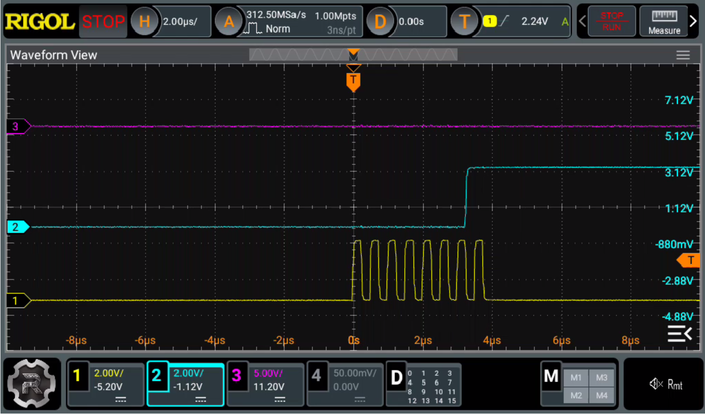

+++
title = "FT232Hを使ってPCでGPIOやSPIを使えるようにする。"
date="2026-06-20"
[extra]
og_image = "/diy/ft232h/ogp.jpg"
+++

SPI接続のデバイスの制御をMCU、例えばCH32VシリーズとかESP32で行おうという場合、デバイスによっては結構SPIで送受信するデータが複雑で、これをデバイス上で開発、デバッグするのは骨が折れる。PCで開発しておいて、最後にハードウェア制御のところだけMCU用に差し替えるということで、もっと簡単に開発出来ないだろうか。

[FT232H](https://ftdichip.com/wp-content/uploads/2020/07/DS_FT232H.pdf)は、USBでGPIOやSPI制御ができるチップだ。FT232Hで検索すれば、ボードになっているものが幾つか見つかる。[AliExpressで発見したもの](https://ja.aliexpress.com/item/1005007467207843.html)を買ってみた。

## 準備

今回は、Lubuntu 26.04とRustを使用した。

まずUSBに接続してlsusbで確認してみる。


$ lsusb

```
...
Bus 001 Device 027: ID 0403:6014 Future Technology Devices International, Ltd FT232H Single HS USB-UART/FIFO IC
```

IDは0403:6014だ。このデバイス、デフォルトではカーネルにUSBシリアルと認識されて掴まれてしまうので、udevで細工する。`/etc/udev/rules.d/99-ft232h.rules`を作成。

```
SUBSYSTEM=="usb", ATTRS{idVendor}=="0403", ATTRS{idProduct}=="6014", ACTION=="add", RUN+="/bin/sh -c 'echo 0 > /sys/$devpath/authorized_default'"
SUBSYSTEM=="usb", ATTRS{idVendor}=="0403", ATTRS{idProduct}=="6014", MODE="0666", GROUP="plugdev"
```

udevを反映する。


$ sudo udevadm control --reload-rules


$ sudo udevadm trigger


カーネルに掴まれていないか確認する。


$ usb-devices | grep -E -A 4 "Vendor=0403 ProdID=6014"


```
P:  Vendor=0403 ProdID=6014 Rev=09.00
S:  Manufacturer=FTDI
S:  Product=Single RS232-HS
C:  #Ifs= 1 Cfg#= 1 Atr=80 MxPwr=500mA
I:  If#= 0 Alt= 0 #EPs= 2 Cls=ff(vend.) Sub=ff Prot=ff Driver=(none)
```

Driver=(none)になればOK。FTDI用のライブラリをインストールしておく。


$ sudo apt install libftdi1-dev


## Rustのクレート作成

これで準備ができたのでRustでコードを書く。クレートを作ってライブラリを追加する。


$ cargo new ft232h


$ cd ft232h


$ cargo add ftdi-embedded-hal


$ cargo add embedded-hal


$ cargo add ftdi


私が試した時点での`Cargo.tmol`はこんな感じ。

```toml
[dependencies]
embedded-hal = "1.0.0"
ftdi = "0.1.3"
ftdi-embedded-hal = { version = "0.24", features = ["ftdi"] }
```

## まずはLチカ(GPIO制御)

`src/bin/blink.rs`を作成する。

```rust
use ftdi_embedded_hal as hal;
use embedded_hal::digital::OutputPin; 
use std::thread::sleep;
use std::time::Duration;

fn main() -> Result<(), Box<dyn std::error::Error>> {
    // 1. デバイスのオープン
    let device = ftdi::find_by_vid_pid(0x0403, 0x6014)
        .interface(ftdi::Interface::A)
        .open()?;

    // 2. HALコンテキスト初期化
    let ftdi_hal = hal::FtHal::init_default(device)?;
    
    // 3. ピンの取得
    let mut led = ftdi_hal.ad0()?;

    println!("FT232H GPIO（Lチカ）を開始します");

    loop {
        led.set_high()?;
        println!("LED ON");
        sleep(Duration::from_millis(500));

        led.set_low()?;
        println!("LED OFF");
        sleep(Duration::from_millis(500));
    }
}
```

実行。


$ cargo run --bin blink


<video width="640px" src="output.mp4" controls width="100%">
  お使いのブラウザは動画再生に対応していません。
</video>

## SPI

`bin/spi_cs.rs`を作る。

```rust
use ftdi_embedded_hal as hal;
use embedded_hal::spi::SpiDevice;
use std::thread::sleep;
use std::time::Duration;

fn main() -> Result<(), Box<dyn std::error::Error>> {
    // 1. デバイスのオープン
    let device = ftdi::find_by_vid_pid(0x0403, 0x6014)
        .interface(ftdi::Interface::A)
        .open()?;

    // 2. 2MHz で HAL 初期化
    let ftdi_hal = hal::FtHal::init_freq(device, 2_000_000)?;
    
    // 3. CS
    let mut spi_device = ftdi_hal.spi_device(3)?;

    println!("FT232H 自動CS制御テストを開始します（周波数: 2MHz）");
    println!("ピン配置: AD0=SCK, AD1=MOSI, AD2=MISO, AD3=CS(自動制御)");

    let mut counter: u8 = 0;

    loop {
        let tx_data = counter;
        let mut buffer = [tx_data];

        // 4. SpiDevice トレイトを介した通信
        // 内部で自動的に CS Low -> SPI転送 -> CS High が完結します。
        spi_device.transfer_in_place(&mut buffer)?;

        println!(
            "SPI通信結果 -> 送信: 0x{:02X} | 受信: 0x{:02X}",
            tx_data, buffer[0]
        );

        counter = counter.wrapping_add(1);
        sleep(Duration::from_secs(1));
    }
}
```

実行。


$ cargo run --bin spi_cs


コードに書かれている通り接続は以下のようになる。

| ピン番号 | 信号名 |
| --- | --- |
|D0| SCK|
|D1| MOSI|
|D2| MISO|
|D3| CS|

オシロで見てみる。ちゃんと2MHzで通信しているね。


