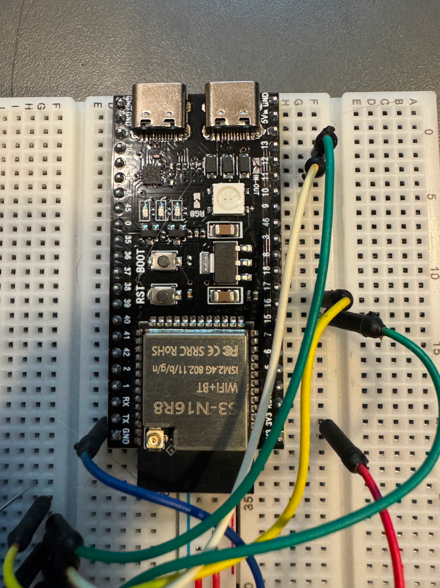

+++
date = "2026-2-28"
title = "JTAGを使った書き込み"
+++

これまでESP32の開発では、秋月のdevkitを使ってきた。

USB serialが載っているので、簡単に書き込みができる。ただ、微妙に書き込みに時間がかかるのがだんだんストレスになってきた。

<iframe width="560" height="315" src="https://www.youtube.com/embed/z4ycaWec_Gc?si=siKSnzfb44cA5Pld" title="YouTube video player" frameborder="0" allow="accelerometer; autoplay; clipboard-write; encrypted-media; gyroscope; picture-in-picture; web-share" referrerpolicy="strict-origin-when-cross-origin" allowfullscreen></iframe>

最初にConnectingというところで5秒くらいかかり、実際の書き込みは6秒くらいか。昔のEP-ROM時代に比べれば10秒強で書き込めるのだから文句を言うのは甚だ贅沢なのだが、人間の欲求とは果てしないのだ。

調べてみるとESP32への書き込みは、他にWifiで行うもの(OTA: on the airというらしい)とJTAGを使うものがあるようだ。Wifiで行うものはESP32側にサーバーを動かすことになるので、お膳立てが必要。JTAGはESP32の最近のチップにあるUSB機能を使うもので、これを使うとデバッガーも使えるようだ。

JTAG対応のdevkitは、USBコネクタが2つ付いているケースが多い。AliExpressで手頃なESP32-S3 N16R8を購入してみた。976円で送料無料だった。

左のコネクタはUSB serial経由で、右のコネクタはESP32直結のようだ。Linuxの場合は[udevの設定](https://docs.espressif.com/projects/esp-idf/en/latest/esp32s3/api-guides/jtag-debugging/configure-builtin-jtag.html)をしてやれば良いとのこと。

ところが、どちらのUSBコネクタも全然認識されない。正直商品ページには回路図も載ってなくて、ちゃんと動くかは不安だった。これは失敗したかなと思ったのだが、いつものおまじない、BOOTボタンを押しながらRSTボタンをポチっとしたところ、ちゃんと動くようになった。このおまじないは最初に1回やるだけで良くて、書き込みのたびにやる必要はない。

さっそくJTAGで書き込みしてみる。

<iframe width="560" height="315" src="https://www.youtube.com/embed/BueKyYtRl-M?si=8YLjaFHhT6U6E_ba" title="YouTube video player" frameborder="0" allow="accelerometer; autoplay; clipboard-write; encrypted-media; gyroscope; picture-in-picture; web-share" referrerpolicy="strict-origin-when-cross-origin" allowfullscreen></iframe>

以前待たされていたConnectingの箇所は、全く待たされることなく進み、書き込みも3秒くらいで完了。全体として3倍くらいの速度になった。

不思議なことに、このボードのUSB serial側で書き込んでみても高速なのだ(正直、JTAGとの速度差は見分けられなった)。書き込みを高速化したいだけなら、最新のESP32を使うだけで良くてJTAGでなくても良いのかもしれない。
