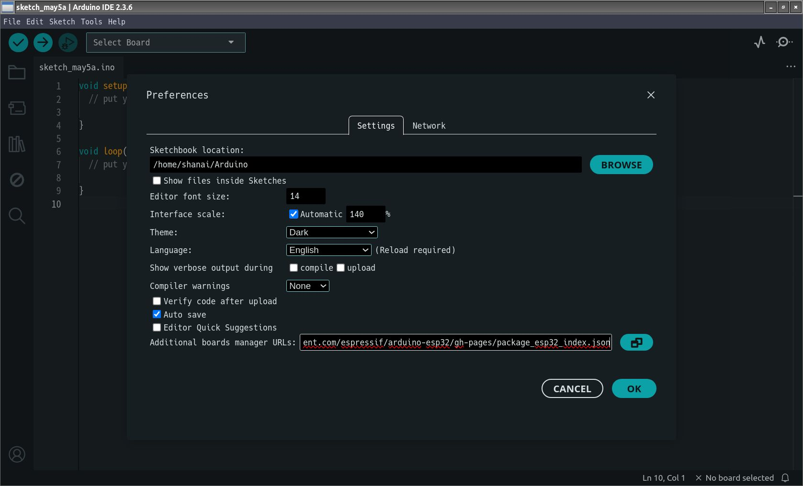
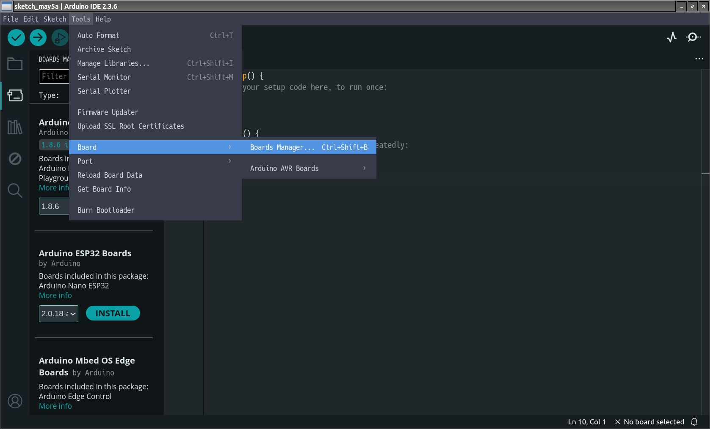
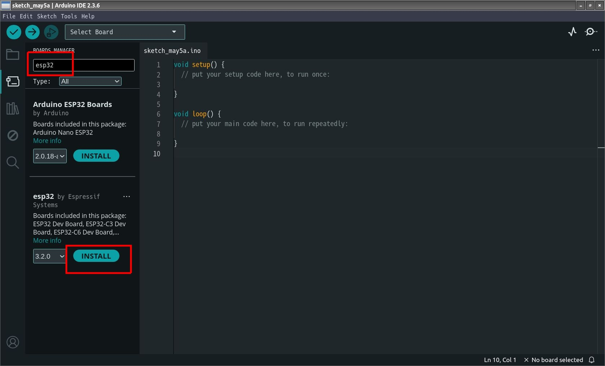
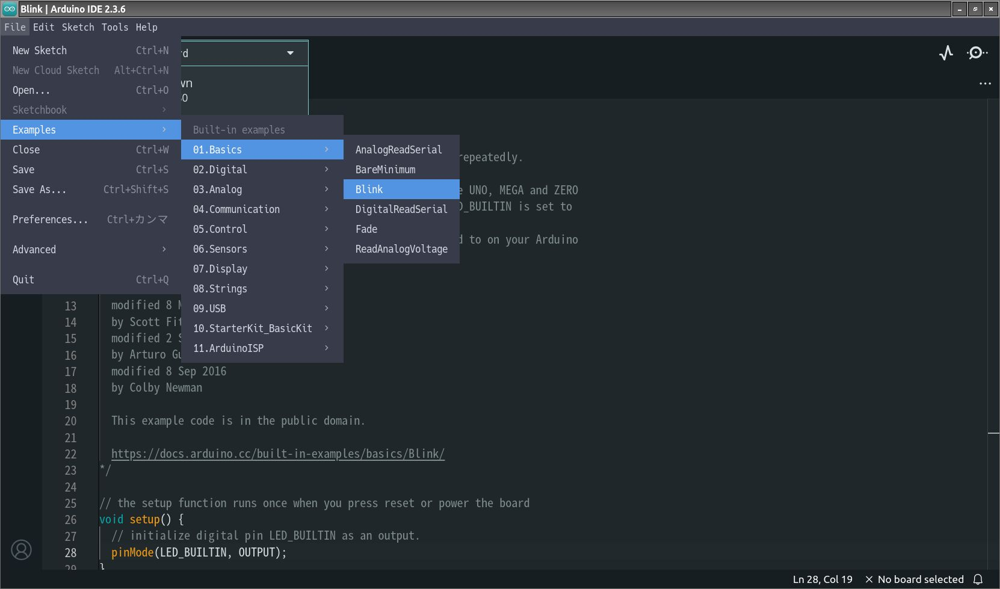
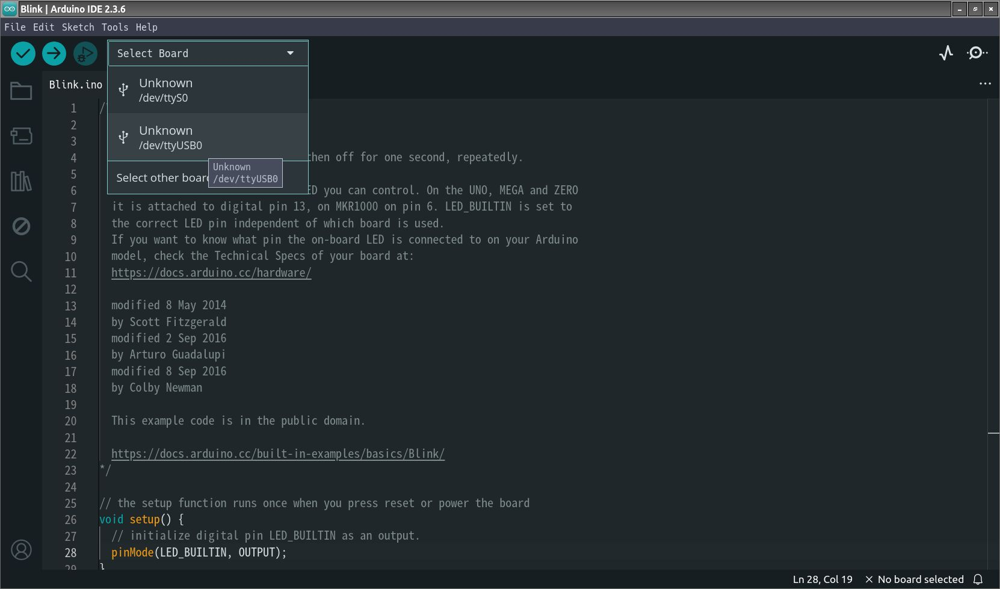
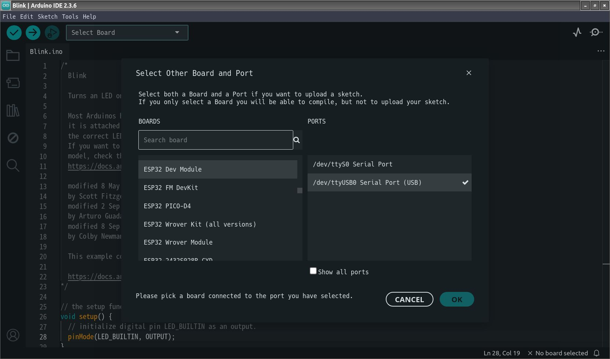
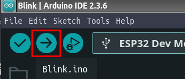
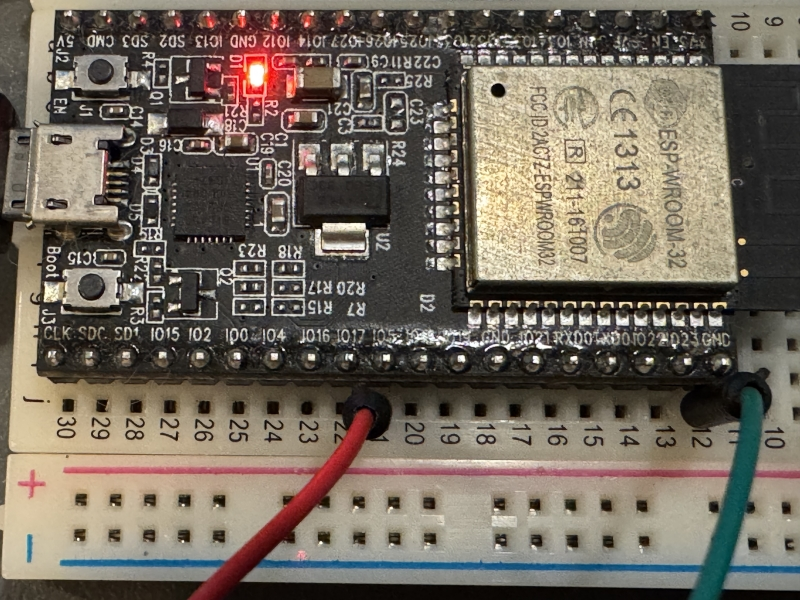

+++
date = "2025-05-05"
title = "セットアップ"
+++

プログラマのセットアップからLチカまで。

## Arduino IDE

最初に[Arduino IDE](https://www.arduino.cc/en/software/)をインストールする。自分はLinux用のAppImageを入手。

実行ビットを立てれば起動できる。

    chmod +x arduino-ide_2.3.6_Linux_64bit.AppImage

### Preferences

ctrl+,でPreferencesを開き、Additional boards managerに以下を入力

    https://raw.githubusercontent.com/espressif/arduino-esp32/gh-pages/package_esp32_index.json

### Board Manager

Tools → Board → Boards Managerを開く。

"esp32"と入力して
esp32 by EspressifをINSTALL

### Lチカの読み込み

File → Examples → 01.Basics → Blinkを開く。

プログラムのLED_BUILTINとあるところを5に変える(GPIO5)。

    void setup() {
      // initialize digital pin LED_BUILTIN as an output.
      pinMode(5, OUTPUT);
    }
    
    // the loop function runs over and over again forever
    void loop() {
      digitalWrite(5, HIGH);  // turn the LED on (HIGH is the voltage level)
      delay(1000);                      // wait for a second
      digitalWrite(5, LOW);   // turn the LED off by making the voltage LOW
      delay(1000);                      // wait for a second
    }

### USBを接続

今回は[ESP32のDev Board](https://akizukidenshi.com/catalog/g/g115673/)を使用した。これはUSBシリアルと、ダウンローダ用の回路が載っている(同等の回路を用意すれば自作も可能)。

!!! note

    自作する場合は、上記の[ESP32のDev Boardの回路図](https://akizukidenshi.com/goodsaffix/esp32_devkitc_v4-sch.pdf)を参考にすると良い。
    
    - USBシリアルの信号線は3.3Vであること
    - USBシリアルのTXDをESP32のRXD0に接続
    - USBシリアルのRXDをESP32のTXD0に接続
    - USBシリアルのDTR/RTSをトランジスタのスイッチを介してESP3のEN/IO0に接続

以下はLinuxの場合のUSB Serialの設定。

自分のユーザをdialoutグループに追加しておく。

    sudo usermod -a -G dialout $USER

有効にするためにlogoff/loginする。

lsusbの出力をUSBに接続前と後で比較するとUSB serialのデバイス名が分かる。

    +Bus 001 Device 028: ID 10c4:ea60 Silicon Labs CP210x UART Bridge

このデバイスがどのポートにつながっているかを調べる

    $ ls -l /dev/serial/by-id/
    合計 0
    lrwxrwxrwx 1 root root 13  5月  5 15:32 usb-Silicon_Labs_CP2102_USB_to_UART_Bridge_Controller_0001-if00-port0 -> ../../ttyUSB0

ttyUSB0というデバイス名であることが分かる。

Select BoardからttyUSB0を選ぶ。

ESP32 Dev Moduleを選ぶ

→ ボタンで書き込みする。

GPIO5ピンが1秒ごとにon/offされることを確認できたらOK。

