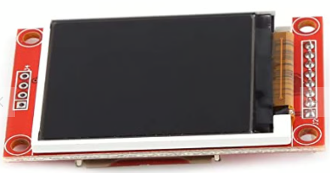
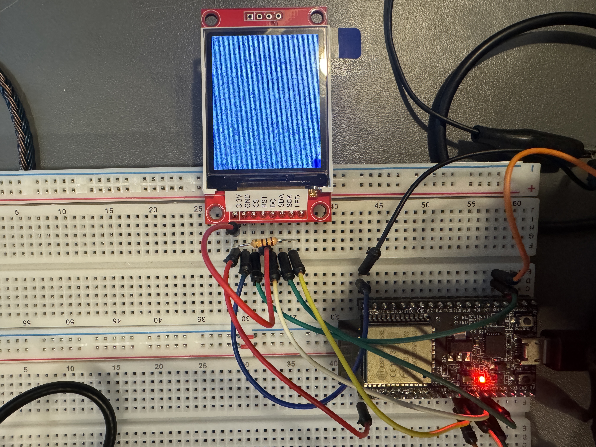

+++
date = "2026-2-21"
title = "ESP32でRustを使ってLCD(ST7735)を制御する"
+++

自作の組み込み機器の表示での文字などの表示は、7セグLEDを使うことが多いが、7セグLEDは結構ピン数が多いので面倒。ずっと気になっていたLCDを試してみた。

今回のLCDはこちら。

<a href="https://electronicwork.shop/items/62d232fcdbe7441d5c7ba1c9">
1.8インチTFT液晶ディスプレイモジュール(ST7735)

</a>

結線はSPIなので、少なくて済む。SPIのCLOCK, DATA, CSあと、ST7735はなぜかデータかコマンドかを知らせる制御線がSPIとは別に必要という不思議な造りになっているので、4線で接続する。

ST7735の制御について検索すると、だいたいはArduinoを使ったもので、しかもライブラリを使っておしまいという感じで、今回はESP32相手なのであまり参考にならない。[ゆるプロ](https://try3dcg.world.coocan.jp/note/spi/st7735s.html)で、ローレベルのST7735に送るコマンドが解説されていたので参考にさせてもらう。

今回もRustを使う。セットアップは[Lチカ](/diy/micro-controller/esp32/rust)で書いた通り。ただ、ESP8684はユーザー用のSPIが1つしかないので、今回はノーマルなESP32を使った(電子ボリュームもSPIで制御なので2つ欲しい。まぁ両方同じSPIにぶら下げてCSで切り替えればいいのだけど、LCDのデータ転送はかなり速いので、あまり色々ぶら下げると信号がなまるかなと)。普通に以下を実行するだけで良く、ESP8684の時のようなクロックを26MHzに変更する設定などは不要。

    cargo generate --git https://github.com/esp-rs/esp-idf-template cargo

ST7735は、1バイトのコマンドをまず送り、その後にコマンドによって決まる長さのデータ(パラメータと呼ぶ)を送る。例によって、こういう部分は[ST7735用のクレート](https://crates.io/crates/st7735-rs)に分けてみた。

作ったmain.rsはこんな感じ。

```Rust
use esp_idf_svc::hal;
use hal::delay::FreeRtos;
use hal::gpio::{AnyInputPin, PinDriver};
use hal::peripherals::Peripherals;
use hal::spi::*;
use hal::units::*;
use st7735_rs::command::{Caset, Colmod, Command, Dispon, Ramwr, Raset, Slpout};
use st7735_rs::color_format::{ColorFormat, Pixel, Pixel12};
use embedded_hal::blocking::spi::WriteIter;

struct CmdSender<'a> {
    dat_cmd: PinDriver<'a, hal::gpio::Gpio12, hal::gpio::Output>,
    spi: SpiDeviceDriver<'a, &'a SpiDriver<'a>>,
}

impl<'a> CmdSender<'a> {
    fn new(
        dat_cmd: PinDriver<'a, hal::gpio::Gpio12, hal::gpio::Output>,
        spi: SpiDeviceDriver<'a, &'a SpiDriver<'a>>,
    ) -> Self {
        Self { dat_cmd, spi }
    }

    fn send(&mut self, mut cmd: impl Command) -> anyhow::Result<()> {
        self.dat_cmd.set_low()?;
        self.spi.write(&[cmd.cmd_byte()])?;
        self.dat_cmd.set_high()?;
        self.spi.write_iter(cmd.parm_bytes())?;
        FreeRtos::delay_ms(cmd.post_delay().as_millis() as u32);
        Ok(())
    }
}

fn main() -> anyhow::Result<()> {
    esp_idf_svc::sys::link_patches();
    esp_idf_svc::log::EspLogger::initialize_default();

    let peripherals = Peripherals::take()?;
    let spi = peripherals.spi2;
    let sclk = peripherals.pins.gpio14;
    let sdo = peripherals.pins.gpio13;
    let cs = peripherals.pins.gpio15;
    let driver = SpiDriver::new::<SPI2>(
        spi, sclk, sdo,
        Option::<AnyInputPin>::None,
        &SpiDriverConfig::new(),
    )?;

    let cfg = config::Config::new().baudrate(15.MHz().into());
    let spi_drv: SpiDeviceDriver<'_, &SpiDriver<'_>> = SpiDeviceDriver::new(&driver, Some(cs), &cfg)?;
    let dat_cmd: PinDriver<'_, hal::gpio::Gpio12, hal::gpio::Output> = PinDriver::output(peripherals.pins.gpio12)?;
    
    let mut cmd_sender = CmdSender::new(dat_cmd, spi_drv);
    cmd_sender.send(Slpout)?;
    cmd_sender.send(Colmod::new(ColorFormat::Bit12))?;
    cmd_sender.send(Dispon)?;
    let x_range = 0..10;
    cmd_sender.send(Caset::new(x_range.clone()))?;
    let y_range = 0..10;
    cmd_sender.send(Raset::new(y_range.clone()))?;
    cmd_sender.send(Ramwr::fill_rect(x_range.clone(), y_range.clone(), Pixel::<Pixel12>::BLUE))?;

    loop {
        FreeRtos::delay_ms(100);
    }
}
```

Cargo.tomlはdependenciesに以下を指定。

```
[dependencies]
log = "0.4"
esp-idf-svc = "0.51"
anyhow = "1"
st7735-rs = "0"
embedded-hal = "0.2"
```

クレートを分けたので、main.rsではコマンドを送っているだけ。なお、ESP32のSPIはフラッシュメモリーの読み込みなどに使われるものが1つ、ユーザーが自由に使えるものが2つ(それぞれSPI2, SPI3。またはHSPI, VSPIと呼ばれる)。今回はSPI2を使用。

[ESP32のデータシート](https://documentation.espressif.com/esp32_technical_reference_manual_en.pdf#spi)で、以下のように記載があるので注意。SPIの出力信号に入力専用のGPIOピンを割り当てても動作しない。

    Note that the I/O GPIO pins are 0-19, 21-23, 25-27, 32-39, while the output GPIOs are 0-19, 21-23, 25-27,
    32-33. GPIO pins 34-39 are input-only.

SPIのクロックは[仕様書](https://www.displayfuture.com/Display/datasheet/controller/ST7735.pdf)によると、66nsとあったので、逆算して15MHzにした。もっと速くても動く模様(30Mhzに設定しても動いた)。

- Slpout: 液晶をスリープから復帰させる
- Colmod: 液晶の表示方向、色数の設定(12bitだと4096色。昔のマイコンみたい)
- Dispon: 表示をonにする
- Caset, Raset: 液晶の書き換えはX方向の範囲とY方向の範囲をこれらのコマンドで設定してから、ピクセルを後続のRamwrで送る
- Ramwr: 書き換えるピクセルを送信



砂嵐になっているのは、電源on直後はメモリーにゴミが入っているため。左下に10x10の青い長方形が描画されていることが分かる。描画速度はどのくらいか計算してみる。この液晶は128x160ドットで、12bitモードでは2ドットで3バイトのデータが必要なので、画面全体の書き換えに必要なのは、

128 x 160 / 2 * 3 = 30720バイト = 245760ビット

SPIのクロックが15MHzだから、

245760 / 15 / 1000 / 1000 = 0.0164秒

1 / 0.0164 = 61FPS

理想値だけど、十分な速度だね。18ビットカラーのモードだと26万色表示でき、この時は1ドットで3バイト必要なので、30FPSということになる。ちょっと調べた感じだとダブルバッファリングとかは無いみたい。常に書き換えをした時にチラついたりしないかとかは未検証。まぁ自分はそんな使い方はしなさそうなので、とりあえずこれでOKにする。

あと液晶の端子にRESETがあったけど、今は3.3Vにプルアップしている。今のところ特に問題ないけど電源on直後に不安定ならパワーオンリセット回路を入れるなり、ESP32のGPIOにつないで、ソフトウェアでリセットした方が良いだろう。あと、LEDという端子はバックライトだった。とりあえず100Ωを入れて3.3Vにつないである。信号線は5Vトレラントではないので注意。まぁESP32なら問題無し。