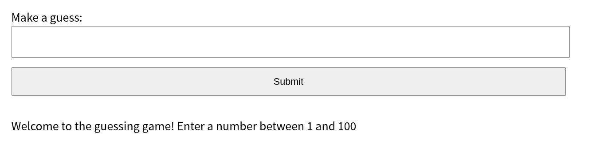

+++
date = "2026-01-01"
title = "ESP32でRustを使ってWebSocket server"
[extra]
og_image = "/diy/micro-controller/esp32/web-socket/ogp.jpg"
+++

[Lチカ](/diy/micro-controller/esp32/rust)が動いたので、REST serverをRustで実装してみる。

Lチカの時と同様に雛形を作る。名前はrest-serverにした

    cargo generate --git https://github.com/esp-rs/esp-idf-template cargo

Cargo.tomlはanyhowだけ追加した。

```
[dependencies]
...
anyhow = "1"
```

[esp-rsのサンプル集](https://github.com/esp-rs/esp-idf-svc/tree/master/examples)にhttp_ws_server.rsとhttp_ws_server_page.htmlがあるので、これをsrcの下にコピーした。http_ws_server.rsはmain.rsにリネーム。

このサンプル、なぜかESP32をWifiアクセスポイントにするという謎仕様なので修正した。

main.rsはこんな感じ。

```rust
use esp_idf_svc::eventloop::EspSystemEventLoop;
use esp_idf_svc::hal::prelude::Peripherals;
use esp_idf_svc::http::server::{Configuration, EspHttpServer};
use esp_idf_svc::http::Method;
use esp_idf_svc::ipv4;
use esp_idf_svc::netif::{EspNetif, NetifConfiguration, NetifStack};
use esp_idf_svc::nvs::EspDefaultNvsPartition;
use esp_idf_svc::wifi::{AuthMethod, BlockingWifi, EspWifi, WifiDriver};
use esp_idf_svc::io::{EspIOError, Write};
use esp_idf_svc::ipv4::{
    ClientConfiguration as IpClientConfiguration, ClientSettings as IpClientSettings,
    Configuration as IpConfiguration, Mask, Subnet,
};
use esp_idf_svc::wifi::{ClientConfiguration, Configuration as WifiConfiguration};
use std::net::Ipv4Addr;
use std::result::Result;
use std::str::FromStr;
use log::info;

const SSID: &str = env!("ESP32_WIFI_SSID");
const PASSWORD: &str = env!("ESP32_WIFI_PASS");
const DEVICE_IP: &str = env!("ESP_DEVICE_IP");
const GATEWAY_IP: &str = env!("GATEWAY_IP");
const GATEWAY_NETMASK: Option<&str> = option_env!("GATEWAY_NETMASK");

fn main() -> anyhow::Result<()> {
    esp_idf_svc::sys::link_patches();
    esp_idf_svc::log::EspLogger::initialize_default();

    let peripherals = Peripherals::take()?;
    let sys_loop = EspSystemEventLoop::take()?;
    let nvs = EspDefaultNvsPartition::take()?;

    let wifi = WifiDriver::new(peripherals.modem, sys_loop.clone(), Some(nvs))?;
    let wifi = configure_wifi(wifi)?;
    let mut wifi = BlockingWifi::wrap(wifi, sys_loop)?;
    connect_wifi(&mut wifi)?;    

    // サーバー設定とインスタンス化
    let mut server = EspHttpServer::new(&Configuration::default())?;

    // GETエンドポイントの登録
    server.fn_handler("/", Method::Get, |req| {
        req.into_ok_response()?.write_all(b"Hello from Rust REST Server!")?;
        Ok::<(), EspIOError>(())
    })?;

    // POSTエンドポイント（JSONデータの受信など）
    server.fn_handler("/api/data", Method::Post, |mut req| {
        let mut buf = [0u8; 100];
        let len = req.read(&mut buf).unwrap();
        // ここでserde等を使ってbufをパースする処理
        
        req.into_ok_response()?.write_all(b"Data received")?;
        Ok::<(), EspIOError>(())
    })?;

    loop {
        std::thread::sleep(std::time::Duration::from_secs(60));
    }
}

fn configure_wifi(wifi: WifiDriver) -> anyhow::Result<EspWifi> {
    let netmask = GATEWAY_NETMASK.unwrap_or("24");
    let netmask = u8::from_str(netmask)?;
    let gateway_addr = Ipv4Addr::from_str(GATEWAY_IP)?;
    let static_ip = Ipv4Addr::from_str(DEVICE_IP)?;

    let mut wifi = EspWifi::wrap_all(
        wifi,
        EspNetif::new_with_conf(&NetifConfiguration {
            ip_configuration: Some(IpConfiguration::Client(IpClientConfiguration::Fixed(
                IpClientSettings {
                    ip: static_ip,
                    subnet: Subnet {
                        gateway: gateway_addr,
                        mask: Mask(netmask),
                    },
                    // Can also be set to Ipv4Addrs if you need DNS
                    dns: None,
                    secondary_dns: None,
                },
            ))),
            ..NetifConfiguration::wifi_default_client()
        })?,

        EspNetif::new(NetifStack::Ap)?,
    )?;

    let wifi_configuration = WifiConfiguration::Client(ClientConfiguration {
        ssid: SSID.try_into().unwrap(),
        bssid: None,
        auth_method: AuthMethod::WPA2Personal,
        password: PASSWORD.try_into().unwrap(),
        channel: None,
        ..Default::default()
    });
    wifi.set_configuration(&wifi_configuration)?;

    Ok(wifi)
}

fn connect_wifi(wifi: &mut BlockingWifi<EspWifi<'static>>) -> Result<(), esp_idf_svc::sys::EspError> {
     let wifi_configuration: esp_idf_svc::wifi::Configuration = esp_idf_svc::wifi::Configuration::Client(esp_idf_svc::wifi::ClientConfiguration {
        ssid: SSID.try_into().unwrap(),
        bssid: None,
        auth_method: AuthMethod::WPA2Personal,
        password: PASSWORD.try_into().unwrap(),
        channel: None,
        ..Default::default()
    });

    wifi.set_configuration(&wifi_configuration)?;

    wifi.start()?;
    info!("Wifi started");

    wifi.connect()?;
    info!("Wifi connected");

    wifi.wait_netif_up()?;
    info!("Wifi netif up");

    Ok(())
}
```

Wi-FiのSSID/パスワードなどは例によってビルドの時に環境変数で渡すので、これらの環境変数を設定してからcargo buildする。DNSは指定していないけど、必要なら同じように環境変数から渡せば良い。

```rust
const SSID: &str = env!("ESP32_WIFI_SSID");
const PASSWORD: &str = env!("ESP32_WIFI_PASS");
const DEVICE_IP: &str = env!("ESP_DEVICE_IP");
const GATEWAY_IP: &str = env!("GATEWAY_IP");
const GATEWAY_NETMASK: Option<&str> = option_env!("GATEWAY_NETMASK");
```

デフォルトのままだと、こんなエラーになる。

```
error[E0599]: no method named `ws_handler` found for struct `EspHttpServer` in the current scope
   --> src/main.rs:134:12
    |
134 |     server.ws_handler("/ws/guess", None, move |ws| {
    |     -------^^^^^^^^^^
    |
help: there is a method `handler` with a similar name
    |
134 -     server.ws_handler("/ws/guess", None, move |ws| {
134 +     server.handler("/ws/guess", None, move |ws| {
    |
```

sdkconfig.defaultsに以下の記載を追加してやれば解決する。

```
CONFIG_HTTPD_WS_SUPPORT=y
```

コアがesp32の場合は、アプリケーションのサイズが1MBを越えていても特に設定を変えなくて良いようだ。起動したらhttp://<<<DEVICE_IP>>>をブラウザで開く。



簡単な数当てゲームが動くので、二分法で当てよう(笑)。
