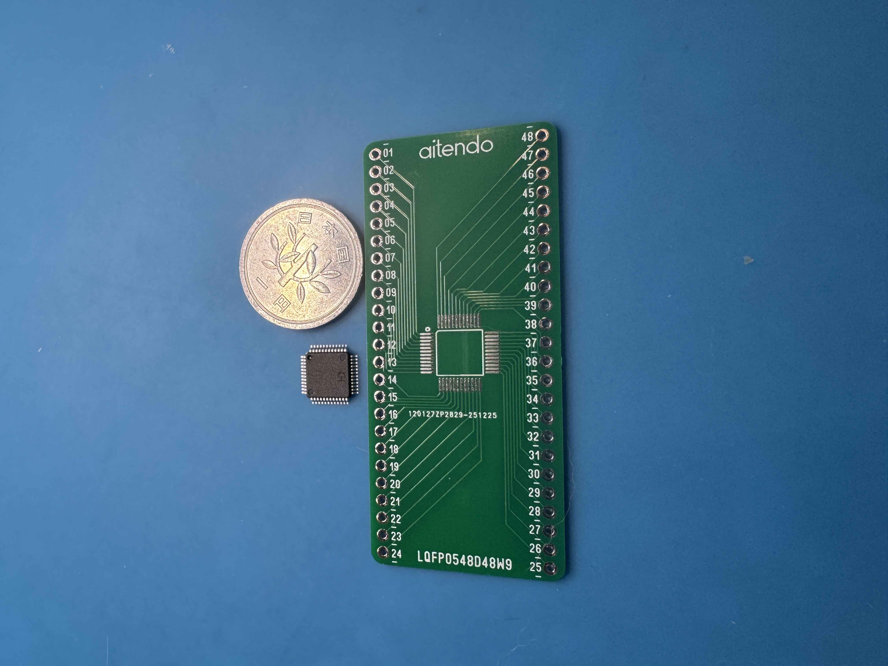
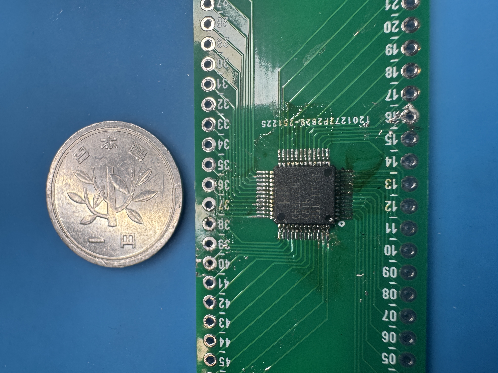

+++
date = "2026-4-11"
title = "CH32V203でRustを使ってLチカ"
+++

CH32V203を手に入れたので、こちらでもRustを使ってLチカ。購入したのはCH32V203 C8T6。SPIが2つ欲しかったので。まずは半田付け。

慣れとは恐ろしい。0.65mmピッチの半田付けにはそれほど苦労しなくなった。

ch32-halを使ったんだけど、最初は全然動かなかった。フラッシュまでは行くんだけど、そのまま進まない(本当はLEDが点滅してコード内のprintがPC側に表示されるはず)。
ダメもとでAIと色々雑談(まぁ雑談しているうちに原因に辿りつくことも多いしね)。

私: 「ch32funのサンプルだと動くんだよね。Rust版はまだ、こなれていないのかな」

AI(Claude): 「それは重要な情報です。elfバイナリを逆アセンブルして比較してみます」

私: 「お前、そんなことまでできるのかよ、ちょっとひくわ。どうだった？」

AI: 「これはqingke-rtのバグですよ! mtvecレジスタへの設定がおかしいです」とか言い出す

AI: 「mainの中にインラインアセンブリでパッチを足してみますね」

私: 「マジかよ動くようになったんだけど。お前すげーな」

AI: 「qingke-rtには是非バグ報告してください」

私: 「分かった。 ん？ でもこのアセンブリとコメント変じゃない？ mtvecに3ではなく0 | 3を書かなければならない、ってあるけど結局一緒じゃん？」

AI: 「するどい指摘です。きっと3を設定でいいのだけど、main()の直後に入れたのがタイミング的に効いたんですよ、きっと」

私: 「本当に？ うたがわしいなぁ」

AI: 「外しても動くかもしれません。試してみます」

私: 「動いたね.. 結局何が悪かったんだろうね..」

で、なんかすっきりしない結果だったが、なんか最近、こうしてAIとの雑談でデバッグするのが結構楽しくなってきてしまった。

コードは[こちら](https://github.com/ruimo/ch32v203-blinky-rust)
