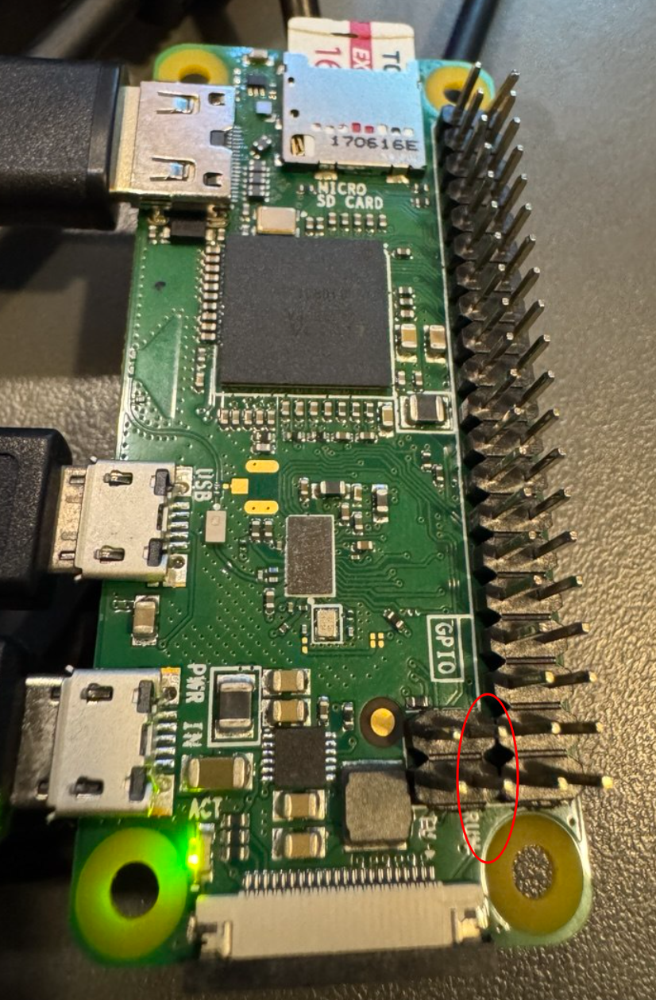
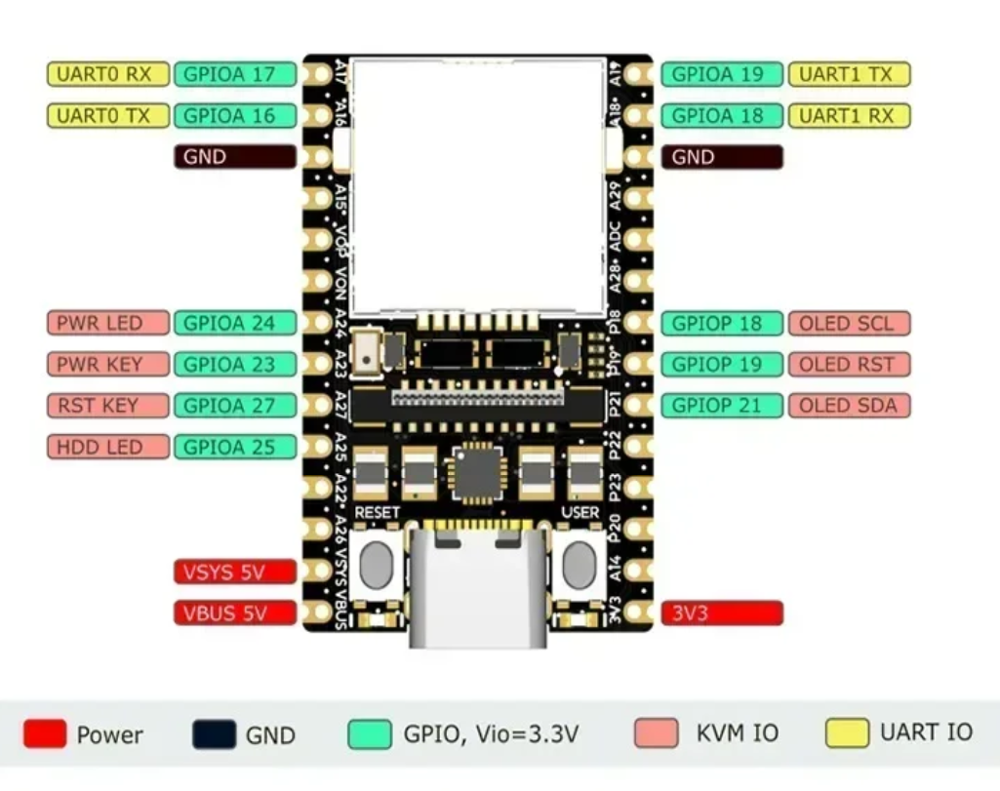

+++
title = "NanoKVM Lite"
description = ""
date ="2026-05-16"
[taxonomies]
tags = ["DIY"]
[extra]
og_image = "/diy/nanokvm/ogp.jpg"
+++

これまで使ってきたNanoVMはPCIe版だったが、ラズパイでも使いたくなりサイコロ型のやつも買うかなと思いたった。しかしAlliExpressで見ると以前は5k円くらいだったと思うのだけど、10k円くらいになっている。かわりに今はLiteというやつがあるようだ。こちらは基板むき出し。まぁこちらでいいかということでポチった。

とりあえず電源を入れて、LANケーブルをつないでみるも全く動かない。avahiに何も出てこない。どうやらPCIe版と違って自分でSDカードを用意しないといけないようだ。[NanoKVMのReleaseページ](https://github.com/sipeed/NanoKVM/releases)に行くと、nanokvm@x.y.zという名前のものと、vx.y.zという名前のものがあって、後者がイメージファイル。現在の最新はv1.4.2だった。xzで圧縮されていたので解凍する。

```bash
xz -d 20260123_NanoKVM_Rev1_4_2.img.xz
```

これを手元の16GBのSDに焼いた。焼くのはddでも良いがうっかりデバイス名間違えるのが怖いので、[ラズパイ用のimager](https://www.raspberrypi.com/software/)を使用。最初のラズパイモデル選択は適当に選び、イメージファイルに上で展開したものを指定すれば良い。

このSDを差して起動すると、無事avahiに出てくるようになった。

```bash
avahi-browse -at | grep -i kvm
+ enp1s0 IPv6 kvm-073d                                      SSH Remote Terminal  local
+ enp1s0 IPv4 kvm-073d                                      SSH Remote Terminal  local
+ enp1s0 IPv4 kvm-073d                                      SSH Remote Terminal  local
+ enxf6696cc93ae4 IPv6 kvm-073d                                      SFTP File Transfer   local
+ enxf6696cc93ae4 IPv4 kvm-073d                                      SFTP File Transfer   local
+ enp1s0 IPv6 kvm-073d                                      SFTP File Transfer   local
+ enp1s0 IPv4 kvm-073d                                      SFTP File Transfer   local
+ enxf6696cc93ae4 IPv6 kvm-073d [xx:xx:xx:xx:xx:xx]                  Workstation          local
+ enp1s0 IPv6 kvm-073d [xx:xx:xx:xx:xx:xx]                  Workstation          local
+ enp1s0 IPv4 kvm-073d [xx:xx:xx:xx:xx:xx]                  Workstation          local
+ enxf6696cc93ae4 IPv4 kvm-073d                                      SSH Remote Terminal  local
+ enxf6696cc93ae4 IPv4 kvm-073d [xx:xx:xx:xx:xx:xx]                  Workstation          local
```

あとは、ここで検出された名前に.localを付けてブラウザで開けば(http://kvm-073d.local)、いつものNanoKVMの画面になる。ユーザー/パスワードの初期値はadmin/admin。

さてラズパイとの接続だが、今回のお相手はRaspberry Pi Zero W。こいつのUSBはMicro USB Type-B x 2だ。2つある内の外側にある方は電源供給用で基板にもPWR INと書かれている。内側のUSBをNanoKVMにつなげばキーボード入力として使えるわけだが、NanoKVM側がTYPE-Cだ。仕方無いのでMicro USB Type-B - USB Type Aのケーブルに、USB Type A/USB-Cの怪しい変換コネクタを入れてNanoKVMに接続。NanoKVMのUSB-Cは電源供給も兼ねているから動くか心配だったが、今のところ問題無いようだ。HDMIはそのままつなげば良い。

とりあえずディスプレイ/キーボード/マウスとして使うだけなら、これでOK。PCの場合はこれ以外にリセットボタンとか電源ボタンの制御ができるのだけど、ラズパイの場合はどうなるのか調べてみた。

するとラズパイはGPIOコネクタの横に、RUNと書かれた端子がある。



ちなみに隣のTVとあるのは、テレビにつなぐ端子だそうだ(多分コンポジット?)。そんなのあるなんて知らんかった。RUNのところの2つのピンは内側はGNDで、外側のピンをGNDに落とすとリセットがかかるそう。試しにやってみたら確かにリセットがかかった。無闇に押すとファイルシステムが壊れそうだがハングした時なんかには便利だろう。

では電源ボタンに相当するものはあるのか。GPIO 3(PIN 5)がそれなのだそうだ。電源offの状態(shutdown -h nowした後など)、でこのピンをテスターで測定すると3.3Vになっているので、これをGNDに落とすと電源が入る。PCの場合、起動後に電源ボタンを押すとACPIの電源offが働いて電源が落ちるが、ラズパイではこの機能はデフォルトでは有効になっていないそうで、確かに起動した状態でGPIO 3をGNDに落としても何も起きない。PCと同じように電源offに設定することも可能で、 /boot/firmware/config.txtの最後にdtoverlay=gpio-shutdownを追加してやれば良いそうだ。

```
[all]
enable_uart=1
dtoverlay=gpio-shutdown
```

これでrebootして試してみると、なるほど確かに電源offできるようになった。ちゃんとシャットダウンが走るので、いきなりリセットより安全だろう。

さて、ではNanoKVMで制御してみるかなということでNanoKVM側のピン配置を見てみる。



左側にPWR LED/PWR KEY/RST KEY/HDD LEDがあるので、とりあえずPWR KEY/RST KEYをラズパイと結線。しかし全く機能しない。RESETをNanoKVMのコンソールで押してもリセットがかからない。それもそのはずで、ラズパイのRUN端子(NanoKVM側のGPIOA 27)をテスターで測定しながらRESETを押してみてもビクともしないのだ。他の端子をテスターであたってみると次のことが分かった。

PWR KEY(GPIOA 23):
普段は0Vで、NanoKVMコンソールでPOWERを押すと3.3Vに上がって0Vに戻る。
つまり論理が逆だ。反転すればラズパイの電源ボタン(3番ピン GPIO2)として使えそう。

HDD LED(GPIOA 25):
普段は0Vで、NanoKVMコンソールでRESETを押すと3.3Vに上がって0Vに戻る。
こいつも論理が逆な上になぜかHDD LEDがRESETになっている。反転すればラズパイのリセットボタン(RUN端子)として使えそう。

なんじゃこりゃと思ったら、どうもLite版はコストダウンのため、このあたりの制御回路が省かれているのだそうだ。まぁ自分でMOS-FET入れてスイッチングする回路を作れば良いわけだが、今回は遠隔制御したいわけではないのでやめておいた。そのうち必要な機会が来たら考えよう。

ちなみに電源LEDは機能しているようだった。

PWR LED(GPIOA 24):
開放で0V。この時NanoKVMコンソールの電源ボタンは緑。
100Ωでプルアップしてみると、NanoKVMコンソールの電源ボタンは白になる。

ただ、OFFが緑で電源ONが白って分からんよね... ちなみにラズパイの1番ピンなどは電源offの状態でも3.3V出ているので、ここでラズパイの電源状態を調べることはできない。/boot/firmware/config.txtに以下を記載するとGPIO 26が電源offの時に0Vになるそうだ(試していない)。

```
dtoverlay=gpio-poweroff,gpiopin=26,active_low=0
```

となると残りのHDD LEDが気になるが、そもそもNanoKVMコンソールにHDDランプは無いし、以下のように[公式ページに記載されている](https://wiki.sipeed.com/hardware/en/kvm/NanoKVM/quick_start.html)。

```
Note: NanoKVM-Cube does not monitor HDD status.
```

詰めが甘いですなw。

